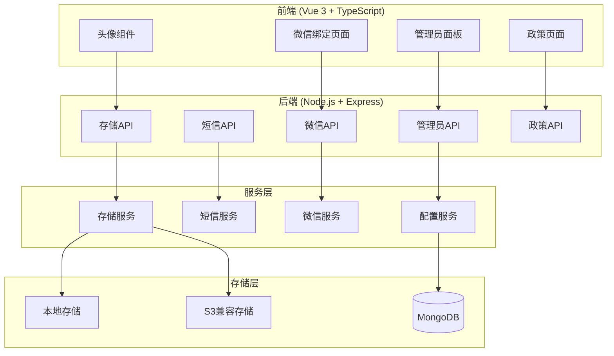
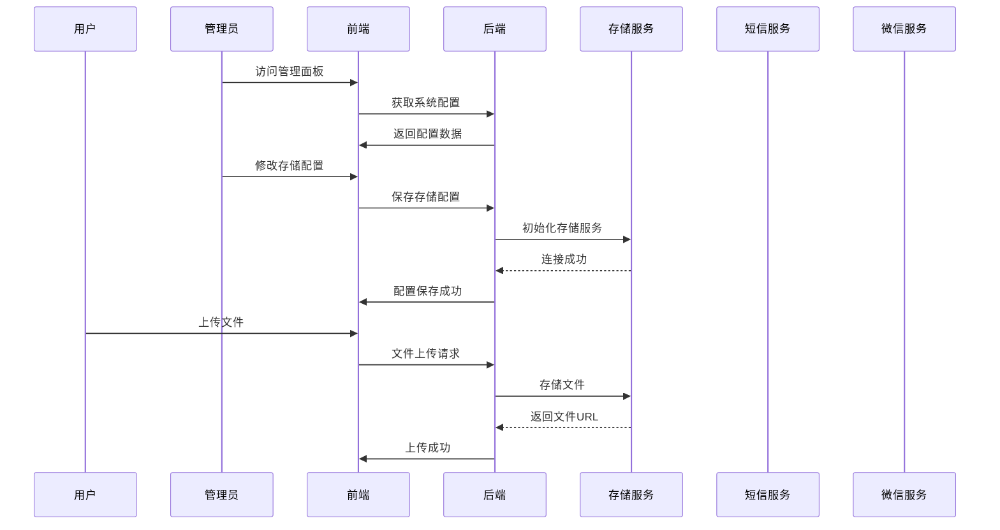

# 设计文档

## 概述

本设计文档描述了管理员后台面板和系统改进功能的技术实现方案。系统采用 Vue 3 + TypeScript 前端和 Node.js + Express + TypeScript 后端架构，使用 MongoDB 作为数据库。

主要设计目标：
- 创建统一的后台管理界面，集中管理系统配置
- 实现可插拔的存储服务架构，支持本地存储和S3兼容存储
- 完善微信绑定和短信验证功能
- 优化用户界面交互体验

## 架构

### 系统架构图



### 数据流图



## 组件和接口

### 后端组件

#### 1. 系统配置模型 (SystemConfig)

```typescript
// thus-backends/thus-server/src/models/SystemConfig.ts
interface ISystemConfig {
  _id: Types.ObjectId;
  
  // 基础配置
  baseUrl: string;
  frontendUrl: string;
  
  // 存储配置
  storage: {
    type: 'local' | 's3';
    local?: {
      uploadDir: string;
    };
    s3?: {
      provider: 'aws' | 'aliyun' | 'tencent' | 'custom';
      endpoint: string;
      accessKeyId: string;
      secretAccessKey: string;
      bucket: string;
      region: string;
      publicUrl?: string;
    };
  };
  
  // 短信配置
  sms: {
    provider: 'tencent' | 'aliyun' | 'yunpian';
    tencent?: {
      secretId: string;
      secretKey: string;
      appId: string;
      signName: string;
      templateId: string;
      region: string;
    };
    aliyun?: {
      accessKeyId: string;
      accessKeySecret: string;
      signName: string;
      templateCode: string;
    };
    yunpian?: {
      apiKey: string;
      templateId: string;
    };
  };
  
  // 微信配置
  wechat: {
    gzhAppId: string;
    gzhAppSecret: string;
    miniAppId?: string;
    miniAppSecret?: string;
  };
  
  // 政策内容
  policies: {
    terms: {
      content: string;
      version: string;
      lastUpdated: Date;
    };
    privacy: {
      content: string;
      version: string;
      lastUpdated: Date;
    };
  };
  
  updatedAt: Date;
  updatedBy: Types.ObjectId;
}
```

#### 2. 存储服务接口

```typescript
// thus-backends/thus-server/src/services/storageService.ts
interface IStorageService {
  upload(file: Buffer, filename: string, mimetype: string): Promise<StorageResult>;
  download(key: string): Promise<Buffer>;
  delete(key: string): Promise<boolean>;
  getUrl(key: string): string;
}

interface StorageResult {
  key: string;
  url: string;
  size: number;
}

// 本地存储实现
class LocalStorageService implements IStorageService {
  private uploadDir: string;
  
  async upload(file: Buffer, filename: string, mimetype: string): Promise<StorageResult>;
  async download(key: string): Promise<Buffer>;
  async delete(key: string): Promise<boolean>;
  getUrl(key: string): string;
}

// S3兼容存储实现
class S3StorageService implements IStorageService {
  private s3Client: S3Client;
  private bucket: string;
  private publicUrl: string;
  
  async upload(file: Buffer, filename: string, mimetype: string): Promise<StorageResult>;
  async download(key: string): Promise<Buffer>;
  async delete(key: string): Promise<boolean>;
  getUrl(key: string): string;
}

// 存储服务工厂
class StorageServiceFactory {
  static create(config: StorageConfig): IStorageService;
}
```

#### 3. 短信服务接口

```typescript
// thus-backends/thus-server/src/services/smsService.ts
interface ISMSService {
  sendVerificationCode(phone: string, code: string): Promise<SMSResult>;
}

interface SMSResult {
  success: boolean;
  messageId?: string;
  error?: string;
}

// 腾讯云短信实现
class TencentSMSService implements ISMSService {
  async sendVerificationCode(phone: string, code: string): Promise<SMSResult>;
}

// 阿里云短信实现
class AliyunSMSService implements ISMSService {
  async sendVerificationCode(phone: string, code: string): Promise<SMSResult>;
}

// 云片短信实现
class YunpianSMSService implements ISMSService {
  async sendVerificationCode(phone: string, code: string): Promise<SMSResult>;
}

// 短信服务工厂
class SMSServiceFactory {
  static create(config: SMSConfig): ISMSService;
}
```

#### 4. 微信绑定服务

```typescript
// thus-backends/thus-server/src/services/wechatService.ts
interface IWeChatService {
  getOAuthUrl(redirectUri: string, state: string): string;
  getAccessToken(code: string): Promise<WeChatTokenResult>;
  getUserInfo(accessToken: string, openId: string): Promise<WeChatUserInfo>;
  bindUser(userId: string, openId: string, unionId?: string): Promise<boolean>;
  unbindUser(userId: string): Promise<boolean>;
  getBindingStatus(userId: string): Promise<WeChatBindingStatus>;
}

interface WeChatTokenResult {
  accessToken: string;
  refreshToken: string;
  openId: string;
  unionId?: string;
  expiresIn: number;
}

interface WeChatUserInfo {
  openId: string;
  unionId?: string;
  nickname: string;
  headimgurl: string;
}

interface WeChatBindingStatus {
  bound: boolean;
  openId?: string;
  nickname?: string;
  bindTime?: Date;
}
```

### 后端API接口

#### 1. 管理员配置API

```typescript
// POST /api/admin/config
// 更新系统配置
interface UpdateConfigRequest {
  section: 'storage' | 'sms' | 'wechat' | 'policies' | 'base';
  config: Partial<ISystemConfig>;
}

// GET /api/admin/config
// 获取系统配置
interface GetConfigResponse {
  code: string;
  data: ISystemConfig;
}

// POST /api/admin/config/test
// 测试配置连接
interface TestConfigRequest {
  type: 'storage' | 'sms' | 'wechat';
}
```

#### 2. 微信绑定API

```typescript
// GET /api/open-connect
// 获取微信绑定状态
interface GetWeChatBindingRequest {
  operateType: 'get-wechat';
  memberId: string;
}

// POST /api/open-connect
// 绑定/解绑微信
interface WeChatBindRequest {
  operateType: 'wechat-bind' | 'wechat-unbind';
  oauth_code?: string;
}
```

#### 3. 政策API

```typescript
// GET /api/policies/terms
// 获取服务协议

// GET /api/policies/privacy
// 获取隐私政策

// PUT /api/admin/policies/terms
// 更新服务协议（管理员）

// PUT /api/admin/policies/privacy
// 更新隐私政策（管理员）
```

### 前端组件

#### 1. 管理员面板组件结构

```
admin-panel/
├── admin-panel.vue          # 主面板页面
├── components/
│   ├── AdminSidebar.vue     # 侧边导航
│   ├── ConfigSection.vue    # 配置区块组件
│   ├── StorageConfig.vue    # 存储配置
│   ├── SMSConfig.vue        # 短信配置
│   ├── WeChatConfig.vue     # 微信配置
│   ├── PolicyEditor.vue     # 政策编辑器
│   └── DatabaseConfig.vue   # 数据库配置
└── tools/
    └── useAdminPanel.ts     # 面板逻辑
```

#### 2. 头像组件增强

```vue
<!-- liu-avatar.vue 增强 -->
<template>
  <div 
    class="la-container"
    :class="{ 'la-editable': editable, 'la-hovering': isHovering }"
    @mouseenter="onMouseEnter"
    @mouseleave="onMouseLeave"
    @click="onAvatarClick"
  >
    <!-- 头像内容 -->
    <div class="la-bg" v-if="!hasAvatar"></div>
    <liu-img v-if="hasAvatar" :src="avatarSrc" class="la-img" />
    <span class="la-span" v-else>{{ char }}</span>
    
    <!-- 悬停遮罩层 -->
    <transition name="fade">
      <div v-if="editable && isHovering" class="la-overlay">
        <svg-icon name="camera" class="la-edit-icon" />
        <span class="la-edit-text">更换头像</span>
      </div>
    </transition>
    
    <!-- 编辑图标 -->
    <div v-if="editable && !isHovering" class="la-edit-badge">
      <svg-icon name="edit" class="la-badge-icon" />
    </div>
  </div>
</template>
```

#### 3. 政策页面组件

```vue
<!-- privacy.vue / terms.vue 增强 -->
<template>
  <div class="policy-page">
    <div class="policy-header">
      <h1>{{ title }}</h1>
      <p class="policy-meta">最后更新：{{ lastUpdated }}</p>
    </div>
    
    <nav class="policy-toc">
      <h3>目录</h3>
      <ul>
        <li v-for="section in sections" :key="section.id">
          <a :href="`#${section.id}`">{{ section.title }}</a>
        </li>
      </ul>
    </nav>
    
    <div class="policy-content" v-html="content"></div>
    
    <button class="back-to-top" @click="scrollToTop">
      返回顶部
    </button>
  </div>
</template>
```

## 数据模型

### 系统配置集合 (system_configs)

```javascript
{
  _id: ObjectId,
  
  // 基础配置
  baseUrl: String,           // API基础URL
  frontendUrl: String,       // 前端URL
  
  // 存储配置
  storage: {
    type: String,            // 'local' | 's3'
    local: {
      uploadDir: String      // 本地上传目录
    },
    s3: {
      provider: String,      // 'aws' | 'aliyun' | 'tencent' | 'custom'
      endpoint: String,      // S3端点
      accessKeyId: String,   // 访问密钥ID（加密存储）
      secretAccessKey: String, // 访问密钥（加密存储）
      bucket: String,        // 存储桶名称
      region: String,        // 区域
      publicUrl: String      // 公开访问URL
    }
  },
  
  // 短信配置
  sms: {
    provider: String,        // 'tencent' | 'aliyun' | 'yunpian'
    enabled: Boolean,
    config: Object           // 服务商特定配置（加密存储）
  },
  
  // 微信配置
  wechat: {
    gzhAppId: String,
    gzhAppSecret: String,    // 加密存储
    miniAppId: String,
    miniAppSecret: String,   // 加密存储
    enabled: Boolean
  },
  
  // 政策内容
  policies: {
    terms: {
      content: String,       // HTML内容
      version: String,
      lastUpdated: Date
    },
    privacy: {
      content: String,       // HTML内容
      version: String,
      lastUpdated: Date
    }
  },
  
  updatedAt: Date,
  updatedBy: ObjectId
}
```

### 用户微信绑定扩展

```javascript
// User 模型扩展
{
  // ... 现有字段
  wechatBinding: {
    openId: String,          // 微信OpenID
    unionId: String,         // 微信UnionID
    nickname: String,        // 微信昵称
    headimgurl: String,      // 微信头像
    bindTime: Date           // 绑定时间
  }
}
```

### 验证码记录集合 (verification_codes)

```javascript
{
  _id: ObjectId,
  phone: String,             // 手机号
  code: String,              // 验证码（加密存储）
  type: String,              // 'login' | 'bind' | 'reset'
  attempts: Number,          // 验证尝试次数
  createdAt: Date,           // 创建时间
  expiresAt: Date,           // 过期时间
  verified: Boolean          // 是否已验证
}
```


## 正确性属性

*正确性属性是一种特征或行为，应该在系统的所有有效执行中保持为真——本质上是关于系统应该做什么的形式化陈述。属性作为人类可读规范和机器可验证正确性保证之间的桥梁。*

### Property 1: 政策页面内容渲染属性

*对于任意* 政策页面（服务协议或隐私政策），当从后端获取内容后，页面应包含标题、更新日期、目录导航和内容区块，且内容应与后端返回的数据一致。

**Validates: Requirements 1.1, 1.2, 1.5**

### Property 2: 头像组件可编辑状态属性

*对于任意* 处于可编辑状态的头像组件，应始终显示编辑图标，且悬停时应显示遮罩层和提示文字。

**Validates: Requirements 2.4**

### Property 3: 存储服务上传属性

*对于任意* 有效的文件上传请求，存储服务应根据配置类型（本地或S3）将文件保存到正确位置，并返回可访问的文件URL。

**Validates: Requirements 3.1, 3.2, 3.5**

### Property 4: 存储服务多服务商支持属性

*对于任意* S3兼容存储配置（AWS S3、阿里云OSS、腾讯云COS），存储服务工厂应能正确初始化对应的客户端实例。

**Validates: Requirements 3.3**

### Property 5: 存储服务错误处理属性

*对于任意* 存储服务连接失败的情况，服务应返回包含错误代码和错误信息的标准错误响应。

**Validates: Requirements 3.7**

### Property 6: 微信绑定状态查询属性

*对于任意* 已认证用户的绑定状态查询请求，服务应返回包含绑定状态（bound/unbound）和相关信息的响应。

**Validates: Requirements 4.2**

### Property 7: 微信授权URL生成属性

*对于任意* 微信绑定请求，服务应生成包含正确 appid、redirect_uri、scope 和 state 参数的微信授权URL。

**Validates: Requirements 4.3**

### Property 8: 微信绑定数据关联属性

*对于任意* 成功的微信授权回调，用户数据应正确更新为包含 openId 的绑定状态；对于解绑操作，绑定数据应被清除。

**Validates: Requirements 4.4, 4.5**

### Property 9: 微信绑定错误处理属性

*对于任意* 微信授权失败或重复绑定的情况，服务应返回明确的错误代码和用户友好的错误信息。

**Validates: Requirements 4.6, 4.7**

### Property 10: 短信服务多服务商支持属性

*对于任意* 短信服务商配置（腾讯云、阿里云、云片），短信服务工厂应能正确初始化对应的服务实例。

**Validates: Requirements 5.1**

### Property 11: 验证码生成属性

*对于任意* 验证码发送请求，生成的验证码应为6位数字字符串，且响应应包含验证码有效期信息。

**Validates: Requirements 5.2, 5.3**

### Property 12: 验证码验证属性

*对于任意* 验证码验证请求，如果验证码正确且未过期，验证应成功并完成相应业务操作；否则验证应失败。

**Validates: Requirements 5.4, 5.5**

### Property 13: 验证码失败处理属性

*对于任意* 过期的验证码或超过错误次数限制的手机号，服务应拒绝验证并返回相应的错误信息。

**Validates: Requirements 5.6, 5.7**

### Property 14: 配置保存生效属性

*对于任意* 有效的配置保存请求，配置应被持久化到数据库，且新配置应立即生效于相关服务。

**Validates: Requirements 6.10**

### Property 15: 配置验证属性

*对于任意* 无效的配置参数（如空的必填字段、格式错误的URL），系统应返回验证错误信息而非保存配置。

**Validates: Requirements 6.11**

### Property 16: 管理员权限验证属性

*对于任意* 管理员API请求，系统应验证请求者的管理员权限，非管理员用户应收到403禁止访问响应。

**Validates: Requirements 6.12**

## 错误处理

### 存储服务错误

| 错误场景 | 错误代码 | 处理方式 |
|---------|---------|---------|
| S3连接失败 | STORAGE_CONNECTION_ERROR | 返回错误信息，记录日志，不影响其他功能 |
| 文件上传失败 | STORAGE_UPLOAD_ERROR | 返回错误信息，支持重试 |
| 文件不存在 | STORAGE_FILE_NOT_FOUND | 返回404错误 |
| 存储配置无效 | STORAGE_CONFIG_INVALID | 拒绝保存，返回验证错误 |

### 短信服务错误

| 错误场景 | 错误代码 | 处理方式 |
|---------|---------|---------|
| 短信发送失败 | SMS_SEND_ERROR | 返回错误信息，记录日志 |
| 验证码过期 | SMS_CODE_EXPIRED | 返回错误，提示重新获取 |
| 验证码错误 | SMS_CODE_INVALID | 返回错误，增加错误计数 |
| 手机号被锁定 | SMS_PHONE_LOCKED | 返回错误，提示稍后重试 |
| 短信配置无效 | SMS_CONFIG_INVALID | 拒绝保存，返回验证错误 |

### 微信服务错误

| 错误场景 | 错误代码 | 处理方式 |
|---------|---------|---------|
| 微信授权失败 | WECHAT_AUTH_ERROR | 返回错误信息，引导用户重试 |
| 微信账号已绑定 | WECHAT_ALREADY_BOUND | 返回错误，提示用户 |
| 微信配置无效 | WECHAT_CONFIG_INVALID | 拒绝保存，返回验证错误 |
| 获取用户信息失败 | WECHAT_USER_INFO_ERROR | 返回错误，记录日志 |

### 管理员API错误

| 错误场景 | 错误代码 | 处理方式 |
|---------|---------|---------|
| 未授权访问 | ADMIN_UNAUTHORIZED | 返回401错误 |
| 权限不足 | ADMIN_FORBIDDEN | 返回403错误 |
| 配置验证失败 | ADMIN_CONFIG_INVALID | 返回400错误，包含验证详情 |

## 测试策略

### 单元测试

单元测试用于验证具体示例、边界情况和错误条件：

1. **存储服务测试**
   - 测试本地存储文件保存和读取
   - 测试S3客户端初始化（使用mock）
   - 测试文件URL生成

2. **短信服务测试**
   - 测试验证码生成格式
   - 测试验证码过期判断
   - 测试错误次数计数

3. **微信服务测试**
   - 测试授权URL生成
   - 测试绑定状态查询
   - 测试错误响应格式

4. **配置服务测试**
   - 测试配置验证逻辑
   - 测试配置加密存储
   - 测试配置读取和更新

### 属性测试

属性测试用于验证跨所有输入的通用属性。每个属性测试应运行至少100次迭代。

使用 **fast-check** 作为 TypeScript 的属性测试库。

#### 属性测试配置

```typescript
import fc from 'fast-check';

// 配置最小迭代次数
const propertyConfig = { numRuns: 100 };
```

#### 属性测试标签格式

每个属性测试必须包含注释引用设计文档中的属性：

```typescript
// Feature: admin-panel-and-system-improvements, Property 3: 存储服务上传属性
// Validates: Requirements 3.1, 3.2, 3.5
```

### 集成测试

1. **API端点测试**
   - 测试所有管理员API端点的认证和授权
   - 测试配置保存和读取流程
   - 测试文件上传完整流程

2. **前后端集成测试**
   - 测试政策页面内容加载
   - 测试管理面板配置保存
   - 测试头像上传流程

### 测试覆盖要求

- 单元测试覆盖率目标：80%
- 所有正确性属性必须有对应的属性测试
- 所有API端点必须有集成测试
- 错误处理路径必须有测试覆盖
