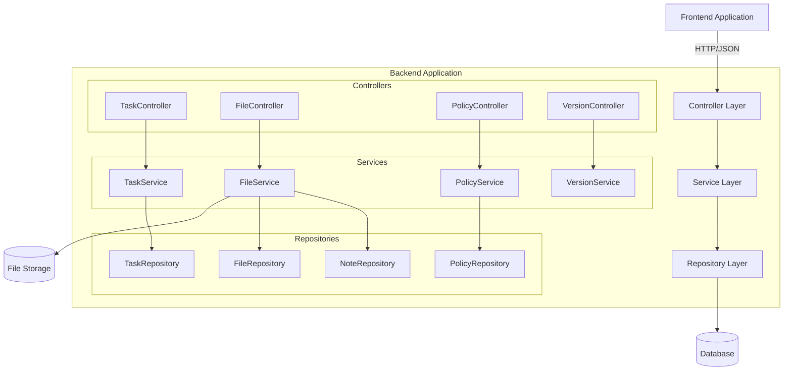

# Design Document: Backend API Fixes

## Overview

本设计文档描述了后端API修复和增强功能的技术实现方案。系统将修复任务创建API的字段不匹配问题、解决文件上传后图片丢失的问题、添加服务条款和隐私政策页面、实现真实的版本检查功能，并标准化错误处理机制。

设计采用分层架构，包括：
- **Controller层**：处理HTTP请求和响应
- **Service层**：实现业务逻辑
- **Repository层**：处理数据持久化
- **Model层**：定义数据结构

所有修复将保持向后兼容性，并遵循RESTful API设计原则。

## Architecture

### 系统架构图



### 架构决策

1. **分层架构**：采用经典的三层架构（Controller-Service-Repository），确保关注点分离和可测试性
2. **依赖注入**：使用Spring框架的依赖注入机制，提高模块间的解耦
3. **统一异常处理**：使用全局异常处理器（@ControllerAdvice）统一处理所有异常
4. **文件存储抽象**：FileService提供存储抽象，支持本地文件系统或云存储的切换

## Components and Interfaces

### 1. Task API组件

#### TaskController

```java
@RestController
@RequestMapping("/api/tasks")
public class TaskController {
    
    @PostMapping
    public ResponseEntity<TaskResponse> createTask(
        @RequestBody @Valid TaskCreateRequest request,
        @AuthenticationPrincipal UserDetails userDetails
    );
    
    @GetMapping("/{id}")
    public ResponseEntity<TaskResponse> getTask(@PathVariable Long id);
    
    @PutMapping("/{id}")
    public ResponseEntity<TaskResponse> updateTask(
        @PathVariable Long id,
        @RequestBody @Valid TaskUpdateRequest request
    );
    
    @DeleteMapping("/{id}")
    public ResponseEntity<Void> deleteTask(@PathVariable Long id);
}
```

#### TaskCreateRequest DTO

```java
public class TaskCreateRequest {
    @NotBlank(message = "标题不能为空")
    @Size(max = 200, message = "标题长度不能超过200字符")
    private String title;
    
    @Size(max = 2000, message = "描述长度不能超过2000字符")
    private String description;
    
    @NotBlank(message = "分类不能为空")
    private String category;
    
    @NotNull(message = "allowAnonymous字段不能为空")
    private Boolean allowAnonymous;
    
    @NotNull(message = "requireLogin字段不能为空")
    private Boolean requireLogin;
    
    @Future(message = "截止日期必须是未来时间")
    private LocalDateTime deadline;
}
```

#### TaskService

```java
@Service
public class TaskService {
    
    public TaskResponse createTask(TaskCreateRequest request, Long userId);
    
    public TaskResponse getTaskById(Long id);
    
    public TaskResponse updateTask(Long id, TaskUpdateRequest request, Long userId);
    
    public void deleteTask(Long id, Long userId);
    
    public List<TaskResponse> getUserTasks(Long userId, TaskFilter filter);
}
```

### 2. File Upload组件

#### FileController

```java
@RestController
@RequestMapping("/api/files")
public class FileController {
    
    @PostMapping("/upload")
    public ResponseEntity<FileUploadResponse> uploadFile(
        @RequestParam("file") MultipartFile file,
        @RequestParam(value = "entityType", required = false) String entityType,
        @RequestParam(value = "entityId", required = false) Long entityId,
        @AuthenticationPrincipal UserDetails userDetails
    );
    
    @GetMapping("/{fileId}")
    public ResponseEntity<Resource> downloadFile(@PathVariable Long fileId);
    
    @DeleteMapping("/{fileId}")
    public ResponseEntity<Void> deleteFile(
        @PathVariable Long fileId,
        @AuthenticationPrincipal UserDetails userDetails
    );
}
```

#### FileService

```java
@Service
public class FileService {
    
    public FileUploadResponse uploadFile(
        MultipartFile file, 
        String entityType, 
        Long entityId, 
        Long userId
    );
    
    public Resource loadFileAsResource(Long fileId);
    
    public void deleteFile(Long fileId, Long userId);
    
    public List<FileMetadata> getFilesByEntity(String entityType, Long entityId);
    
    // 内部方法
    private String generateUniqueFileName(String originalFilename);
    
    private void validateFile(MultipartFile file);
    
    private String storeFile(MultipartFile file, String uniqueFilename);
}
```

#### FileUploadResponse DTO

```java
public class FileUploadResponse {
    private Long fileId;
    private String fileName;
    private String fileUrl;
    private String contentType;
    private Long size;
    private LocalDateTime uploadedAt;
}
```

### 3. Note System组件

#### NoteService增强

```java
@Service
public class NoteService {
    
    public NoteResponse createNote(NoteCreateRequest request, Long userId);
    
    public NoteResponse updateNote(Long id, NoteUpdateRequest request, Long userId);
    
    public NoteResponse getNoteById(Long id, Long userId);
    
    // 新增：关联文件到笔记
    public void attachFilesToNote(Long noteId, List<Long> fileIds);
    
    // 新增：获取笔记的所有文件
    public List<FileMetadata> getNoteFiles(Long noteId);
}
```

### 4. Policy Pages组件

#### PolicyController

```java
@RestController
@RequestMapping("/api/policies")
public class PolicyController {
    
    @GetMapping("/terms")
    public ResponseEntity<PolicyResponse> getTermsOfService();
    
    @GetMapping("/privacy")
    public ResponseEntity<PolicyResponse> getPrivacyPolicy();
    
    @PutMapping("/terms")
    @PreAuthorize("hasRole('ADMIN')")
    public ResponseEntity<PolicyResponse> updateTermsOfService(
        @RequestBody @Valid PolicyUpdateRequest request
    );
    
    @PutMapping("/privacy")
    @PreAuthorize("hasRole('ADMIN')")
    public ResponseEntity<PolicyResponse> updatePrivacyPolicy(
        @RequestBody @Valid PolicyUpdateRequest request
    );
}
```

#### PolicyService

```java
@Service
public class PolicyService {
    
    public PolicyResponse getPolicy(PolicyType type);
    
    public PolicyResponse updatePolicy(PolicyType type, String content, Long adminUserId);
    
    public List<PolicyVersion> getPolicyHistory(PolicyType type);
}
```

#### PolicyResponse DTO

```java
public class PolicyResponse {
    private Long id;
    private PolicyType type;
    private String content;
    private String version;
    private LocalDateTime lastUpdated;
    private LocalDateTime effectiveDate;
}
```

### 5. Version Check组件

#### VersionController

```java
@RestController
@RequestMapping("/api/version")
public class VersionController {
    
    @GetMapping("/check")
    public ResponseEntity<VersionCheckResponse> checkVersion(
        @RequestParam("currentVersion") String currentVersion,
        @RequestParam(value = "platform", required = false) String platform
    );
    
    @GetMapping("/current")
    public ResponseEntity<VersionInfo> getCurrentVersion();
}
```

#### VersionService

```java
@Service
public class VersionService {
    
    public VersionCheckResponse checkForUpdates(String currentVersion, String platform);
    
    public VersionInfo getCurrentVersion();
    
    public VersionInfo getLatestVersion(String platform);
    
    // 内部方法
    private int compareVersions(String version1, String version2);
    
    private boolean isNewerVersion(String current, String latest);
}
```

#### VersionCheckResponse DTO

```java
public class VersionCheckResponse {
    private String currentVersion;
    private String latestVersion;
    private boolean updateAvailable;
    private String downloadUrl;
    private String releaseNotes;
    private LocalDateTime releaseDate;
    private boolean mandatory;
}
```

### 6. 统一错误处理组件

#### GlobalExceptionHandler

```java
@RestControllerAdvice
public class GlobalExceptionHandler {
    
    @ExceptionHandler(MethodArgumentNotValidException.class)
    public ResponseEntity<ErrorResponse> handleValidationException(
        MethodArgumentNotValidException ex
    );
    
    @ExceptionHandler(ResourceNotFoundException.class)
    public ResponseEntity<ErrorResponse> handleResourceNotFoundException(
        ResourceNotFoundException ex
    );
    
    @ExceptionHandler(UnauthorizedException.class)
    public ResponseEntity<ErrorResponse> handleUnauthorizedException(
        UnauthorizedException ex
    );
    
    @ExceptionHandler(ForbiddenException.class)
    public ResponseEntity<ErrorResponse> handleForbiddenException(
        ForbiddenException ex
    );
    
    @ExceptionHandler(FileStorageException.class)
    public ResponseEntity<ErrorResponse> handleFileStorageException(
        FileStorageException ex
    );
    
    @ExceptionHandler(Exception.class)
    public ResponseEntity<ErrorResponse> handleGenericException(Exception ex);
}
```

#### ErrorResponse DTO

```java
public class ErrorResponse {
    private int code;
    private String message;
    private Long timestamp;
    private Map<String, String> fieldErrors; // 用于验证错误
    private String path; // 请求路径
}
```

## Data Models

### Task Model (更新)

```java
@Entity
@Table(name = "tasks")
public class Task {
    @Id
    @GeneratedValue(strategy = GenerationType.IDENTITY)
    private Long id;
    
    @Column(nullable = false, length = 200)
    private String title;
    
    @Column(length = 2000)
    private String description;
    
    @Column(nullable = false)
    private String category;
    
    @Column(nullable = false)
    private Boolean allowAnonymous;
    
    @Column(nullable = false)
    private Boolean requireLogin;
    
    @Column
    private LocalDateTime deadline;
    
    @ManyToOne(fetch = FetchType.LAZY)
    @JoinColumn(name = "user_id", nullable = false)
    private User creator;
    
    @Column(nullable = false)
    private LocalDateTime createdAt;
    
    @Column(nullable = false)
    private LocalDateTime updatedAt;
    
    @Enumerated(EnumType.STRING)
    @Column(nullable = false)
    private TaskStatus status;
}
```

### File Model (新增)

```java
@Entity
@Table(name = "files")
public class File {
    @Id
    @GeneratedValue(strategy = GenerationType.IDENTITY)
    private Long id;
    
    @Column(nullable = false, unique = true)
    private String uniqueFileName;
    
    @Column(nullable = false)
    private String originalFileName;
    
    @Column(nullable = false)
    private String storagePath;
    
    @Column(nullable = false)
    private String contentType;
    
    @Column(nullable = false)
    private Long fileSize;
    
    @Column
    private String entityType; // "note", "task", etc.
    
    @Column
    private Long entityId;
    
    @ManyToOne(fetch = FetchType.LAZY)
    @JoinColumn(name = "uploaded_by", nullable = false)
    private User uploadedBy;
    
    @Column(nullable = false)
    private LocalDateTime uploadedAt;
    
    @Column(nullable = false)
    private Boolean deleted;
}
```

### Note Model (更新)

```java
@Entity
@Table(name = "notes")
public class Note {
    @Id
    @GeneratedValue(strategy = GenerationType.IDENTITY)
    private Long id;
    
    @Column(nullable = false)
    private String title;
    
    @Column(columnDefinition = "TEXT")
    private String content;
    
    @ManyToOne(fetch = FetchType.LAZY)
    @JoinColumn(name = "user_id", nullable = false)
    private User author;
    
    @OneToMany(mappedBy = "entityId", cascade = CascadeType.ALL)
    @Where(clause = "entity_type = 'note' AND deleted = false")
    private List<File> attachedFiles;
    
    @Column(nullable = false)
    private LocalDateTime createdAt;
    
    @Column(nullable = false)
    private LocalDateTime updatedAt;
}
```

### Policy Model (新增)

```java
@Entity
@Table(name = "policies")
public class Policy {
    @Id
    @GeneratedValue(strategy = GenerationType.IDENTITY)
    private Long id;
    
    @Enumerated(EnumType.STRING)
    @Column(nullable = false, unique = true)
    private PolicyType type;
    
    @Column(columnDefinition = "TEXT", nullable = false)
    private String content;
    
    @Column(nullable = false)
    private String version;
    
    @Column(nullable = false)
    private LocalDateTime lastUpdated;
    
    @Column(nullable = false)
    private LocalDateTime effectiveDate;
    
    @ManyToOne(fetch = FetchType.LAZY)
    @JoinColumn(name = "updated_by")
    private User updatedBy;
}

public enum PolicyType {
    TERMS_OF_SERVICE,
    PRIVACY_POLICY
}
```

### Version Model (新增)

```java
@Entity
@Table(name = "app_versions")
public class AppVersion {
    @Id
    @GeneratedValue(strategy = GenerationType.IDENTITY)
    private Long id;
    
    @Column(nullable = false)
    private String version;
    
    @Column
    private String platform; // "web", "android", "ios", null for all
    
    @Column(nullable = false)
    private String downloadUrl;
    
    @Column(columnDefinition = "TEXT")
    private String releaseNotes;
    
    @Column(nullable = false)
    private LocalDateTime releaseDate;
    
    @Column(nullable = false)
    private Boolean mandatory;
    
    @Column(nullable = false)
    private Boolean active;
}
```

## Database Schema Changes

### 需要执行的数据库迁移

```sql
-- 1. 更新tasks表，添加新字段
ALTER TABLE tasks 
ADD COLUMN allow_anonymous BOOLEAN NOT NULL DEFAULT false,
ADD COLUMN require_login BOOLEAN NOT NULL DEFAULT true;

-- 2. 创建files表
CREATE TABLE files (
    id BIGINT PRIMARY KEY AUTO_INCREMENT,
    unique_file_name VARCHAR(255) NOT NULL UNIQUE,
    original_file_name VARCHAR(255) NOT NULL,
    storage_path VARCHAR(500) NOT NULL,
    content_type VARCHAR(100) NOT NULL,
    file_size BIGINT NOT NULL,
    entity_type VARCHAR(50),
    entity_id BIGINT,
    uploaded_by BIGINT NOT NULL,
    uploaded_at TIMESTAMP NOT NULL,
    deleted BOOLEAN NOT NULL DEFAULT false,
    FOREIGN KEY (uploaded_by) REFERENCES users(id),
    INDEX idx_entity (entity_type, entity_id),
    INDEX idx_uploaded_by (uploaded_by)
);

-- 3. 创建policies表
CREATE TABLE policies (
    id BIGINT PRIMARY KEY AUTO_INCREMENT,
    type VARCHAR(50) NOT NULL UNIQUE,
    content TEXT NOT NULL,
    version VARCHAR(20) NOT NULL,
    last_updated TIMESTAMP NOT NULL,
    effective_date TIMESTAMP NOT NULL,
    updated_by BIGINT,
    FOREIGN KEY (updated_by) REFERENCES users(id)
);

-- 4. 创建app_versions表
CREATE TABLE app_versions (
    id BIGINT PRIMARY KEY AUTO_INCREMENT,
    version VARCHAR(20) NOT NULL,
    platform VARCHAR(20),
    download_url VARCHAR(500) NOT NULL,
    release_notes TEXT,
    release_date TIMESTAMP NOT NULL,
    mandatory BOOLEAN NOT NULL DEFAULT false,
    active BOOLEAN NOT NULL DEFAULT true,
    UNIQUE KEY unique_version_platform (version, platform)
);

-- 5. 插入默认政策数据
INSERT INTO policies (type, content, version, last_updated, effective_date) VALUES
('TERMS_OF_SERVICE', '<h1>服务条款</h1><p>待更新...</p>', '1.0', NOW(), NOW()),
('PRIVACY_POLICY', '<h1>隐私政策</h1><p>待更新...</p>', '1.0', NOW(), NOW());

-- 6. 插入当前版本信息
INSERT INTO app_versions (version, platform, download_url, release_notes, release_date, mandatory, active) VALUES
('1.0.0', NULL, 'https://example.com/download', '初始版本', NOW(), false, true);
```


## Correctness Properties

属性（Property）是关于系统行为的特征或规则，应该在所有有效执行中保持为真。属性是人类可读规范和机器可验证正确性保证之间的桥梁。通过属性测试，我们可以验证系统在各种输入下的通用正确性，而不仅仅是特定的例子。

### Property 1: 任务创建字段完整性

*对于任何*包含所有必需字段（title、description、category、allowAnonymous、requireLogin、deadline）的有效任务创建请求，API应该成功创建任务并返回201状态码，且返回的任务对象应该包含所有提交的字段值以及生成的ID和时间戳。

**Validates: Requirements 1.1, 1.2, 1.3, 1.6**

### Property 2: 任务字段持久化一致性

*对于任何*成功创建的任务，从数据库检索该任务时，所有字段值（特别是allowAnonymous和requireLogin）应该与创建时提交的值完全一致。

**Validates: Requirements 1.2, 1.3**

### Property 3: 输入验证拒绝无效数据

*对于任何*包含无效字段值的任务创建请求（如空标题、超长描述、过去的截止日期），API应该返回400状态码和描述性错误消息，且不应该在数据库中创建任何记录。

**Validates: Requirements 1.4**

### Property 4: 文件上传Round-Trip一致性

*对于任何*有效的文件上传请求，上传后返回的URL应该可以通过HTTP GET请求访问，且下载的文件内容应该与上传的文件内容完全一致（字节级别相同）。

**Validates: Requirements 2.1, 2.4**

### Property 5: 笔记文件关联持久化

*对于任何*包含文件引用的笔记，保存后重新检索该笔记时，应该返回所有关联的文件URL，且这些URL应该是有效可访问的。

**Validates: Requirements 2.2, 2.3**

### Property 6: 笔记删除级联标记

*对于任何*被删除的笔记，其所有关联的文件应该在数据库中被标记为deleted=true，但文件记录本身不应该被物理删除。

**Validates: Requirements 2.6**

### Property 7: 政策内容格式和版本信息

*对于任何*政策类型（服务条款或隐私政策），API响应应该包含有效的HTML内容、版本号和最后更新日期字段。

**Validates: Requirements 3.3, 3.4**

### Property 8: 政策更新版本递增

*对于任何*政策内容的更新操作，新版本的版本号应该大于旧版本，且lastUpdated时间戳应该更新为当前时间。

**Validates: Requirements 3.6**

### Property 9: 版本号比较正确性

*对于任何*两个语义化版本号（major.minor.patch格式），版本比较函数应该正确识别哪个版本更新，遵循语义化版本规范（先比较major，再比较minor，最后比较patch）。

**Validates: Requirements 4.2, 4.5**

### Property 10: 版本检查响应完整性

*对于任何*版本检查请求，响应应该包含currentVersion、latestVersion、updateAvailable标志，且当currentVersion < latestVersion时，updateAvailable应该为true并包含downloadUrl；当currentVersion >= latestVersion时，updateAvailable应该为false。

**Validates: Requirements 4.1, 4.3, 4.4**

### Property 11: 错误响应格式统一性

*对于任何*返回错误状态码（4xx或5xx）的API响应，响应体应该包含code、message和timestamp字段，且格式应该符合ErrorResponse DTO的定义。

**Validates: Requirements 5.1**

### Property 12: 验证错误详细信息

*对于任何*因字段验证失败而返回400状态码的请求，响应应该包含fieldErrors字段，其中包含每个验证失败字段的具体错误消息。

**Validates: Requirements 5.2**

### Property 13: 数据库约束强制执行

*对于任何*尝试插入违反数据库约束的数据（如NULL值插入NOT NULL字段、重复值插入UNIQUE字段），数据库应该拒绝操作并抛出异常，API应该返回适当的错误响应。

**Validates: Requirements 6.5**

### Property 14: 时区处理一致性

*对于任何*包含日期时间字段的实体，保存到数据库和从数据库检索时，时区应该保持一致（统一使用UTC），且时间值应该精确匹配（允许毫秒级别的精度）。

**Validates: Requirements 6.6**

### Property 15: 文件类型白名单验证

*对于任何*文件上传请求，如果文件的MIME类型不在配置的白名单中（如image/jpeg、image/png、image/gif），API应该返回400状态码并拒绝上传。

**Validates: Requirements 7.1**

### Property 16: 文件大小限制验证

*对于任何*文件上传请求，如果文件大小超过配置的最大限制（如10MB），API应该返回400状态码并拒绝上传，且不应该在服务器上保存任何文件数据。

**Validates: Requirements 7.2**

### Property 17: 文件名唯一性和不可预测性

*对于任何*两次文件上传（即使是相同的文件），生成的uniqueFileName应该不同，且文件名应该包含随机组件（如UUID），使其不可预测。

**Validates: Requirements 7.3**

### Property 18: 文件访问通过API端点

*对于任何*文件访问URL，URL应该指向API端点（如/api/files/{fileId}），而不是直接的文件系统路径，且访问需要通过FileController处理。

**Validates: Requirements 7.5**

### Property 19: 文件头部验证

*对于任何*上传的文件，系统应该验证文件的实际内容类型（通过文件头部魔数）与声明的MIME类型一致，如果不一致应该拒绝上传。

**Validates: Requirements 7.6**

### Property 20: 缓存数据一致性

*对于任何*被缓存的数据（如政策页面），在缓存有效期内，多次请求应该返回相同的内容；当底层数据更新时，缓存应该被失效或更新。

**Validates: Requirements 8.4**

### Property 21: API监控日志完整性

*对于任何*API请求，系统应该记录包含请求路径、HTTP方法、响应状态码、响应时间和时间戳的日志条目，用于后续监控和分析。

**Validates: Requirements 8.6**

## Error Handling

### 错误处理策略

系统采用分层的错误处理策略：

1. **Controller层**：捕获HTTP相关异常，返回适当的HTTP状态码
2. **Service层**：抛出业务逻辑异常，包含详细的错误信息
3. **Repository层**：捕获数据访问异常，转换为业务异常
4. **全局异常处理器**：统一处理所有未捕获的异常

### 自定义异常层次结构

```java
// 基础业务异常
public class BusinessException extends RuntimeException {
    private final String errorCode;
    private final HttpStatus httpStatus;
    
    public BusinessException(String message, String errorCode, HttpStatus httpStatus) {
        super(message);
        this.errorCode = errorCode;
        this.httpStatus = httpStatus;
    }
}

// 资源未找到异常
public class ResourceNotFoundException extends BusinessException {
    public ResourceNotFoundException(String resourceType, Long id) {
        super(
            String.format("%s with id %d not found", resourceType, id),
            "RESOURCE_NOT_FOUND",
            HttpStatus.NOT_FOUND
        );
    }
}

// 验证异常
public class ValidationException extends BusinessException {
    private final Map<String, String> fieldErrors;
    
    public ValidationException(String message, Map<String, String> fieldErrors) {
        super(message, "VALIDATION_ERROR", HttpStatus.BAD_REQUEST);
        this.fieldErrors = fieldErrors;
    }
}

// 文件存储异常
public class FileStorageException extends BusinessException {
    public FileStorageException(String message, Throwable cause) {
        super(message, "FILE_STORAGE_ERROR", HttpStatus.INTERNAL_SERVER_ERROR);
        initCause(cause);
    }
}

// 未授权异常
public class UnauthorizedException extends BusinessException {
    public UnauthorizedException(String message) {
        super(message, "UNAUTHORIZED", HttpStatus.UNAUTHORIZED);
    }
}

// 禁止访问异常
public class ForbiddenException extends BusinessException {
    public ForbiddenException(String message) {
        super(message, "FORBIDDEN", HttpStatus.FORBIDDEN);
    }
}
```

### 错误响应示例

**验证错误（400）：**
```json
{
    "code": 400,
    "message": "请求参数验证失败",
    "timestamp": 1769356988212,
    "path": "/api/tasks",
    "fieldErrors": {
        "title": "标题不能为空",
        "deadline": "截止日期必须是未来时间"
    }
}
```

**资源未找到（404）：**
```json
{
    "code": 404,
    "message": "Task with id 123 not found",
    "timestamp": 1769356988212,
    "path": "/api/tasks/123"
}
```

**服务器内部错误（500）：**
```json
{
    "code": 500,
    "message": "服务器内部错误",
    "timestamp": 1769356988212,
    "path": "/api/tasks"
}
```

### 日志记录策略

- **INFO级别**：记录所有API请求和响应（不包含敏感数据）
- **WARN级别**：记录业务异常和预期的错误情况
- **ERROR级别**：记录系统异常和未预期的错误，包含完整堆栈跟踪
- **敏感数据脱敏**：日志中不记录密码、令牌等敏感信息

## Testing Strategy

### 测试方法论

本项目采用双重测试策略，结合单元测试和基于属性的测试（Property-Based Testing, PBT）：

- **单元测试**：验证特定的例子、边缘情况和错误条件
- **属性测试**：验证跨所有输入的通用属性

两者是互补的，共同提供全面的测试覆盖：
- 单元测试捕获具体的bug和已知的边缘情况
- 属性测试验证通用的正确性并发现未预期的bug

### 测试框架选择

- **单元测试框架**：JUnit 5
- **属性测试框架**：jqwik（Java的Property-Based Testing库）
- **Mock框架**：Mockito
- **集成测试**：Spring Boot Test + Testcontainers（用于数据库）
- **API测试**：REST Assured

### 属性测试配置

每个属性测试必须：
1. 运行至少100次迭代（由于随机化）
2. 使用注释标签引用设计文档中的属性
3. 标签格式：`@Tag("Feature: backend-api-fixes, Property {number}: {property_text}")`

### 测试覆盖目标

- **代码覆盖率**：至少80%的行覆盖率和70%的分支覆盖率
- **API端点覆盖**：100%的端点都有集成测试
- **属性覆盖**：每个设计文档中的属性都有对应的属性测试

### 单元测试示例

```java
@SpringBootTest
class TaskServiceTest {
    
    @Autowired
    private TaskService taskService;
    
    @MockBean
    private TaskRepository taskRepository;
    
    @Test
    @DisplayName("创建任务时应该保存所有字段")
    void createTask_shouldSaveAllFields() {
        // Given
        TaskCreateRequest request = new TaskCreateRequest();
        request.setTitle("Test Task");
        request.setDescription("Test Description");
        request.setCategory("default");
        request.setAllowAnonymous(true);
        request.setRequireLogin(false);
        request.setDeadline(LocalDateTime.now().plusDays(1));
        
        // When
        TaskResponse response = taskService.createTask(request, 1L);
        
        // Then
        assertNotNull(response.getId());
        assertEquals("Test Task", response.getTitle());
        assertTrue(response.getAllowAnonymous());
        assertFalse(response.getRequireLogin());
    }
    
    @Test
    @DisplayName("空标题应该抛出验证异常")
    void createTask_withEmptyTitle_shouldThrowValidationException() {
        // Given
        TaskCreateRequest request = new TaskCreateRequest();
        request.setTitle("");
        request.setCategory("default");
        
        // When & Then
        assertThrows(ValidationException.class, () -> {
            taskService.createTask(request, 1L);
        });
    }
}
```

### 属性测试示例

```java
@PropertyBasedTest
@Tag("Feature: backend-api-fixes, Property 1: 任务创建字段完整性")
class TaskCreationPropertyTest {
    
    @Autowired
    private TaskService taskService;
    
    @Property(tries = 100)
    void taskCreation_shouldPreserveAllFields(
        @ForAll @StringLength(min = 1, max = 200) String title,
        @ForAll @StringLength(max = 2000) String description,
        @ForAll boolean allowAnonymous,
        @ForAll boolean requireLogin
    ) {
        // Given
        TaskCreateRequest request = new TaskCreateRequest();
        request.setTitle(title);
        request.setDescription(description);
        request.setCategory("default");
        request.setAllowAnonymous(allowAnonymous);
        request.setRequireLogin(requireLogin);
        request.setDeadline(LocalDateTime.now().plusDays(1));
        
        // When
        TaskResponse response = taskService.createTask(request, 1L);
        
        // Then
        assertNotNull(response.getId());
        assertEquals(title, response.getTitle());
        assertEquals(description, response.getDescription());
        assertEquals(allowAnonymous, response.getAllowAnonymous());
        assertEquals(requireLogin, response.getRequireLogin());
        assertNotNull(response.getCreatedAt());
    }
}
```

```java
@PropertyBasedTest
@Tag("Feature: backend-api-fixes, Property 4: 文件上传Round-Trip一致性")
class FileUploadPropertyTest {
    
    @Autowired
    private FileService fileService;
    
    @Property(tries = 100)
    void fileUpload_shouldPreserveContent(
        @ForAll @ByteArrayLength(min = 1, max = 1024 * 1024) byte[] fileContent,
        @ForAll @From("validImageMimeTypes") String mimeType
    ) {
        // Given
        MockMultipartFile file = new MockMultipartFile(
            "file",
            "test.jpg",
            mimeType,
            fileContent
        );
        
        // When
        FileUploadResponse uploadResponse = fileService.uploadFile(file, "note", 1L, 1L);
        Resource downloadedFile = fileService.loadFileAsResource(uploadResponse.getFileId());
        
        // Then
        assertNotNull(uploadResponse.getFileId());
        assertNotNull(uploadResponse.getFileUrl());
        assertArrayEquals(fileContent, downloadedFile.getInputStream().readAllBytes());
    }
    
    @Provide
    Arbitrary<String> validImageMimeTypes() {
        return Arbitraries.of("image/jpeg", "image/png", "image/gif");
    }
}
```

```java
@PropertyBasedTest
@Tag("Feature: backend-api-fixes, Property 9: 版本号比较正确性")
class VersionComparisonPropertyTest {
    
    @Autowired
    private VersionService versionService;
    
    @Property(tries = 100)
    void versionComparison_shouldFollowSemanticVersioning(
        @ForAll @IntRange(min = 0, max = 10) int major1,
        @ForAll @IntRange(min = 0, max = 10) int minor1,
        @ForAll @IntRange(min = 0, max = 10) int patch1,
        @ForAll @IntRange(min = 0, max = 10) int major2,
        @ForAll @IntRange(min = 0, max = 10) int minor2,
        @ForAll @IntRange(min = 0, max = 10) int patch2
    ) {
        // Given
        String version1 = String.format("%d.%d.%d", major1, minor1, patch1);
        String version2 = String.format("%d.%d.%d", major2, minor2, patch2);
        
        // When
        int comparisonResult = versionService.compareVersions(version1, version2);
        
        // Then
        if (major1 > major2) {
            assertTrue(comparisonResult > 0);
        } else if (major1 < major2) {
            assertTrue(comparisonResult < 0);
        } else if (minor1 > minor2) {
            assertTrue(comparisonResult > 0);
        } else if (minor1 < minor2) {
            assertTrue(comparisonResult < 0);
        } else if (patch1 > patch2) {
            assertTrue(comparisonResult > 0);
        } else if (patch1 < patch2) {
            assertTrue(comparisonResult < 0);
        } else {
            assertEquals(0, comparisonResult);
        }
    }
}
```

### 集成测试策略

```java
@SpringBootTest(webEnvironment = SpringBootTest.WebEnvironment.RANDOM_PORT)
@Testcontainers
class TaskApiIntegrationTest {
    
    @Container
    static PostgreSQLContainer<?> postgres = new PostgreSQLContainer<>("postgres:15");
    
    @Autowired
    private TestRestTemplate restTemplate;
    
    @Test
    void createTask_withValidData_shouldReturn201() {
        // Given
        TaskCreateRequest request = new TaskCreateRequest();
        request.setTitle("Integration Test Task");
        request.setCategory("default");
        request.setAllowAnonymous(false);
        request.setRequireLogin(true);
        request.setDeadline(LocalDateTime.now().plusDays(1));
        
        HttpHeaders headers = new HttpHeaders();
        headers.setBearerAuth("valid-jwt-token");
        HttpEntity<TaskCreateRequest> entity = new HttpEntity<>(request, headers);
        
        // When
        ResponseEntity<TaskResponse> response = restTemplate.postForEntity(
            "/api/tasks",
            entity,
            TaskResponse.class
        );
        
        // Then
        assertEquals(HttpStatus.CREATED, response.getStatusCode());
        assertNotNull(response.getBody());
        assertNotNull(response.getBody().getId());
    }
}
```

### 测试数据生成策略

对于属性测试，使用jqwik的生成器：
- **字符串**：使用`@StringLength`控制长度
- **数字**：使用`@IntRange`、`@LongRange`控制范围
- **日期时间**：使用自定义生成器生成未来日期
- **枚举**：使用`Arbitraries.of()`从枚举值中选择
- **复杂对象**：使用`Combinators`组合多个生成器

### 持续集成中的测试

- 每次提交都运行所有单元测试和属性测试
- 每天运行一次完整的集成测试套件
- 属性测试在CI中使用更多迭代（500次）以发现更多边缘情况
- 测试失败时，保存失败的随机种子以便重现

### 测试优先级

1. **高优先级**：核心业务逻辑（任务创建、文件上传）
2. **中优先级**：错误处理、验证逻辑
3. **低优先级**：辅助功能（政策页面、版本检查）

所有优先级的测试都必须通过才能合并代码。
