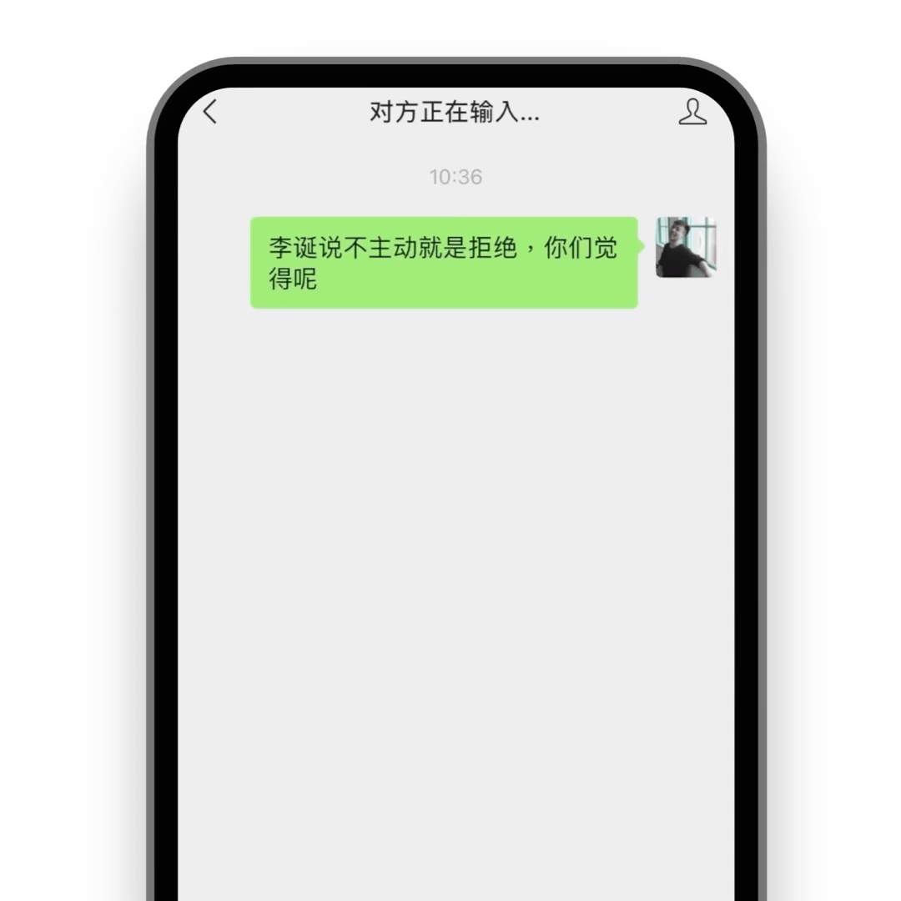
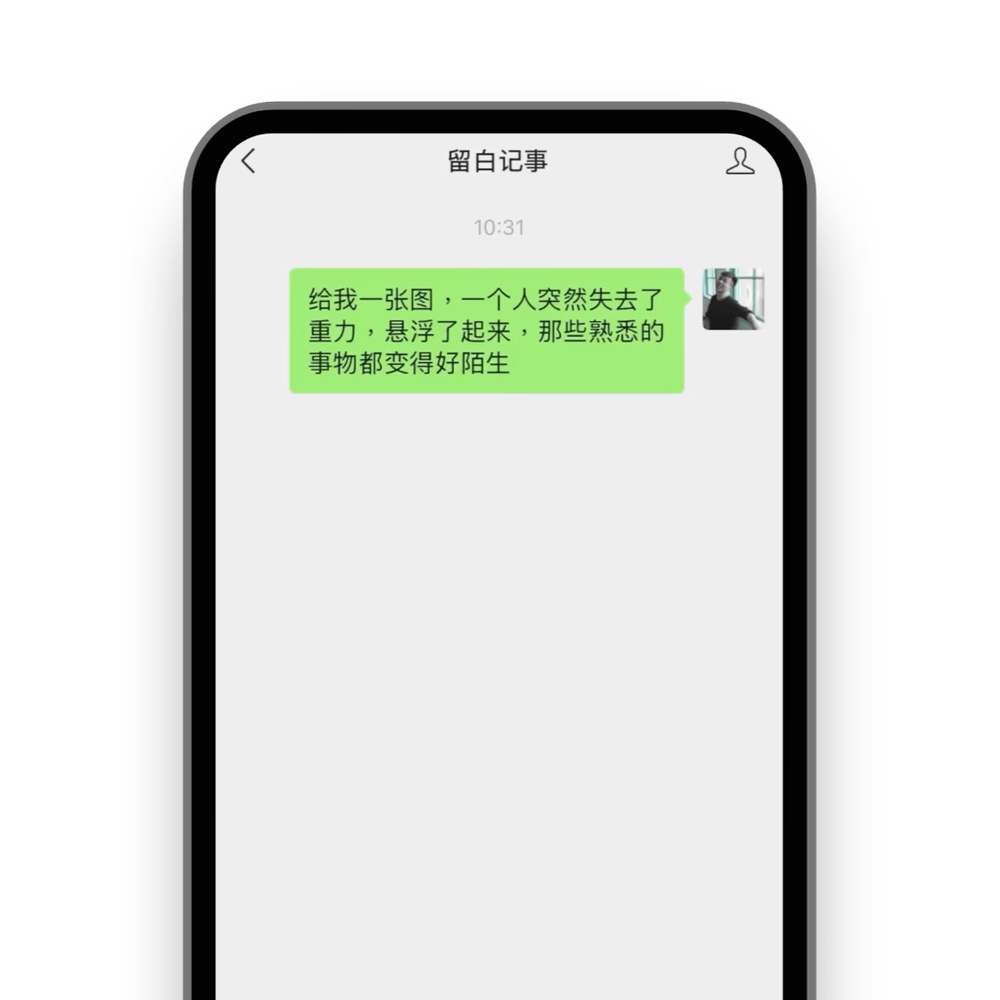

<div align="center">

  

  <h1>如是 (Thus-Note)</h1>

  <p><strong>你的笔记 + 日程 + 待办清单 + 任务 with AI</strong></p>

  <p><em>如是记录，真实自我</em></p>

  [](./LICENSE)
  [](https://nodejs.org/)
  [](https://www.typescriptlang.org/)
  [](https://vuejs.org/)
  [](https://github.com/poboll/thus-note/stargazers)
  [](https://github.com/poboll/thus-note/network/members)

  [](https://github.com/poboll/thus-note/issues)
  [](https://github.com/poboll/thus-note/pulls)
  [](https://github.com/poboll/thus-note/releases)

  [](https://biomejs.dev/)
  [](http://makeapullrequest.com)

</div>

---

## 📖 目录

- [项目简介](#-项目简介)
- [核心特性](#-核心特性)
- [技术栈](#-技术栈)
- [快速开始](#-快速开始)
- [项目架构](#-项目架构)
- [开发指南](#-开发指南)
- [部署指南](#-部署指南)
- [API 文档](#-api-文档)
- [功能展示](#-功能展示)
- [贡献指南](#-贡献指南)
- [常见问题](#-常见问题)
- [许可证](#-许可证)
- [致谢](#-致谢)

---

## 📝 项目简介

> 本项目基于 [Liubai](https://github.com/yenche123/liubai) 开源项目进行二次开发，遵循 AGPL-3.0 开源协议。
> 
> 感谢原作者 [@yenche123](https://github.com/yenche123) 的优秀工作！

**如是 (Thus-Note)** 是一个专注于真实记录的个人信息管理系统，秉承"如是我闻"的理念，帮助用户记录真实的想法和生活。我们致力于打造一个功能强大、易于使用、隐私安全的个人知识管理平台。

### 🎯 设计理念

- **真实记录**: 鼓励用户记录真实的想法和生活，而非完美的展示
- **原子化管理**: 每一条记录都是独立的原子单元，可以自由组合和关联
- **隐私优先**: 用户对自己的数据拥有完全的控制权
- **多端同步**: 支持多平台无缝同步，随时随地访问
- **AI 赋能**: 集成多个 AI 模型，提供智能辅助功能

###  在线体验

- **Web 应用**: [https://thus-note.example.com](https://thus-note.example.com) (开发中)
- **使用文档**: [https://docs.thus-note.example.com](https://docs.thus-note.example.com) (开发中)

---

## ✨ 核心特性

### 📊 信息管理

- **原子化记录**: 文本、图片、多级标签、状态、文件，灵活组合
- **多维度组织**: 支持标签、状态、时间等多维度信息组织
- **富文本编辑**: 支持 Markdown 语法的富文本编辑器
- **智能搜索**: 全文搜索，快速定位所需内容
- **版本历史**: 自动保存内容历史，随时回溯

### ☁️ 云端同步

- **实时同步**: 多设备无缝同步，数据永不丢失
- **冲突解决**: 智能合并冲突数据，保护用户内容
- **离线优先**: PWA 技术，断网也能正常使用，联网自动同步
- **增量同步**: 仅同步变更内容，节省流量和时间

### 🤖 AI 智能助手

- **多模型集成**: 集成多个大模型，提供智能写作、总结、分析等功能
- **三重助手**: 写作助手、分析助手、绘图助手，全方位 AI 支持
- **智能对话**: 自然语言交互，理解用户意图
- **内容生成**: 自动生成摘要、扩写内容、翻译文本
- **隐私控制**: 可选择是否让 AI 读取特定内容

### 🔒 隐私与安全

- **隐私保护**: 支持原子化管理每张卡片，可设置"仅保存本地"或"拒绝 AI 读取"
- **数据加密**: 传输和存储全程加密
- **权限控制**: 精细化的访问权限管理
- **本地优先**: 数据优先存储在本地，云端同步可选

### 🎨 用户体验

- **响应式设计**: 支持 300px ~ 1920px 宽度的屏幕，从 📱 到 💻
- **主题切换**: 浅色/深色模式，护眼舒适
- **国际化**: 中英文界面切换
- **快捷操作**: 丰富的快捷键支持
- **流畅动画**: 精心设计的过渡动画，提升使用体验

### 🔌 多平台集成

- **Web 应用**: 现代化的浏览器端应用
- **VS Code 插件**: 在编辑器中直接记录和管理
- **微信小程序**: 随时随地记录灵感
- **第三方集成**: 支持钉钉、飞书、维格表等平台

---

## 🛠️ 技术栈

### 前端技术栈

| 技术 | 版本 | 用途 | 说明 |
|------|------|------|------|
| [Vue](https://vuejs.org/) | 3.4+ | 渐进式 JavaScript 框架 | 构建用户界面 |
| [TypeScript](https://www.typescriptlang.org/) | 5.0+ | 类型安全的 JavaScript 超集 | 提供类型检查 |
| [Vite](https://vitejs.dev/) | 5.0+ | 下一代前端构建工具 | 快速的开发体验 |
| [VueUse](https://vueuse.org/) | 10.x+ | Vue 组合式工具集 | 提供常用组合式函数 |
| [Dexie.js](https://dexie.org/) | 3.x+ | IndexedDB 封装库 | 本地数据存储 |
| [TipTap](https://tiptap.dev/) | 2.x+ | 富文本编辑器 | 提供强大的编辑功能 |
| [PWA](https://web.dev/progressive-web-apps/) | - | 渐进式 Web 应用 | 离线支持和安装 |
| [Biome](https://biomejs.dev/) | - | 代码格式化和检查 | 统一代码风格 |

### 后端技术栈

| 技术 | 版本 | 用途 | 说明 |
|------|------|------|------|
| [Node.js](https://nodejs.org/) | 20.x LTS | JavaScript 运行时 | 服务器运行环境 |
| [TypeScript](https://www.typescriptlang.org/) | 5.0+ | 类型安全的 JavaScript 超集 | 提供类型检查 |
| [Express](https://expressjs.com/) | 4.x+ | Web 应用框架 | 构建 REST API |
| [MongoDB](https://www.mongodb.com/) | 7.x+ | NoSQL 数据库 | 存储用户数据 |
| [Mongoose](https://mongoosejs.com/) | 8.x+ | MongoDB 对象建模 | 数据模型定义 |
| [Redis](https://redis.io/) | 7.x+ | 内存数据库 | 缓存和会话管理 |
| [JWT](https://jwt.io/) | - | JSON Web Token | 身份验证 |
| [Socket.io](https://socket.io/) | 4.x+ | 实时通信 | WebSocket 支持 |

### 文档技术栈

| 技术 | 版本 | 用途 | 说明 |
|------|------|------|------|
| [VitePress](https://vitepress.dev/) | 1.x+ | 静态站点生成器 | 构建文档站点 |
| [Vue](https://vuejs.org/) | 3.4+ | 前端框架 | 构建文档界面 |

### VS Code 插件技术栈

| 技术 | 版本 | 用途 | 说明 |
|------|------|------|------|
| [TypeScript](https://www.typescriptlang.org/) | 5.0+ | 开发语言 | 提供类型检查 |
| [esbuild](https://esbuild.github.io/) | - | 快速打包工具 | 构建插件 |
| [VS Code API](https://code.visualstudio.com/api) | - | VS Code 扩展 API | 扩展编辑器功能 |

### 微信小程序技术栈

| 技术 | 版本 | 用途 | 说明 |
|------|------|------|------|
| [TypeScript](https://www.typescriptlang.org/) | 5.0+ | 开发语言 | 提供类型检查 |
| [Skyline](https://developers.weixin.qq.com/miniprogram/dev/framework/skyline/) | - | 小程序渲染引擎 | 提供高性能渲染 |
| [Chat Tool API](https://developers.weixin.qq.com/miniprogram/dev/framework/open-ability/chatTool.html) | - | 聊天工具 API | 集成聊天功能 |

---

## 🚀 快速开始

### 环境要求

| 依赖 | 最低版本 | 推荐版本 | 说明 |
|------|---------|---------|------|
| Node.js | 18.0.0 | 20.x LTS | JavaScript 运行时 |
| pnpm | 8.0.0 | 9.x | 包管理器 |
| MongoDB | 5.0 | 7.x | NoSQL 数据库 |
| Redis | 6.0 | 7.x | 内存数据库 |
| Docker | 20.10+ | 最新版 | 容器化部署（可选） |

### 安装步骤

#### 1. 克隆项目

```bash
git clone https://github.com/poboll/thus-note.git
cd thus-note
```

#### 2. 安装依赖

```bash
# 安装根目录依赖
pnpm install

# 安装后端依赖
cd thus-backends/thus-server
pnpm install

# 安装前端依赖
cd ../../thus-frontends/thus-web
pnpm install

# 安装文档依赖
cd ../../thus-docs
pnpm install
```

#### 3. 配置环境变量

```bash
# 复制环境变量模板
cp thus-backends/thus-server/.env.example thus-backends/thus-server/.env

# 编辑环境变量文件
nano thus-backends/thus-server/.env
```

必要的环境变量配置：

```env
# 服务器配置
PORT=3000
NODE_ENV=development

# 数据库配置
MONGODB_URI=mongodb://localhost:27017/thus-note
REDIS_URI=redis://localhost:6379

# JWT 配置
JWT_SECRET=your-secret-key-here
JWT_ACCESS_EXPIRES=15m
JWT_REFRESH_EXPIRES=7d

# AI 服务配置（可选）
OPENAI_API_KEY=your-openai-api-key
ANTHROPIC_API_KEY=your-anthropic-api-key

# 第三方服务配置（可选）
QINIU_ACCESS_KEY=your-qiniu-access-key
QINIU_SECRET_KEY=your-qiniu-secret-key
```

#### 4. 启动服务

**方式一：使用 Docker Compose（推荐）**

```bash
# 启动所有服务
docker-compose up -d

# 查看日志
docker-compose logs -f

# 停止服务
docker-compose down
```

**方式二：手动启动**

```bash
# 1. 启动数据库服务
# MongoDB
mongod --dbpath /path/to/data

# Redis
redis-server

# 2. 启动后端服务（新终端）
cd thus-backends/thus-server
pnpm dev

# 3. 启动前端服务（新终端）
cd thus-frontends/thus-web
pnpm dev

# 4. 启动文档站点（可选，新终端）
cd thus-docs
pnpm docs:dev
```

#### 5. 访问应用

- **Web 应用**: http://localhost:5173
- **API 文档**: http://localhost:3000/api/docs
- **用户文档**: http://localhost:5174

---

## 📁 项目架构

```
thus-note/
├── thus-frontends/              # 前端项目
│   ├── thus-web/               # Web 应用 (Vue 3 + TypeScript)
│   │   ├── src/                # 源代码
│   │   │   ├── components/     # 组件
│   │   │   ├── views/          # 页面
│   │   │   ├── stores/         # 状态管理 (Pinia)
│   │   │   ├── utils/          # 工具函数
│   │   │   ├── api/            # API 接口
│   │   │   ├── composables/    # 组合式函数
│   │   │   ├── types/          # TypeScript 类型
│   │   │   └── main.ts        # 应用入口
│   │   ├── public/             # 静态资源
│   │   ├── .notes/             # 开发笔记
│   │   ├── .vscode/           # VS Code 配置
│   │   ├── package.json
│   │   ├── tsconfig.json
│   │   ├── vite.config.ts
│   │   ├── biome.json
│   │   ├── netlify.toml
│   │   └── vercel.json
│   ├── thus-vscode-extension/  # VS Code 插件
│   │   ├── src/                # 源代码
│   │   │   ├── extension.ts    # 插件入口
│   │   │   ├── commands/       # 命令
│   │   │   ├── views/          # 视图
│   │   │   ├── services/       # 服务
│   │   │   └── utils/         # 工具函数
│   │   ├── images/             # 图标资源
│   │   ├── .notes/            # 开发笔记
│   │   ├── .vscode/           # VS Code 配置
│   │   ├── package.json
│   │   ├── tsconfig.json
│   │   ├── esbuild.js
│   │   ├── eslint.config.mjs
│   │   └── CHANGELOG.md
│   └── thus-weixin/           # 微信小程序
│       ├── miniprogram/        # 小程序源码
│       │   ├── pages/          # 页面
│       │   ├── components/      # 组件
│       │   ├── utils/           # 工具函数
│       │   ├── services/        # 服务
│       │   └── app.ts          # 应用入口
│       ├── images/             # 图片资源
│       ├── .notes/             # 开发笔记
│       ├── .vscode/            # VS Code 配置
│       ├── package.json
│       ├── tsconfig.json
│       ├── project.config.json  # 微信小程序配置
│       └── project.private.config.json
├── thus-backends/              # 后端项目
│   ├── thus-server/           # Node.js 服务器
│   │   ├── src/               # 源代码
│   │   │   ├── routes/        # API 路由
│   │   │   ├── models/        # 数据模型 (Mongoose)
│   │   │   ├── services/      # 业务逻辑
│   │   │   ├── middleware/    # 中间件
│   │   │   ├── config/        # 配置
│   │   │   ├── utils/         # 工具函数
│   │   │   ├── validators/    # 数据验证
│   │   │   ├── types/         # TypeScript 类型
│   │   │   └── index.ts       # 应用入口
│   │   ├── tests/             # 测试文件
│   │   ├── logs/              # 日志文件
│   │   ├── uploads/           # 上传文件
│   │   ├── scripts/           # 脚本工具
│   │   ├── package.json
│   │   ├── tsconfig.json
│   │   ├── .env.example
│   │   ├── .env
│   │   ├── docker-compose.yml
│   │   ├── INSTALL.md
│   │   ├── QUICK_START.md
│   │   ├── USER_GUIDE.md
│   │   └── README.md
│   ├── thus-laf/              # LAF 云函数后端（已废弃）
│   │   ├── cloud-functions/   # 云函数代码
│   │   ├── types/            # 类型定义
│   │   └── LICENSE
│   └── thus-ffmpeg/           # FFmpeg 服务
│       ├── app.js             # 应用入口
│       ├── package.json
│       ├── nodeman.json       # Nodeman 配置
│       └── README.md
├── thus-docs/                 # 项目文档
│   ├── docs/                  # 文档内容
│   │   ├── guide/            # 使用指南
│   │   ├── article/          # 文章
│   │   └── connect/          # 集成指南
│   ├── .vitepress/           # VitePress 配置
│   │   ├── theme/            # 自定义主题
│   │   └── config.ts        # 站点配置
│   ├── public/               # 静态资源
│   ├── .env.template         # 环境变量模板
│   ├── .gitignore
│   ├── package.json
│   └── README.md
├── assets/                   # 资源文件
│   ├── explore/             # 功能展示图片
│   └── vsce-images/         # VS Code 插件图片
├── scripts/                  # 脚本工具
│   └── branding-replace.js  # 品牌替换脚本
├── internal/                 # 内部文档（已屏蔽）
│   ├── docs/                # 项目计划和架构文档
│   ├── backend-docs/        # 后端开发文档
│   └── references/          # 参考资料
├── .gitignore               # Git 忽略文件
├── docker-compose.yml       # Docker 编排文件
├── lerna.json              # Lerna 配置
├── package.json            # 根目录包配置
├── pnpm-lock.yaml         # pnpm 锁文件
├── LICENSE                # 开源协议
├── NOTICE                 # 版权声明
└── README.md             # 项目说明
```

---

## 👨‍💻 开发指南

### 代码规范

```bash
# 格式化代码
pnpm format

# 检查代码
pnpm lint

# 修复代码问题
pnpm lint:fix
```

### 测试

```bash
# 运行所有测试
pnpm test

# 运行后端测试
cd thus-backends/thus-server
pnpm test

# 运行前端测试
cd thus-frontends/thus-web
pnpm test

# 运行集成测试
cd thus-backends/thus-server
bash tests/integration-test.sh
```

### 构建生产版本

```bash
# 构建前端
cd thus-frontends/thus-web
pnpm build

# 构建 VS Code 插件
cd thus-frontends/thus-vscode-extension
pnpm build

# 构建微信小程序
cd thus-frontends/thus-weixin
pnpm build

# 构建后端
cd thus-backends/thus-server
pnpm build

# 构建文档
cd thus-docs
pnpm docs:build
```

### 开发流程

1. **创建功能分支**

```bash
git checkout -b feature/amazing-feature
```

2. **进行开发**

```bash
# 启动开发服务器
pnpm dev

# 进行代码修改
```

3. **提交更改**

```bash
git add .
git commit -m "feat: add amazing feature"
```

4. **推送分支**

```bash
git push origin feature/amazing-feature
```

5. **创建 Pull Request**

在 GitHub 上创建 Pull Request，等待代码审查。

---

## 🚢 部署指南

### Docker 部署

#### 使用 Docker Compose

```bash
# 构建镜像
docker-compose build

# 启动服务
docker-compose up -d

# 查看日志
docker-compose logs -f

# 停止服务
docker-compose down

# 停止并删除数据卷
docker-compose down -v
```

#### 手动部署

**后端部署**

```bash
cd thus-backends/thus-server

# 安装生产依赖
pnpm install --production

# 构建项目
pnpm build

# 启动服务
pnpm start

# 或使用 PM2
pm2 start npm --name "thus-server" -- start
```

**前端部署**

```bash
cd thus-frontends/thus-web

# 构建项目
pnpm build

# 部署 dist 目录到静态服务器
# 例如：Nginx、Apache、CDN 等
```

### 环境变量配置

生产环境需要配置以下环境变量：

| 变量名 | 说明 | 必填 | 示例 |
|--------|------|------|------|
| NODE_ENV | 运行环境 | 是 | production |
| PORT | 服务端口 | 是 | 3000 |
| MONGODB_URI | MongoDB 连接字符串 | 是 | mongodb://localhost:27017/thus-note |
| REDIS_URI | Redis 连接字符串 | 是 | redis://localhost:6379 |
| JWT_SECRET | JWT 密钥 | 是 | your-secret-key-here |
| JWT_ACCESS_EXPIRES | 访问令牌过期时间 | 否 | 15m |
| JWT_REFRESH_EXPIRES | 刷新令牌过期时间 | 否 | 7d |
| OPENAI_API_KEY | OpenAI API 密钥 | 否 | sk-... |
| ANTHROPIC_API_KEY | Anthropic API 密钥 | 否 | sk-ant-... |
| QINIU_ACCESS_KEY | 七牛云 Access Key | 否 | your-access-key |
| QINIU_SECRET_KEY | 七牛云 Secret Key | 否 | your-secret-key |
| EMAIL_HOST | SMTP 服务器 | 否 | smtp.example.com |
| EMAIL_USER | SMTP 用户名 | 否 | user@example.com |
| EMAIL_PASS | SMTP 密码 | 否 | password |

### 云平台部署

#### Vercel 部署（前端）

```bash
cd thus-frontends/thus-web

# 安装 Vercel CLI
npm i -g vercel

# 部署
vercel
```

#### Netlify 部署（前端）

```bash
cd thus-frontends/thus-web

# 安装 Netlify CLI
npm i -g netlify-cli

# 部署
netlify deploy --prod
```

#### GitHub Pages 部署（文档）

```bash
cd thus-docs

# 构建站点
pnpm docs:build

# 将 .vitepress/dist 目录推送到 GitHub Pages
```

---

## 📚 API 文档

### RESTful API

后端提供 RESTful API 接口，主要包括：

#### 认证相关 (`/api/auth/*`)

- `POST /api/auth/register` - 用户注册
- `POST /api/auth/email` - 邮箱登录
- `POST /api/auth/phone` - 手机登录
- `POST /api/auth/github` - GitHub OAuth
- `POST /api/auth/google` - Google OAuth
- `POST /api/auth/wechat/gzh` - 微信公众号登录
- `POST /api/auth/wechat/mini` - 微信小程序登录
- `POST /api/auth/refresh` - 刷新令牌
- `POST /api/auth/logout` - 用户登出
- `GET /api/auth/me` - 获取当前用户信息

#### 笔记相关 (`/api/threads/*`)

- `GET /api/threads` - 获取笔记列表
- `GET /api/threads/:id` - 获取笔记详情
- `POST /api/threads` - 创建笔记
- `PUT /api/threads/:id` - 更新笔记
- `DELETE /api/threads/:id` - 删除笔记
- `POST /api/threads/:id/archive` - 归档笔记
- `GET /api/threads/search` - 搜索笔记

#### 内容相关 (`/api/contents/*`)

- `GET /api/contents` - 获取内容列表
- `GET /api/contents/latest/:threadId` - 获取最新内容
- `GET /api/contents/history/:threadId` - 获取内容历史
- `POST /api/contents` - 创建内容
- `PUT /api/contents/:id` - 更新内容
- `POST /api/contents/:id/blocks` - 添加内容块
- `PUT /api/contents/:id/blocks/:index` - 更新内容块
- `DELETE /api/contents/:id/blocks/:index` - 删除内容块
- `DELETE /api/contents/:id` - 删除内容

#### 评论相关 (`/api/comments/*`)

- `GET /api/comments` - 获取评论列表
- `GET /api/comments/:parentId/replies` - 获取评论回复
- `POST /api/comments` - 创建评论
- `PUT /api/comments/:id` - 更新评论
- `DELETE /api/comments/:id` - 删除评论

#### 同步相关 (`/api/sync/*`)

- `POST /api/sync/get` - 获取数据
- `POST /api/sync/set` - 设置数据
- `POST /api/sync/operate` - 操作数据

#### 设置相关 (`/api/settings/*`)

- `GET /api/settings` - 获取用户设置
- `PUT /api/settings` - 更新用户设置
- `PUT /api/settings/notifications` - 更新通知设置
- `PUT /api/settings/language` - 更新语言设置
- `PUT /api/settings/theme` - 更新主题设置
- `PUT /api/settings/timezone` - 更新时区设置

#### 文件相关 (`/api/files/*`)

- `POST /api/files/upload` - 上传文件
- `GET /api/files` - 获取文件列表
- `GET /api/files/:id` - 获取文件详情
- `GET /api/files/:id/download` - 下载文件
- `DELETE /api/files/:id` - 删除文件

#### AI 相关 (`/api/ai/*`)

- `POST /api/ai/prompt` - AI 提示
- `POST /api/ai/summarize` - AI 总结
- `POST /api/ai/analyze` - AI 分析
- `POST /api/ai/translate` - AI 翻译
- `POST /api/ai/code` - AI 代码生成
- `POST /api/ai/chat` - AI 问答

#### 监控端点

- `GET /health` - 健康检查
- `GET /health/db` - 数据库状态
- `GET /metrics` - Prometheus 指标

详细的 API 文档请访问：`http://localhost:3000/api/docs`

### WebSocket API

实时通信使用 WebSocket 协议：

- **连接地址**: `ws://localhost:3000/ws`
- **事件类型**: 消息推送、实时同步、通知提醒

---

## 🎨 功能展示

<div align="center">

  
  <p>添加日程安排</p>

  
  <p>AI 智能助手对话</p>

  
  <p>卡片评论和补充</p>

  
  <p>离线模式正常使用</p>

  
  <p>原子化信息展开</p>

  
  <p>日程视图浏览</p>

  
  <p>AI 日程智能分析</p>

  
  <p>AI 绘图功能</p>

  
  <p>多设备同步</p>

  
  <p>看板任务管理</p>

</div>

---

## 🗓️ 开发计划

### 近期计划

- [ ] 后端服务器迁移完成（从 LAF 云函数到自建服务器）
- [ ] 新 UI 设计和品牌升级
- [ ] 更多 AI 模型集成（Claude、GPT-4、文心一言等）
- [ ] 移动端原生应用（iOS/Android）

### 中期计划

- [ ] 团队协作功能增强
- [ ] 插件生态系统
- [ ] 数据导入导出增强
- [ ] 更多第三方平台集成

### 长期计划

- [ ] 企业版功能
- [ ] 私有化部署方案
- [ ] 开放 API 平台
- [ ] AI 自主工作区完善

---

## 🤝 贡献指南

我们欢迎所有形式的贡献！

### 如何贡献

1. **Fork 本项目**

点击 GitHub 页面右上角的 "Fork" 按钮

2. **创建特性分支**

```bash
git checkout -b feature/amazing-feature
```

3. **提交更改**

```bash
git add .
git commit -m "feat: add amazing feature"
```

4. **推送到分支**

```bash
git push origin feature/amazing-feature
```

5. **开启 Pull Request**

在 GitHub 上创建 Pull Request，等待代码审查

### 代码规范

- 遵循项目的代码风格
- 添加必要的注释
- 编写测试用例
- 更新相关文档

### 提交信息规范

使用语义化提交信息：

- `feat`: 新功能
- `fix`: 修复 bug
- `docs`: 文档更新
- `style`: 代码格式调整
- `refactor`: 代码重构
- `test`: 测试相关
- `chore`: 构建/工具相关

示例：

```
feat: add user authentication
fix: resolve database connection issue
docs: update API documentation
style: format code with Biome
refactor: optimize database queries
test: add unit tests for user service
chore: update dependencies
```

---

## ❓ 常见问题

### 数据库连接失败

**问题**: 无法连接到 MongoDB

**解决方案**:

```bash
# 检查 MongoDB 是否运行
ps aux | grep mongod

# 检查端口是否被占用
lsof -i :27017

# 检查连接字符串
echo $MONGODB_URI

# 测试连接
mongosh "mongodb://localhost:27017/thus-note"
```

### Redis 连接失败

**问题**: 无法连接到 Redis

**解决方案**:

```bash
# 检查 Redis 是否运行
redis-cli ping

# 启动 Redis
redis-server
```

### 前端构建失败

**问题**: `pnpm build` 报错

**解决方案**:

```bash
# 清除缓存
rm -rf node_modules .vite dist
pnpm install
pnpm build
```

### 端口被占用

**问题**: 端口已被其他进程占用

**解决方案**:

```bash
# 查找占用端口的进程
lsof -i :3000

# 杀死进程
kill -9 <PID>

# 或修改环境变量中的端口
```

### 依赖安装失败

**问题**: `pnpm install` 报错

**解决方案**:

```bash
# 清除缓存
pnpm store prune

# 重新安装
rm -rf node_modules pnpm-lock.yaml
pnpm install
```

### 获取更多帮助

如果遇到问题，请：

1. 查看 [Issues](https://github.com/poboll/thus-note/issues)
2. 在 [Discussions](https://github.com/poboll/thus-note/discussions) 中提问
3. 提交 Issue 时请提供：
   - 操作系统版本
   - Node.js 版本
   - 错误日志
   - 复现步骤

---

## 📞 联系我们

- **GitHub**: https://github.com/poboll/thus-note
- **Issues**: https://github.com/poboll/thus-note/issues
- **Discussions**: https://github.com/poboll/thus-note/discussions
- **Email**: support@thus-note.example.com

<div align="center">
  <a href="https://github.com/poboll/thus-note/discussions">
    
  </a>
</div>

---

## 📄 开源许可

本项目基于 [AGPL-3.0](./LICENSE) 开源协议。

**原项目归属**: 本项目基于 [Liubai](https://github.com/yenche123/liubai) 进行二次开发，感谢原作者的贡献。

### AGPL-3.0 要点

- ✅ 商业使用
- ✅ 修改和分发
- ✅ 私人使用
- ⚠️ 必须公开源代码
- ⚠️ 必须包含许可证和版权声明
- ⚠️ 网络使用也必须提供源代码

---

## 🙏 致谢

感谢以下开源项目和贡献者：

- [Liubai](https://github.com/yenche123/liubai) - 原始项目
- [Vue.js](https://vuejs.org/) - 前端框架
- [Express](https://expressjs.com/) - 后端框架
- [MongoDB](https://www.mongodb.com/) - 数据库
- [Vite](https://vitejs.dev/) - 构建工具
- [VitePress](https://vitepress.dev/) - 文档生成器
- [TypeScript](https://www.typescriptlang.org/) - 类型安全
- [Node.js](https://nodejs.org/) - JavaScript 运行时

---

<div align="center">

  <p><strong>如是记录，真实自我 ✨</strong></p>
  <p>Made with ❤️ by <a href="https://github.com/poboll">poboll</a></p>
  <p>© 2024 Thus-Note. All rights reserved.</p>

  [⬆ 回到顶部](#如是-thus-note)

</div>
