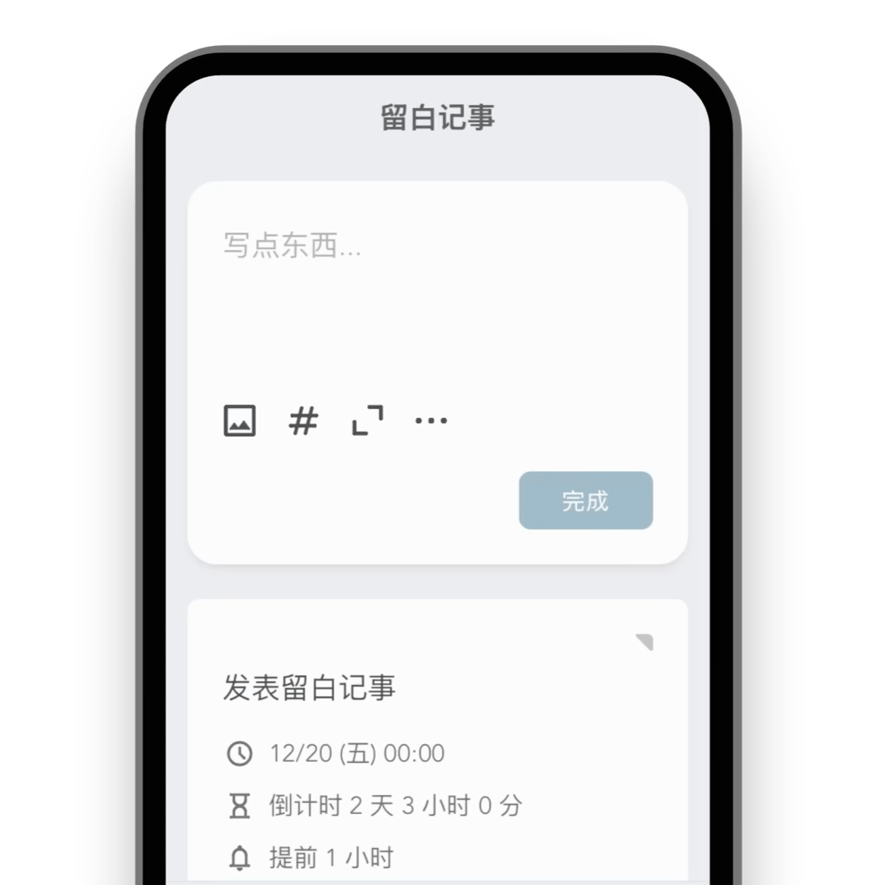

<div align="center">

  

  <h3>如是 (Thus-Note)</h3>

  <p>你的笔记 + 日程 + 待办清单 + 任务 with AI</p>

  > *如是记录，真实自我*

</div>

<br>

## 项目说明 📢

> 本项目基于 [Liubai](https://github.com/yenche123/liubai) 开源项目进行二次开发，遵循 AGPL-3.0 开源协议。
> 
> 感谢原作者 [@yenche123](https://github.com/yenche123) 的优秀工作！

**如是 (Thus-Note)** 是一个专注于真实记录的个人信息管理系统，秉承"如是我闻"的理念，帮助用户记录真实的想法和生活。

🌟 [在线体验](https://thus-note.example.com) (开发中)

📚 [使用文档](https://docs.thus-note.example.com) (开发中)

🚀 [快速开始](#快速开始)


## 核心特性 🥂

✅ **原子化记录**: 文本、图片、多级标签、状态、文件，灵活组合

✅ **云端同步**: 多设备无缝同步，数据永不丢失

✅ **响应式设计**: 支持 300px ~ 1920px 宽度的屏幕，从 📱 到 💻

✅ **AI 智能助手**: 集成多个大模型，提供智能写作、总结、分析等功能

✅ **隐私保护**: 支持原子化管理每张卡片，可设置 "仅保存本地" 或 "拒绝 AI 读取"

✅ **主题切换**: 浅色/深色模式，护眼舒适

✅ **离线优先**: PWA 技术，断网也能正常使用

✅ **多平台集成**: 支持微信、VS Code 等平台集成

✅ **国际化**: 中英文界面切换

✅ **富文本编辑**: 支持 Markdown 语法的富文本编辑器

## 快速开始 🚀

### 环境要求
- Node.js >= 18
- pnpm >= 8
- MongoDB (可选，用于后端开发)

### 安装依赖
```bash
# 克隆项目
git clone https://github.com/poboll/thus-note.git
cd thus-note

# 安装依赖
pnpm install
```

### 启动开发
```bash
# 启动前端开发服务器
cd thus-frontends/thus-web
pnpm dev

# 启动文档站点
cd thus-docs
pnpm dev
```

### 前端开发
```bash
# 进入前端目录
cd thus-frontends/thus-web

# 安装依赖
pnpm install

# 启动开发服务器
pnpm dev
```

### 后端开发
```bash
# 进入后端目录  
cd thus-backends/thus-laf

# 安装依赖
pnpm install

# 启动开发环境
pnpm dev
```

### 文档开发
```bash
# 进入文档目录
cd thus-docs

# 安装依赖
pnpm install

# 启动文档服务器
pnpm docs:dev
```

### 构建部署
```bash
# 构建前端
cd thus-frontends/thus-web
pnpm build

# 构建文档
cd thus-docs
pnpm build
```

## 📁 项目架构

```
thus-note/
├── thus-frontends/          # 前端项目
│   ├── thus-web/           # Web 应用 (Vue 3 + TypeScript)
│   ├── thus-vscode-extension/  # VS Code 插件
│   └── thus-weixin/        # 微信小程序
├── thus-backends/           # 后端项目  
│   ├── thus-laf/          # LAF 云函数后端
│   └── thus-ffmpeg/       # FFmpeg 服务
├── thus-docs/              # 项目文档
└── memory-bank/            # 实验性功能 (AI 记忆库)
```

### 技术栈

**前端 (thus-web)**
- Vue 3.x + Vite + TypeScript
- VueUse + Dexie.js + TipTap
- PWA + Service Worker
- 响应式设计

**后端 (thus-server)**  
- Node.js + TypeScript
- MongoDB 数据库
- 云函数架构 (计划迁移到自建服务器)

**文档 (thus-docs)**
- VitePress 静态站点生成

**VS Code 插件 (thus-vscode)**
- TypeScript + esbuild
- 支持 Web Extension

**微信小程序 (thus-weixin)**
- Skyline + TypeScript
- Chat Tool API 集成

> [!NOTE]
> `memory-bank/` 目录是实验性的 AI 自主工作区，完全由 AI 生成和维护，用于项目的智能化管理和文档生成。


## 联系我们 👋

- **GitHub**: https://github.com/poboll/thus-note
- **Issues**: https://github.com/poboll/thus-note/issues
- **Discussions**: https://github.com/poboll/thus-note/discussions

<p>
  <a href="https://github.com/poboll/thus-note/discussions">
    
  </a>
</p>

## 功能展示 🍭

<div align="center">

  
  <p>添加日程安排</p>

  
  <p>AI 智能助手对话</p>

  
  <p>卡片评论和补充</p>

  
  <p>离线模式正常使用</p>

  
  <p>原子化信息展开</p>

  
  <p>日程视图浏览</p>

  
  <p>AI 日程智能分析</p>

  
  <p>AI 绘图功能</p>

  
  <p>多设备同步</p>

  
  <p>看板任务管理</p>

</div>

## 开发计划 🗓️

- [ ] 后端服务器迁移 (从 LAF 云函数到自建服务器)
- [ ] 新 UI 设计和品牌升级
- [ ] 更多 AI 模型集成
- [ ] 移动端原生应用
- [ ] 团队协作功能增强
- [ ] 插件生态系统

## 贡献指南 🤝

我们欢迎所有形式的贡献！

1. Fork 本项目
2. 创建特性分支 (`git checkout -b feature/amazing-feature`)
3. 提交更改 (`git commit -m 'Add some amazing feature'`)
4. 推送到分支 (`git push origin feature/amazing-feature`)
5. 开启 Pull Request

## 开源许可 📝

本项目基于 [AGPL-3.0](./LICENSE) 开源协议。

**原项目归属**: 本项目基于 [Liubai](https://github.com/yenche123/liubai) 进行二次开发，感谢原作者的贡献。

---

<div align="center">
  <p>如是记录，真实自我 ✨</p>
  <p>Made with ❤️ by Thus-Note Team</p>
</div>

