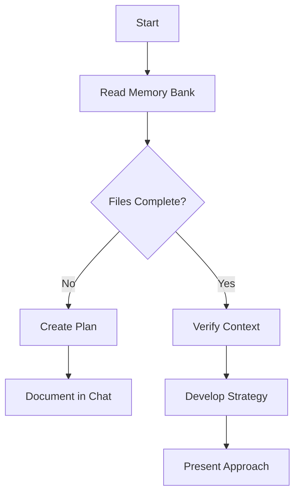
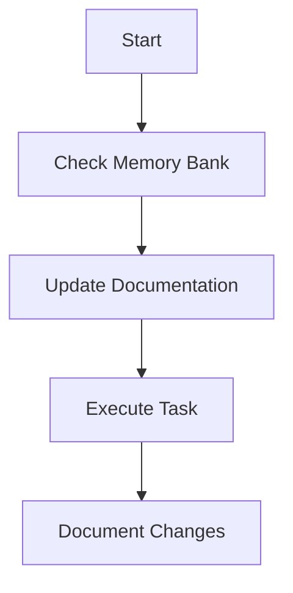
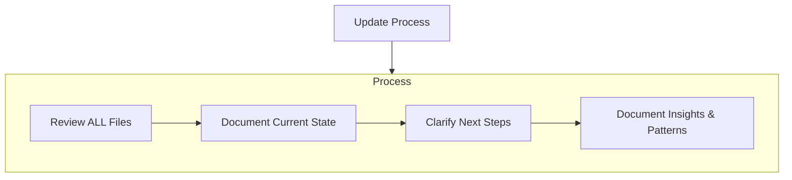

# Memory Bank Documentation System

## Overview
The Memory Bank is a comprehensive documentation system designed to maintain perfect continuity between development sessions. It serves as the single source of truth for project understanding and continuation.

## Core Philosophy
The Memory Bank operates on the principle of complete session reset - every new task begins with a fresh read of ALL Memory Bank files to ensure complete context and continuity.

## File Structure

### Core Files (Required)
1. `projectbrief.md`
   - Foundation document
   - Core requirements and goals
   - Project scope definition
   - Source of truth for project direction

2. `productContext.md`
   - Project purpose
   - Problem space
   - Solution approach
   - User experience goals

3. `activeContext.md`
   - Current work focus
   - Recent changes
   - Next steps
   - Active decisions
   - Project insights

4. `systemPatterns.md`
   - System architecture
   - Technical decisions
   - Design patterns
   - Component relationships

5. `techContext.md`
   - Technology stack
   - Development setup
   - Technical constraints
   - Dependencies

6. `progress.md`
   - Project status
   - Evolution tracking
   - Known issues
   - Decision history

### Additional Context
Create additional files/folders for:
- Feature documentation
- Integration specs
- API documentation
- Testing strategies
- Deployment procedures

## Usage Workflows

### Plan Mode

### Act Mode

## Documentation Updates

Memory Bank updates occur when:
1. Discovering new project patterns
2. After implementing significant changes
3. When user requests with **update memory bank**
4. When context needs clarification

### Update Process

## Best Practices

1. **Complete Reviews**
   - Read ALL files at task start
   - Review ALL files during updates
   - Focus on activeContext.md and progress.md

2. **Regular Updates**
   - Document new patterns immediately
   - Update after significant changes
   - Keep current state accurate

3. **Clarity First**
   - Maintain clear structure
   - Use consistent formatting
   - Keep information organized

4. **Continuous Improvement**
   - Refine documentation patterns
   - Enhance update processes
   - Develop better tools