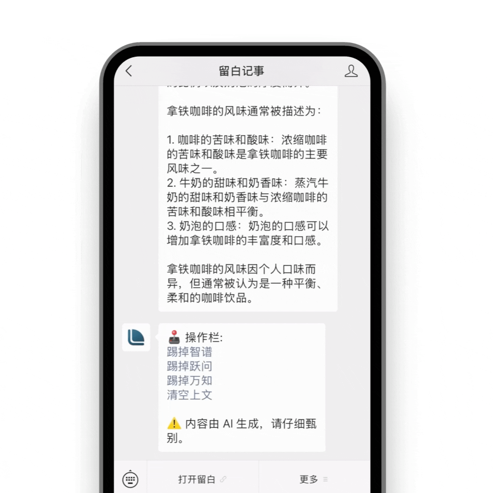
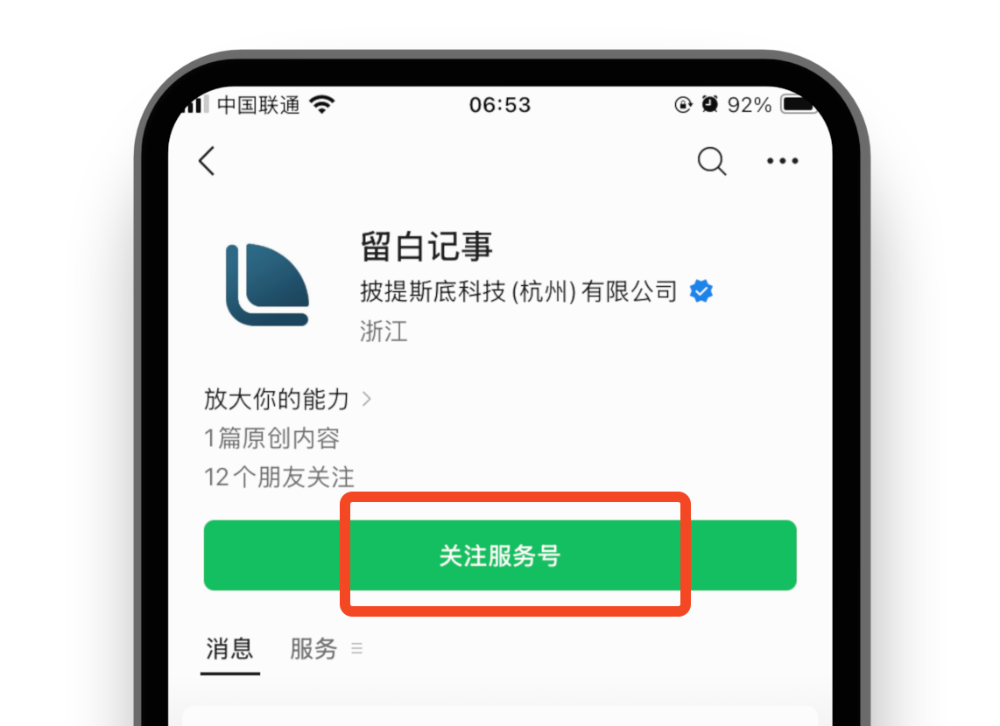
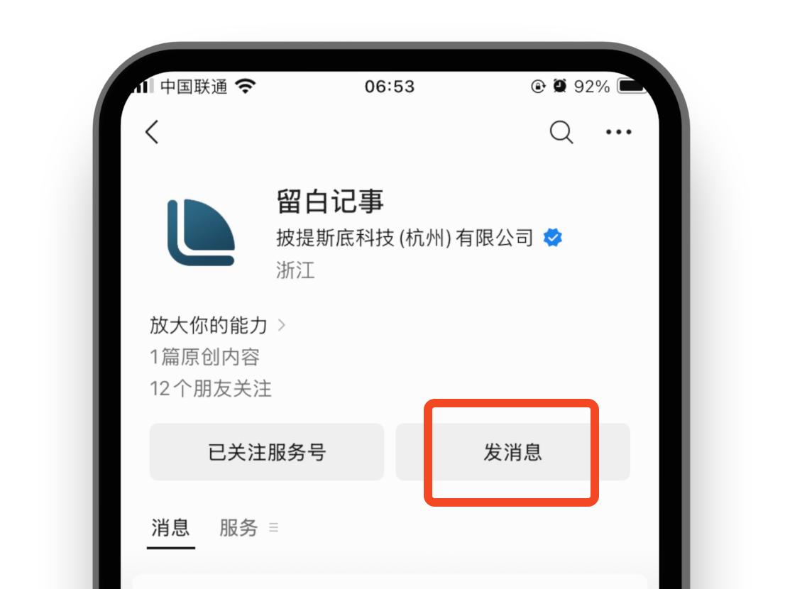
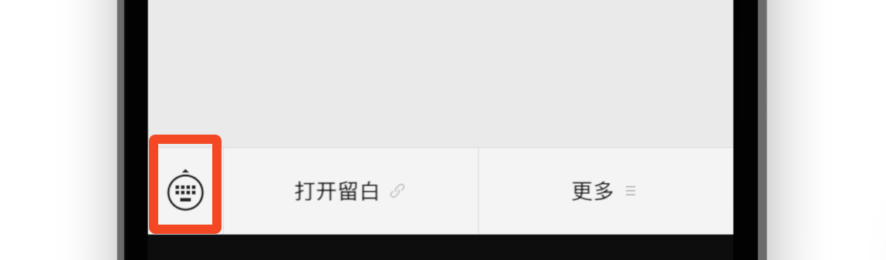
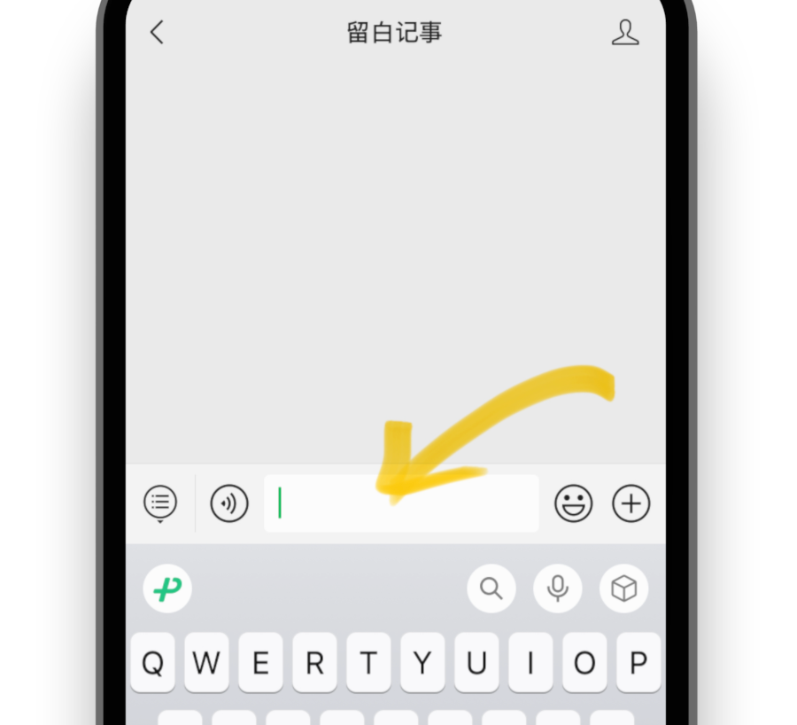
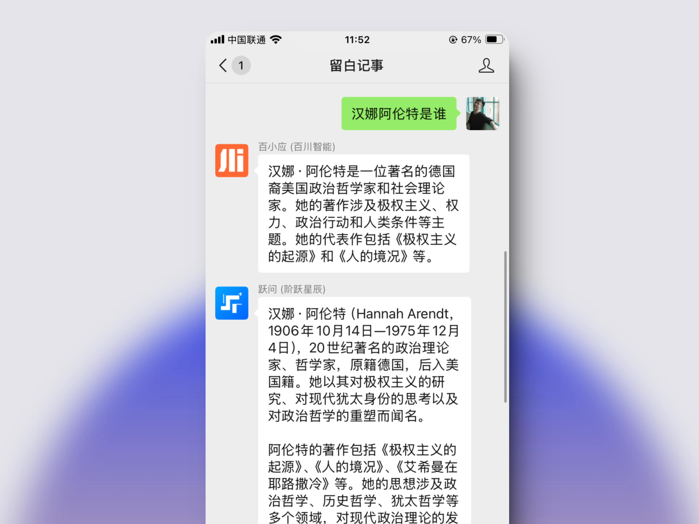

# 如何在微信对话框中，同时召唤三种大模型？

 

 

我们写了一个应用，让你在微信对话框里随时召唤 3 个大模型。

同时支持，切换模型，最多有 7 家杰出的大模型厂商供你选择。

 

基本上，发图片和收图片，我们也都适配了。

 

## 使用方式

只要 3 步：

### 1. 关注“留白记事”

扫码关注👆

### 2. 点击“发消息”

### 3. 点击底部 ⌨️ 图标

 

就这样，你拥有 3 个助手了......

 

 

## 除此之外

留白提供了搜索、创建日程、读取日程和获取最近的待办等一系列工具，供大模型们调用......

 

其中涉及隐私的处理，你可以[点击这里](./supercharge-yourself#privacy)查看详情。

 

## 最后

我们发现三个助手这样的呈现，能很好的补充上下文，供模型间互相理解。

同时，你可以对一个问题，从不同角度来审视，还可以比对不同的结果，避免字面意义上的陷入单一模型所带来的信息茧房。

> 你可以同时比对多个模型的结果，避免陷入信息茧房

本项目完全开源，非常需要你的 star! 对我们会是莫大的帮助。

[https://github.com/yenche123/liubai](https://github.com/yenche123/liubai)

祝你和你的助手们，愉悦的交流、完美的协作！

