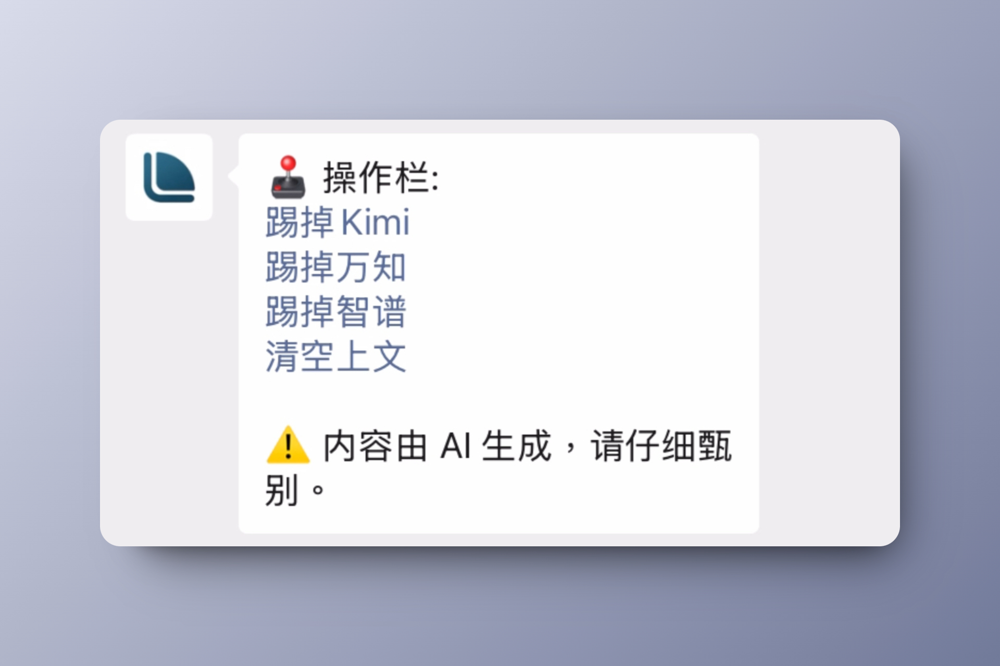

# 给你三个助手，我想放大你的能力

 

  

## 一句话介绍 {#intro}

如是 = 给你三个助手的超级记事本！

 

## 底座 {#foundation}

在留白内，万物原子化！

一张卡片可以附着：

文本、图片、文件、日期（提醒）、状态（待办或已完成）、标签……

 

这些原子化的信息，只在你需要时，以最优雅的形态呈现：

想看今日行程时，有日程。

 

想管理日常待办，有看板。

 

有常用信息（比如收件地址、发票）要存放，能收藏！

 

有一句话（like 你的精神状态）要置顶，当然也可以！

 

有补充要说明，自己来个评论吧！

 

拒绝臃肿，当你不需要时，它们都被藏在“我的”页面中。

 

留白万物原子化，只在你需要的时候出现；

但你又想要强大，那留白毫无保留全给你！

 

## 三个助手 {#three-assistants}

留白连接一切，这两年人们最想连接 AI 了。

它总是把

- 信息打破再组合（长变短）
- 信息点到线延伸（短变长）

所以你想问，我能不能在留白里使用 AI？

那我告诉你不能，因为我要让你就在微信里使用它！更准确来说“它们”！

 

你现在可以直接在微信上使用 7 家杰出大模型公司提供的智能，它们分别是（依首字母排序）：

- 百小应 (百川智能)
- DeepSeek (深度求索)
- 海螺 (MiniMax)
- Kimi (月之暗面)
- 万知 (零一万物)
- 跃问 (阶跃星辰)
- 智谱 (智谱华章)

你的疑惑，最多能被三个助手同时接住！

 

谁不回你，谁又在乱答，请直接换掉它！

 

不要这么多废话，谁说得好再“继续”！

 

可以生图吗？那必须可以！

 

有了留白底座，“帮我看一下明天的日程”

 

“晚上跟老妈通话”

 

到底怎么使用？

关注「如是」微信公众号👇，三个助手就在你的微信对话框里。

 

不用下载

不用安装

不用注册

原生地使用 AI，就这么简单！

 

## 隐私 {#privacy}

若三个助手读取了你的留白里的记事，系统消息会直接给出隐私提示。

 

“可是，有些私密的信息我完全不想被三个助手读取……”

关掉“AI可读”，通通挡在门外。

 

“这个非常机密，我想云端同步都不要”

关掉“同步到云端”，一键锁上。

 

你的数据，你的自由。

 

## 多设备、全平台 {#multi-platforms}

“该不会只有某某全家桶才能用吧……”

留白支持安卓、鸿蒙、iOS、macOS、Windows……

 

让你在各品牌手机、电脑或平板上，任意使用！

你可以[戳这里安装 App](../../guide/install/)（准确来说是“添加”），让你的数据无缝地在各设备间流转。

厂牌切换，你的自由。

 

## 离线使用 {#offline}

“赶高铁、在飞机上，能用吗？”

在留白 App 内，登录后支持离线使用。

 

开飞航、关 Wi-Fi，想使用留白，依然没问题。

本地优先，你的自由。

 

## 开源 {#open-source}

以上所有，完全开源！

访问：

[https://github.com/yenche123/thus-note](https://github.com/yenche123/thus-note)

查看源代码。

看不懂代码没关系，因为总有人能看懂（更遑论以当前 AI 的能力，代码的白话解释已经是现在进行式）。

 

开源让留白变得可审计，使上面我们所说的“切换、隐私、你的自由”都不再是口号。

没有人能忽悠得了你。

你的软件，你的自由。

 

**如是，就是要放大你的能力。**
