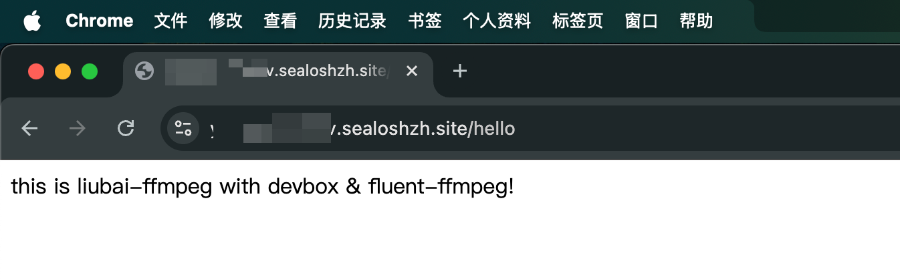

# 如何使用 devbox 实现微信语音输入

## 背景

在[留白记事](../2024/how-to-use-multi-ai-on-wechat)上，很多人们会想直接使用微信的语音输入，说的总比打字快。

与常见的 `.mp3` 和 `.wav` 格式不同，微信语音输入默认使用的是 `.amr` 格式。

下图为开发者服务器接收到来自微信的 webhook，表示公众号上有用户传来语音消息，你能看到格式即为 `.amr`。


许多 STT (Speech to Text) 服务只支持前者，这就衍生一个需求：我们如何将 `.amr` 格式的语音转换为 `.mp3` 格式？

## 解决方案

起初，我想用 `Laf` 解决，后来发现 `Laf` 定位于 **函数即服务** 的解决方案，不支持用文件系统比如 `fs` 操作服务器上的文件。

后来在 GitHub 上看到一个[解决思路](https://github.com/leegsen7/amr2mp3)：启动一个 `express` 服务，使用 `fluent-ffmpeg` 将 `.amr` 转换为 `.mp3`，再临时将文件存于服务器上供调用方使用。

这个方案的前提是，服务器上已经事先安装了 `FFmpeg`，否则 `fluent-ffmpeg` 将无法使用。

“这可不是一个简单的函数即服务”我当时心想。我自己是一个后端和运维小白，以前都是 Serverless 一把梭，专注于前端跟用户的交互。现在这可有点难到我了。

不过，我想起了 Sealos 前阵子上线的 `devbox`，宣传里似乎就是要弥补 `Laf` 这样函数即服务的不足。

“我是不是可以在 devbox 上部署如上我所说的服务呢？”于是改造（踩坑）就开始了。

## devbox 使用体感

devbox 是什么可以看[官方的介绍](https://mp.weixin.qq.com/s/X5yjgt_XQnqI4YJt59OVWA)，我这里想特别说它的开发体验。

因为这非常影响你对 `devbox` 的理解，也是我走过的弯路，所以这一段使用心得或者说结论，我放到这里论述。

在 `devbox` 上，一切开发过程都是**直连到服务器上的**。

我一开始非常不习惯，然而它的原理就是我们本地 IDE 上的 `Connect to SSH Host` 功能，我们来看一下 Claude 对此的说明：


devbox 让你免去 `记录服务器 IP 或域名` / `输入 SSH 端口号` / `输入服务器用户名或密码（或SSH密钥）` 的过程，只需要下方一键按下去即可。


我用的是 [Windsurf](http://xhslink.com/a/ZEPzwpGI1tg3)，一键按下去后，我的 Windsurf 就试图去连接到远程服务器上了。这之后你在 IDE 上的修改，实际上都是在操作远端服务器。

包括，运行 `pnpm i` 或者其他命令，全是如此。

更为重要的是，你所有的操作，包括命令的运行，最后在 Devbox Web UI 上点击 `发布版本` 时，全部（再讲一次，包括`命令的运行`）会被打包成一个 docker 镜像，相当于对当前虚拟机的状态进行一个快照。


所以我们在 devbox 开发环境上安装的所有依赖和底层软件（比如`FFmpeg`），在 `发布版本` 之后，我们在生产环境上完全无需重走一遍，而是开箱即用，所有的前置需要全都被安装好了。

当你理解这一点之后，你才终于理解为什么 `devbox` 宣传时一直说：终于不用担心生产环境时的依赖问题和版本号冲突问题了，因为生产环境完全就是开发环境的镜像！

## 动手实现

有了以上对 `devbox` 的认知后，动手实现的部分就相对简单了。

### 1. 在 devbox 上选择 express


### 2. 用 IDE 打开

如上提到的，用 `VS Code` / `Cursor` / `Windsurf` 连接到服务器上进行开发。

连接上服务器后，全选所有文件 `Cmd + A`，将默认模板文件全部删除。

### 3. 下载代码

我们刚刚选择了 `express` 的模板，所以默认 `git`, `node` 和 `pnpm` 全部安装好了。

现在我们打开 Terminal 终端，用 `git` 下载代码:

```shell
git clone https://github.com/yenche123/liubai.git
```

这里分享一个心得，你在 SSH Host 的 IDE 上输入命令，感觉会有那么一点卡卡的 delay 感，那是因为你真的在操作远程服务器上的终端，你们之间当然会有一个延时了。

以前的开发体验是，你在本地开发完毕后，再将代码打包，然后上传到服务器上；使用 `devbox` 则是一切都在服务器上操作，开发即部署。

### 4. 安装 FFmpeg

继续在 Terminal 上输入以下命令，完成 `FFmpeg` 的安装:

```shell
sudo apt update && sudo apt upgrade    # press Y to continue
sudo apt install ffmpeg                # press Y to continue
ffmpeg -version                        # verify if installed successfully
```

最后一行可以校验是否安装成功。

再说一次，这次安装完成以后，在生产环境上是无需重走一遍的，因为镜像里将会直接包含了这个软件。非常神奇吧！

### 5. 编写 entrypoint.sh


我们在根目录上，也就是跟 `liubai/` 同级的位置（如上图所示），创建一个 `entrypoint.sh` 文件，内容如下:

```shell
#!/bin/bash
cd /home/devbox/project/liubai/liubai-backends/liubai-ffmpeg
pnpm dev
```

这个文件是告知生产环境的服务器，机器启动之后，如何启动我们渴望的服务。

我们这里就是告知机器，先定位到目标文件夹 `liubai-ffmpeg` 然后再运行 `pnpm dev` 命令，去启动 `express` 服务。

### 6. 授权 entrypoint.sh

同样在根目录，我们运行以下命令，为 `entrypoint.sh` 添加可执行的权限:

```shell
chmod +x entrypoint.sh
```

### 7. 安装依赖

我们打开 `liubai-ffmpeg` 目录，来安装所需依赖：

```shell
cd /home/devbox/project/liubai/liubai-backends/liubai-ffmpeg
pnpm i
```

### 8. 在开发环境上启动服务

回到根目录上，我们来模拟一遍服务的启动：

```shell
cd /home/devbox/project
bash entrypoint.sh
```


看到如上图所示的打印消息，就说明我们已在开发环境的机器上启动了 `amr` 转 `mp3` 的服务！

我们回到 `devbox` web ui 上，复制一下公网地址:


然后在浏览器地址栏拼接 `/hello`，如果能看到如下图所示的画面，就说明给我们的服务已经成功启动了。



现在改拼接 `/new?url=你的amr文件&id=当前时间戳（毫秒）`

你就获得了一个 `amr` 转换为 `mp3` 的服务啦！

### 9. 部署到生产环境

我们在 devbox web ui 上点击 `发布版本`。


发版过程中，你的 IDE 会短暂断开连接，这是正常的。

发版后，我们点击 `上线`，按照最低配置点击完成即可。

等待几分钟后，你就拥有另一个公网可访问链接，这就是生产环境的 `amr` 转换为 `mp3` 服务啦！

## 在 devbox 上 git commit

在 devbox 上，我们可能会想开发完后提交 git commit，这个时候需要远程服务器拥有远程仓库的推送权限。

下面以 GitHub 为例，分享一下我遇到的情况。

在 Terminal 上运行 `git push origin 你的分支名` 时，Terminal 会在浏览器上打开一个 GitHub 页面，要求你输入 IDE 上的授权码，如下二图所示。


但这个操作可能会授权失败，这个时候在 IDE 右下角会弹出通知，让你用 `Personal access tokens` 进行授权，如下图所示：


授权完毕之后，再 `git push` 一下，应该就没问题了。

## 立即体验

上面提到的服务已经部署在“留白记事”上了，现在关注“留白记事”微信公众号，发送语音给它，就会调用上方提到的 `amr` 转 `mp3` 服务。

目前大模型厂商 7 小虎中，MiniMax 是允许开发者在 `messages` 中直接传入 `mp3` 格式的 `base64`。看到这里，你还不快去试试，原生地在微信中使用多模态！


## 结语

综合上文，我们使用了 `devbox` 完成了一个 `amr` 转 `mp3` 的服务。

本文的核心在于 **devbox 使用体感** 那一节，我们简单介绍了 `devbox` 与传统开发的区别，由于 `Connect to SSH Host` 的能力，我们直接操作了远程服务器，在其上完成了软件的安装和核心代码的开发。

借由 `devbox` 对底层容器的优化，它让我们拥有**开发即部署**的能力，开发完直接在开发服务器上验证结果；同时 `devbox` 能对整个虚拟器进行快照，解决了 `开发环境` 和 `生产环境` 的一致性难题，让我们在生产环境上无需重走一遍安装依赖以及底层软件的流程，达到生产环境开箱即用的效果。

对于本文有任何疑问，欢迎在评论区留言，或者在 liubai 上[提交 issue](https://github.com/yenche123/liubai/issues) 与我交流！

## 本文作者

- [Yanzhe](https://github.com/yenche123)，留白记事开发者。留白记事是一款集合多个 AI 的生产力工具，让你在微信上即可管理你的笔记、日程、任务和待办清单！


