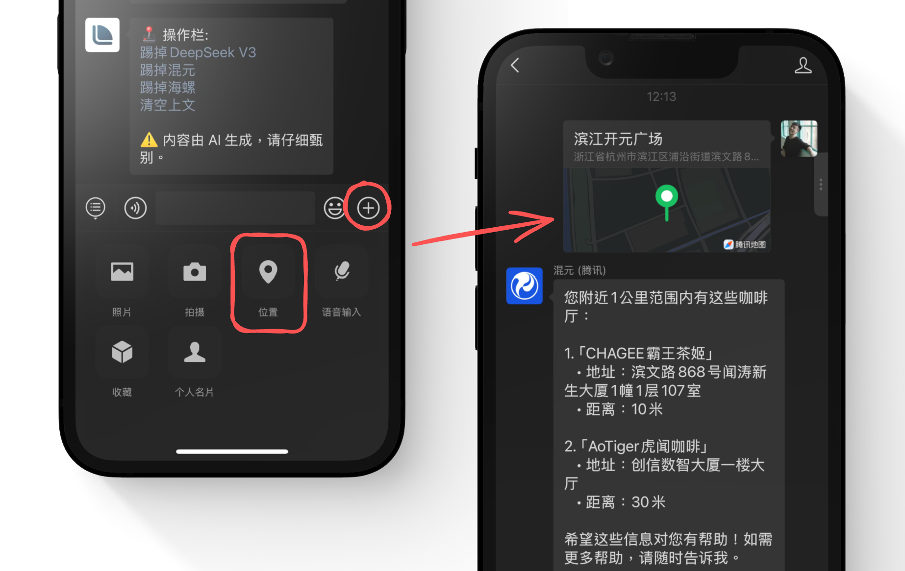
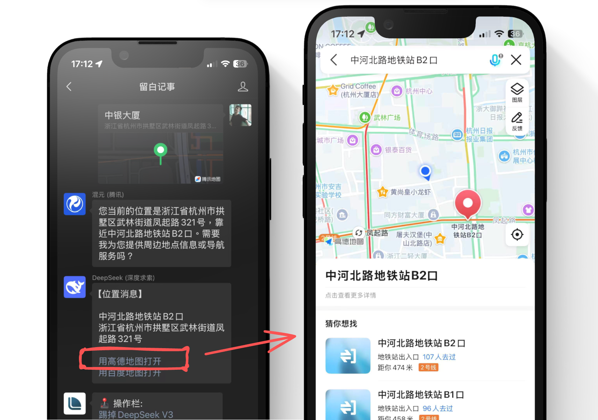
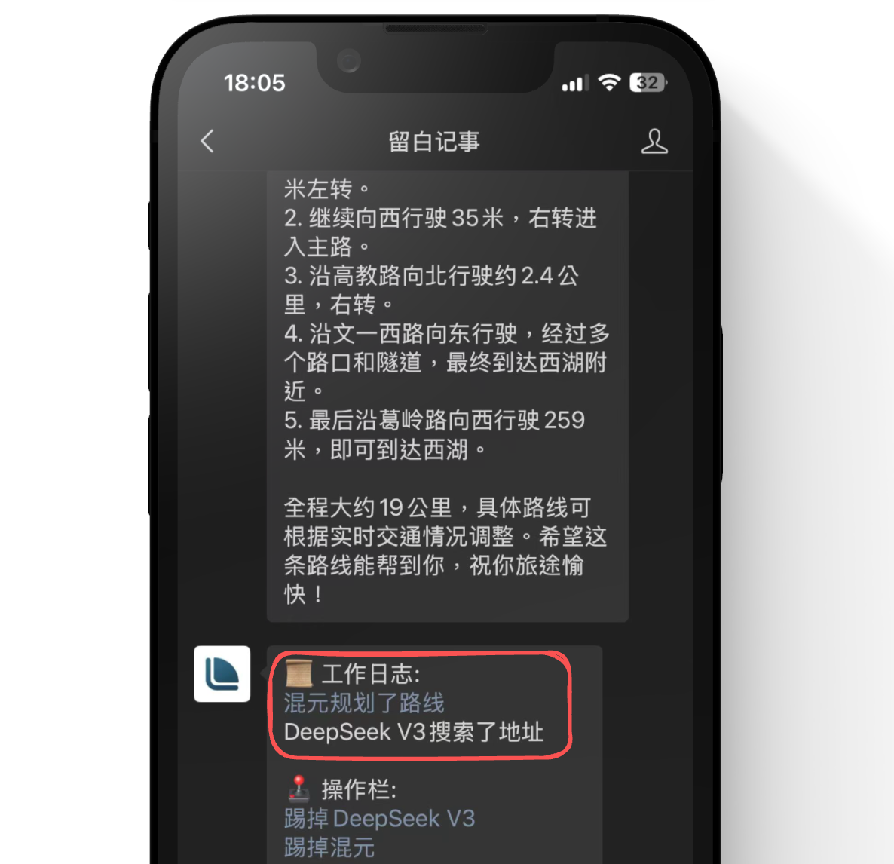
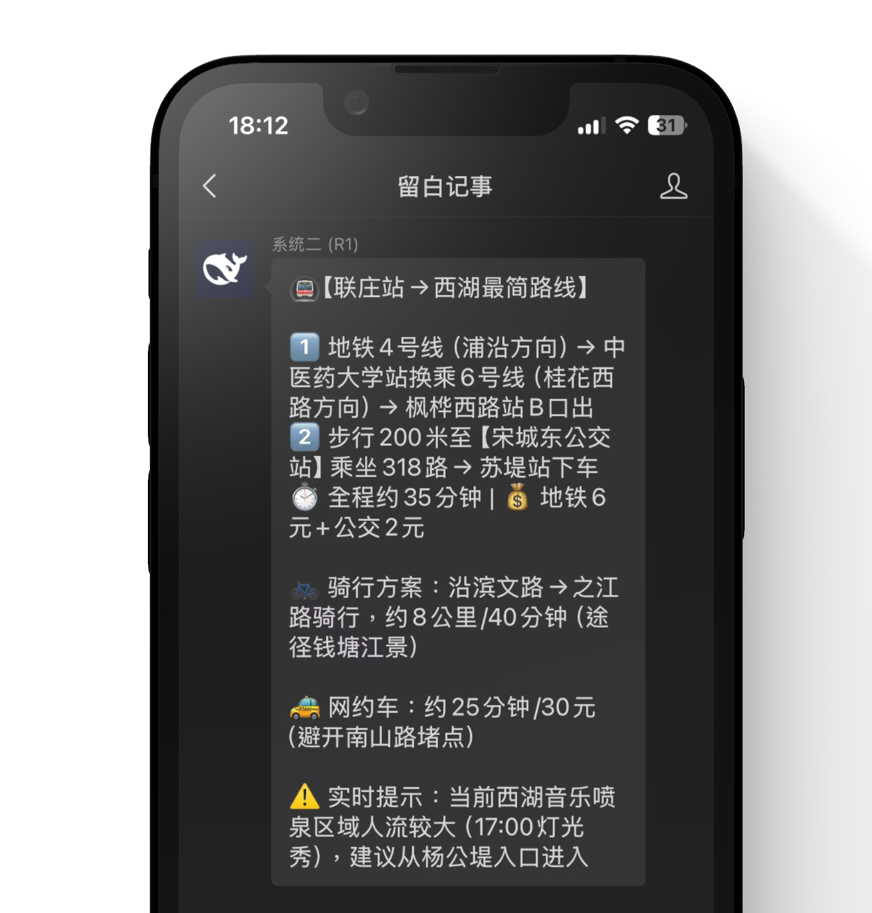
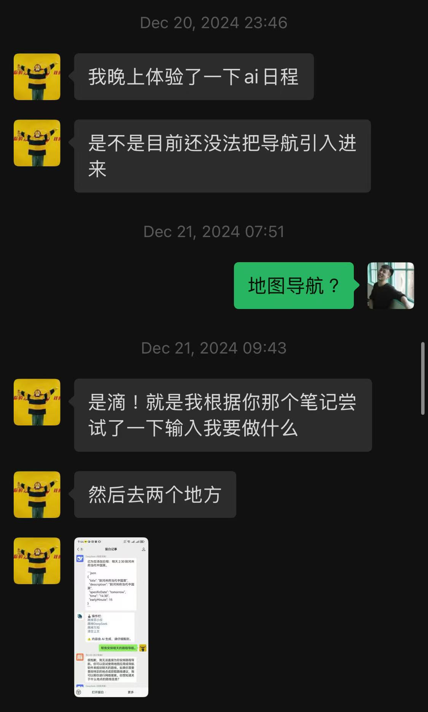

# 五一出行，就用如是

发送位置消息：

 

一键打开高德地图、百度地图：

 

增加可信度，就看工作日志：

> [!WARNING] 警告
> 当前 AI 依然存在强烈的幻觉现象，使用时还是需要你再三查核。

路线整理，[系统二](./system-two)来帮忙：

> [!NOTE] 把我整无语了
> 按他上面说的最简路线走，会花两个小时才会到吧......

原理上，我们就只是给了 AI 们一份地图 🗺️（包含导航能力🧭）。剩下的，就靠底层大模型技术提升了。

如是，预祝你五一出行愉快！

> [!TIP] 那个
> 如果耽误了行程，可不可以不要怪我......
> 
> 叔叔阿姨们，我真的很努力了🙇

## 特别感谢

本功能特别感谢庄导提供独家建议。