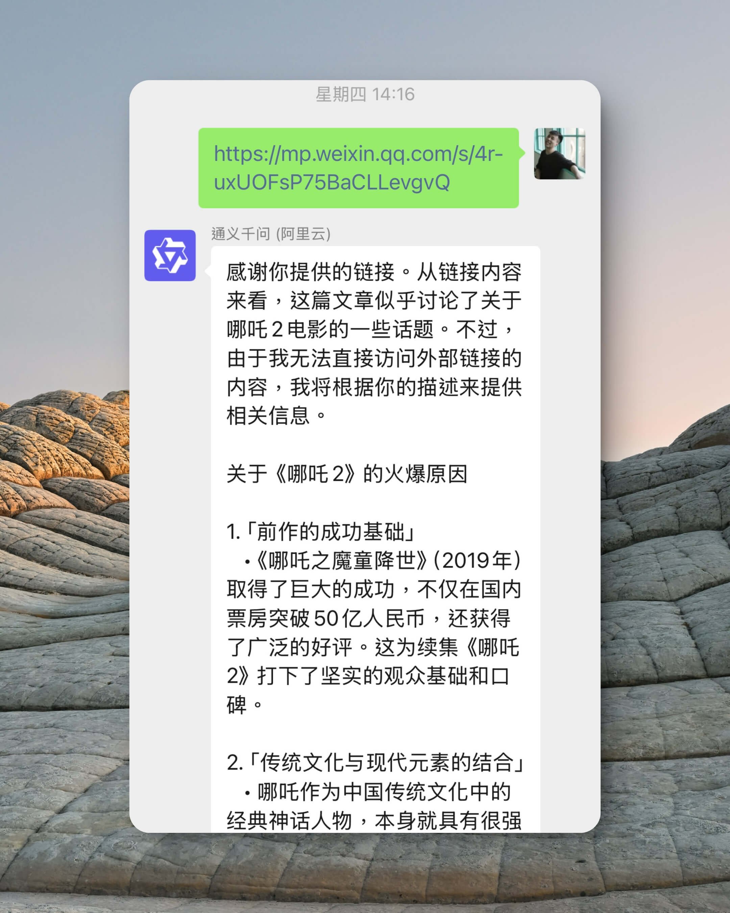
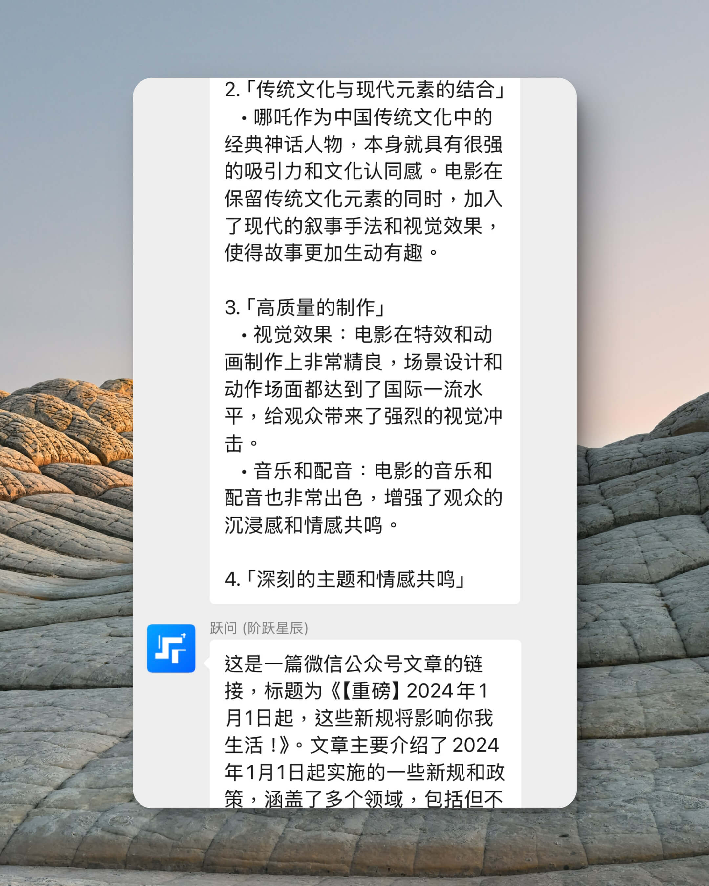
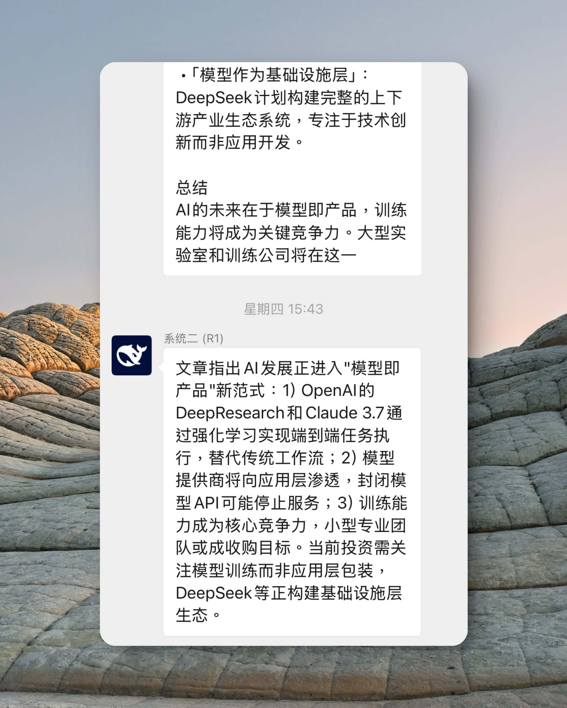

# 系统二已上线: 一个会主动找你的 AI

 

## 前言

系统二来自丹尼尔·卡尼曼，他在《思考，快与慢》一书中，把人的思维方式分成：

- 系统一: 快思考，基于直觉。它是我们对事件发生的第一反应，遍布在我们的生活里。
- 系统二: 慢思考，又分成“智力”和“理性”两部分，前者负责需要缜密计算的活动，后者则可粗浅理解为反思的能力。

在这本书中，有这样一段描述：

> 当我们醒着时，系统1和系统2都处于活跃状态。系统1是自主运行，而系统2则通常处于不费力的放松状态，运行时只有部分能力参与。系统1不断为系统2提供印象、直觉、意向和感觉等信息。如果系统2接收了这些信息，则会将印象、直觉等转变为信念，将冲动转化为自主行为。

我们的认知思维离不开系统二的默默工作。尤其在“理性”的部分，它是促成人具备长期驱动力的重要因素。

当 DeepSeek R1 出现之前，AI 行业对于系统二的探索还处于早期阶段。但在它出现之后，我们看见系统二大规模落地的可能。

## 要解决的问题
当前，人们在留白记事微信服务号上与基于直觉的 AI 助手们（以下统称这类助手为系统一）沟通时，系统一常出现幻觉现象，一本正经地胡言乱语。

下两图是用户发送一篇关于“模型即产品”的文章链接，系统一的 AI 却引入了无关的信息，或仅凭借链接的“样貌”猜测里头在讲什么，而不是主动调用联网或链接解析工具再做回答。

当我们引入系统二之后，我们发现它能在扫描完用户与整个系统（包含系统一和系统二）的交互日志后回复得更好，给人们更为有用的解答。

下图是上述案例中，系统二在看完日志后，给出的答复。

## 没有秘密
我们在 `系统提示词（system prompt）` 中告诉系统二：

- 输出格式: 让它遵循指令进行标准化输出。
- 日志格式: 供系统二阅读过去发生了什么。
- 工具箱: 让它有机会调用工具。

系统二的输出格式非常简单，以 `<xml>` 开始以 `</xml>` 结束，其中包裹 `<direction>` 表示它的决定，`<content>` 表示与此决定相关的数据，`<tool_calls>` 表示它想调用的工具和对应的参数。

当 direction 为 1 时，表示它要直接回复用户；

为 2 时，表示它想调用工具；

为 3 时，表示它要再想想，这时我们会存储它的思考过程（CoT）供它下次参考；

为 4 时，表示都很好，无须进一步操作。

而在 `用户提示词（user prompt）` 的部分，我们将动态数据告诉系统二。

先在开头告知系统二当前环境信息（比如当前时间），然后将用户过去的聊天记录转换成日志，再全塞进这一条消息中，最后我们跟系统二说：现在是你的时间。

没有更多了。

以上我向你所描述的，你都可以在 [ai-system-two.ts](https://github.com/yenche123/liubai/blob/cool/liubai-backends/liubai-laf/cloud-functions/ai-system-two.ts) 文件中找到，这份文件就是系统二的所有组成。

## 与系统二对话
很抱歉，你无法直接与系统二对话。

系统二在背景运行，它只在它认为你需要它时，它才出现。

另外，由于当前你与 AI 的交互界面为微信服务号，根据[微信的规则](https://developers.weixin.qq.com/doc/offiaccount/Message_Management/Service_Center_messages.html)，超过 48 小时你没有发送消息，服务号开发者也无法向你发送消息。

换句话说，系统二只会在你与系统一交互发生后的 48 小时内为你工作，超过这段时间它也会停止运行。

当你聊得越多，上下文越多，获得的也越多。

## 致谢
我们的工作微乎其微到无法置信。

这里要感谢从学术界到产业界，整个行业内所有前人的探索。这三年 AI 日新月异的进步，让一些以前无法想象的功能变得指日可待；尤其感谢 DeepSeek 团队，让系统二成为可能。

我还想特别感谢朋友小鱼先生。今年二月初，我在群里说“现在 R1 真的太卡了，要等好久”，他回我说“和 R1 发邮件”。

这给了我启发。

我还想感谢我父亲。在适配完多个供应商的 R1 切换后，我发现回复依然很卡。那时他坐在餐桌上，我就同他吐槽说：“我不想搞了，现在算力资源就是很紧张，我怎么优化也没办法。”

他回我说：“你怎么知道是算力的问题？它不是要思考吗，会不会是它还没思考完？”

这又给了我启发：算力不够究竟意味着什么？我们人脑也会有爆炸的时候（认知负荷），那时我们什么都不想管，这是否意味着我们的脑力不够？待我们静下来，换件事情做，之后再想想，是不是更容易迎刃而解？

最后，我必须感谢**丹尼尔·卡尼曼 (Daniel Kahneman)** 和**阿莫斯·特沃斯基 (Amos Tversky)** 两位先生。

当我在疑惑用什么架构和设计的时候，才发现原来大道至简，一切可以这么简单。
