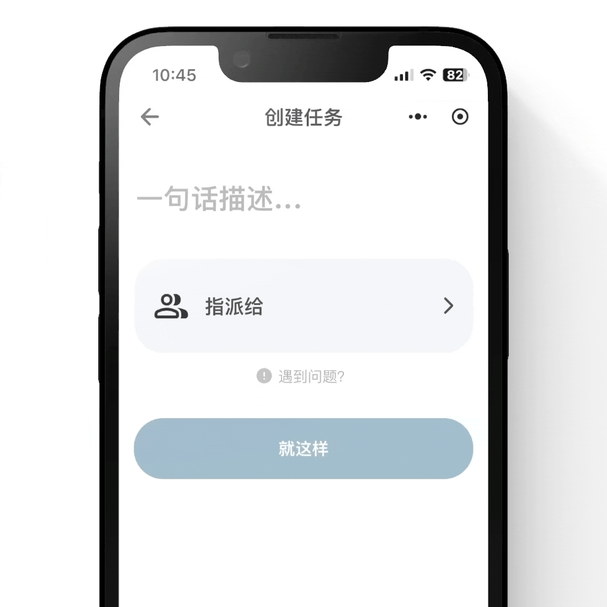
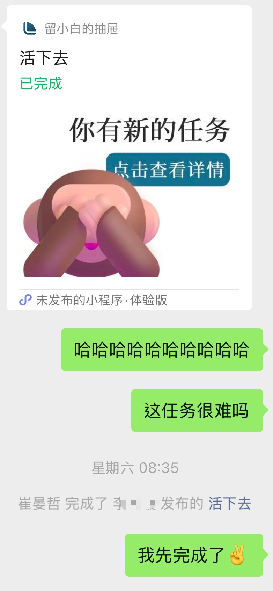
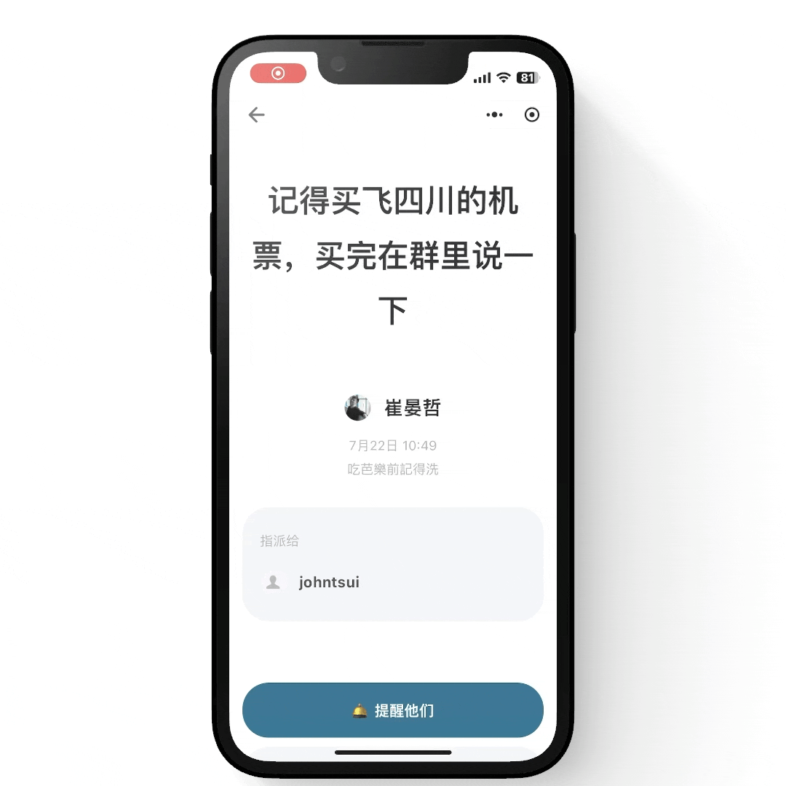
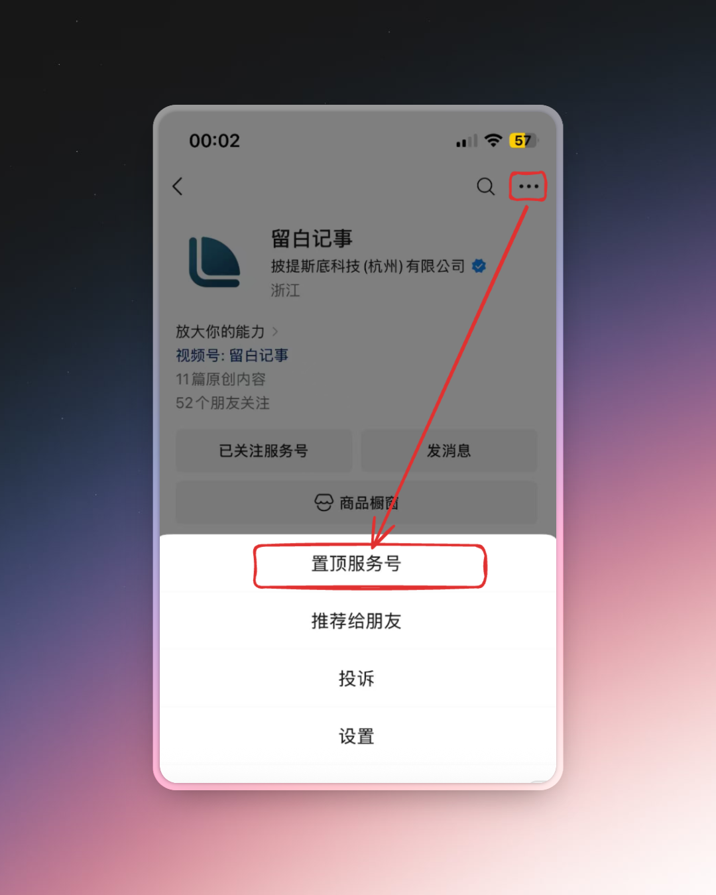
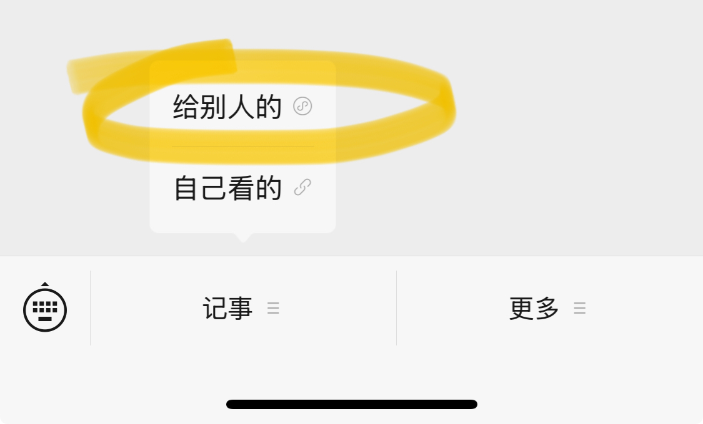
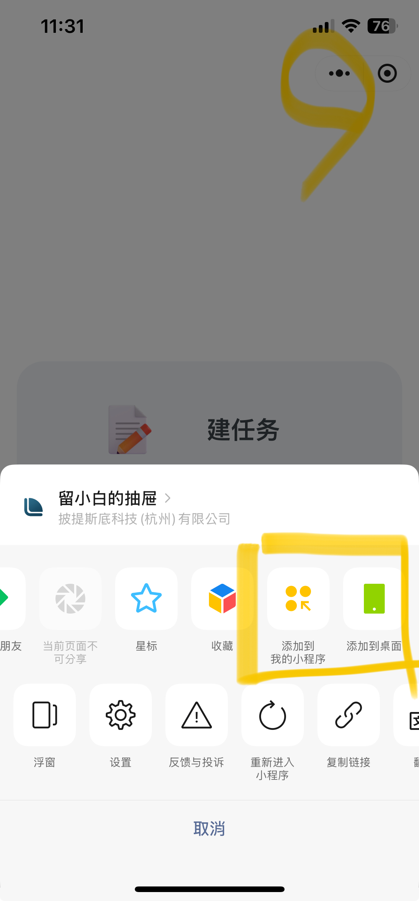

# 在微信上处理任务

微信团队今年上半年（2025）发布了 `聊天工具 API`，我们基于此开发了全新的任务管理功能：让你直接选择微信群聊或微信联络人，将任务直接分派给他/她。

## 🚀 先用再说

微信扫一扫👆，立即使用。

## 🤸 特色

### 协作时，无需邀请确认

在大家都有微信的前提下，无需邀请注册，你可以直接选择群聊里（单聊也适用）的参与者：

### 无需点开，在聊天界面里展示状态

与单聊和群聊深度集成，让你在微信聊天界面里，查看任务状态：

### 一键软提醒

在人情社会里推进事情感到绝望？想 push 又不能太 push？

“轻松提醒”，我们都为你想好了：

所有的任务不顺，请全责怪给如是！

> 这怎么会是你的问题呢！

## 🔏 隐私

根据[微信官方文档](https://developers.weixin.qq.com/miniprogram/dev/framework/open-ability/chatTool.html)，聊天工具 API 涉及三种 id 信息：

- `opengid`: 微信群的唯一标识
- `open_single_roomid`: 单聊的唯一标识
- `group_openid`: 微信用户在此聊天室下的唯一标识，同一个用户在不同的聊天室下 id 不同

其他隐私信息，诸如用户昵称、头像和群聊名，开发者皆无法获取，而是交由微信小程序的 `open-data-list`、`open-data-item` 和 `open-data` 组件渲染而成。

另外，根据微信的规则，聊天工具 API 只适用于当前你选择的联络人或群聊，无法被转发至其他联络人或群聊。

## 🤲 快速找回

### 方法一: 置顶如是（推荐）

微信扫一扫 ⬆️ 卡片，再如下图所示，置顶如是。

以后，你只需要在菜单栏上选择 `记事 // 给别人的` 即可快速新建任务。

### 方法二：添加到我的小程序 or 桌面

打开小程序后，点击右上角“...”，如下图所示，即可添加到我的小程序 or 桌面。

## ⛵ 结语

我们在 [官网](../../guide/what-is-thus) 上写着一句话介绍：

> 如是 = 备忘录📝 + 日历📆 + 任务📌 + 待办清单📂 

现在，我们全面开启任务协作的时代，就是要让你超能打！

