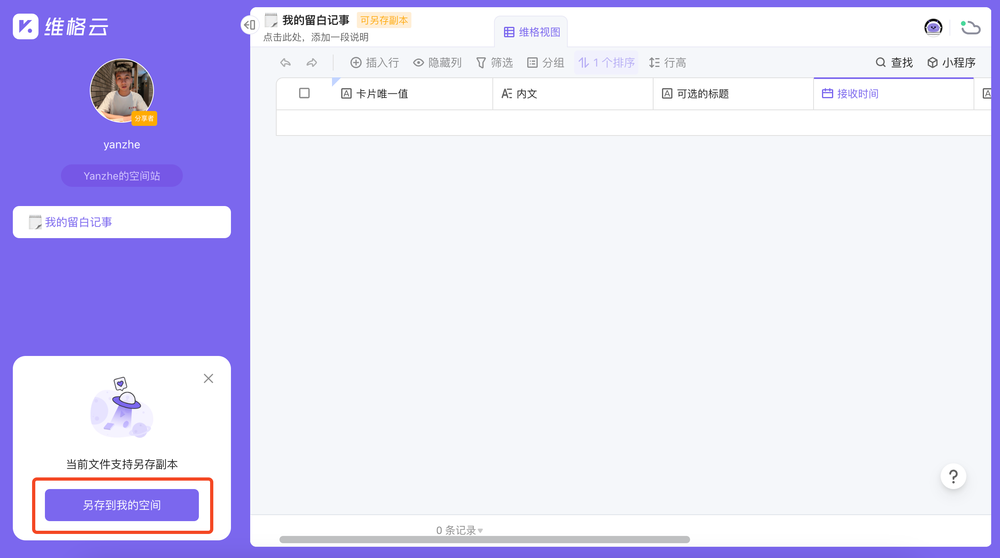
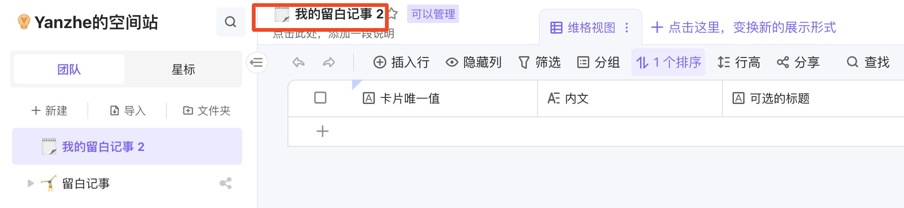
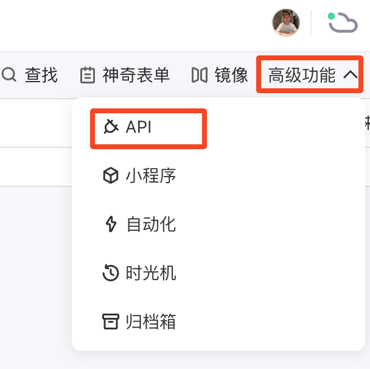
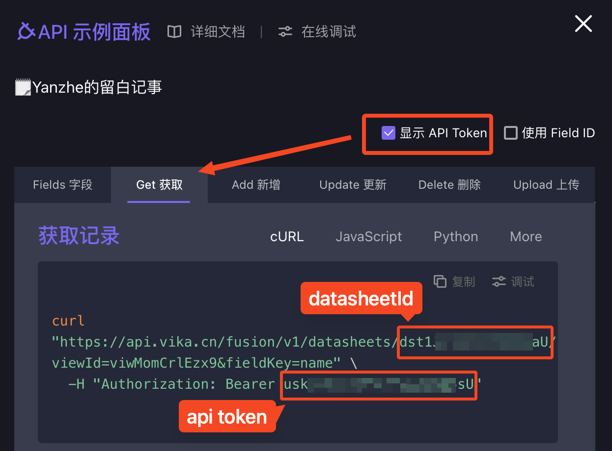
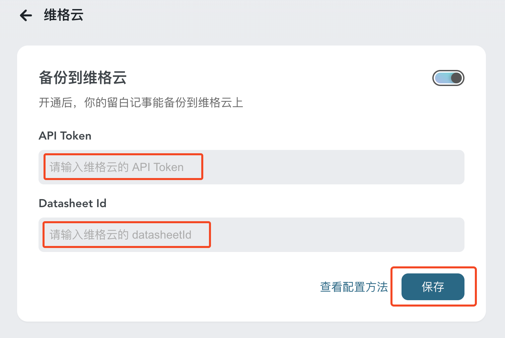

# 连接到维格云上

我们提供保姆级（小白也能用！）的简易配置方法，让你轻松把留白上的记事备份到 Vika 维格云上☁️

配置只要 5 分钟!! 超过 5 分钟者，请直接[联系客服](https://work.weixin.qq.com/kfid/kfcfb6f3959d36f6a0f)，我们在线为你服务。

## 开始

### 1. 另存副本

打开这个链接: https://vika.cn/share/shrcNTzgGJ1YYPtGmZugH

如上图所示，点击 `另存到我的空间`。

::: tip 小提示
若未登录，vika 会提示你先登录，登录完再次点击即可。
:::

### 2. 打开副本

打开 [vika.cn](https://vika.cn/)，找到你刚刚另存的多维表格。

点开你的副本，在顶部的位置，点一下名称，如下图所示，可以重命名。建议修改为 `xxx的如是`，其中 `xxx` 替换为你的名字或昵称。

### 3. 只要两个参数

在多维表格最右侧，有个 `API`，点击它；如果找不到，展开 `高级功能` 应该就能看到它。

在面板上，我们点击 `显示 API Token`，选择 `Get 获取`，依下图所示分别复制 `API token` 和 `datasheetId`。

将它们分别粘贴到 [如是](https://my.thus-note.com/connect/vika) 上：

::: tip 小提示
API Token 在 `Bearer` 右边，尾部不包含引号 `"`。

dataSheetId 在 `https://api.vika.cn/fusion/v1/datasheets/` 右边，以 `dst` 开头，前后不包含斜杠 `/`。
:::

最后点击`保存`。

### 4. 完成 🎉

现在你可以回到 [如是](https://my.thus-note.com/) 上记录，同时观察你的 vika 有没有来自如是的记事！

## 常见问题

### 1. 只能备份吗？可不可以双向同步？

“在第三方多维表格编辑，需要同步到留白”

“在留白上更新某个字段又要同步过去”...... 

这将引发一系列需求，没完没了，同时可能存在安全隐患（比如循环触发），故“同步”功能目前没有计划。

“备份”很简单，这很留白。

### 2. 编辑后，不会同步到 vika 上？

同问题一，同步会引发数据一致性的问题，故不支持。

在留白上查看最新记录，在 vika 上留档你的旧数据。

各司其职，这很优雅！

