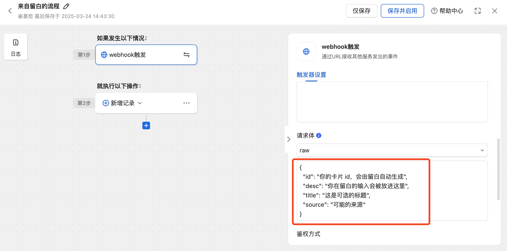

# 连接到 WPS 上

我们提供保姆级（小白也能用！）的简易配置方法，让你轻松把如是上的记事备份到 WPS 上。

配置只要 5 分钟!! 超过 5 分钟者，请直接[联系客服](https://work.weixin.qq.com/kfid/kfcfb6f3959d36f6a0f)，我们在线为你服务。

## 开始

### 1. 新建多维表格

请先登录[金山文档](https://www.kdocs.cn/latest)。

登录后，打开这篇多维表格: [https://www.kdocs.cn/l/chDKViRt3A2g](https://www.kdocs.cn/l/chDKViRt3A2g)


点击页面左上角的小箭头，选择 `另存为`，如上图所示。


在弹出的窗口里，重命名文件为 `xxx的如是`，其中 `xxx` 替换为你的名字或昵称。

然后点击 `另存并打开`。


### 2. 打开自动化流程

打开后，点击页面上方的 `自动化流程`。


再点击 `来自如是的流程`。


### 3. 设置回调地址

复制 `回调地址`，如下图所示。


在新的窗口打开如是: https://my.thus-note.com/connect/wps


启用 `备份到 WPS`，粘贴 `回调地址`，最后点击**保存**，如上图所示。

::: tip 小提示
这一步打开的如是不要关闭，第 5 步还要用到。
:::

### 4. 设置请求体

```json
{
  "id": "你的卡片 id，会由如是自动生成",
  "desc": "你在如是的输入会被放进这里",
  "title": "这是可选的标题",
  "source": "可能的来源"
}
```

复制以上文本，返回到 WPS 上，往下滑找到**请求体**，如下图所示粘贴。



### 5. 设置鉴权方式

回到如是上，复制`密码`。


按如下图所示，在 WPS 上设置 `鉴权方式`。


其中：
- **鉴权方**: 选择 HTTP Basic Auth
- **账户名**: 填入 `thus`
- **密码**: 粘贴刚刚复制的密码

### 6. 完成 🎉

点击 `保存并启用` 就配置完毕了！


现在你可以回到 [如是](https://my.thus-note.com/) 上记录，同时观察 WPS 的多维表格有没有你的最新记录。

## 进阶

金山文档的多维表格似乎支持 DeepSeek R1 回复（分析）你表格的数据，有玩出花样的朋友，欢迎[联系客服](https://work.weixin.qq.com/kfid/kfcfb6f3959d36f6a0f)或[邮件](mailto:hi@thus-note.com)告诉我们，我再把它整理到文档上来。

当然，你也可以直接在 [GitHub](https://github.com/yenche123/liubai/blob/cool/thus-docs/docs/guide/connect/wps.md) 上编辑本页面，提交 PR 🙌

## 常见问题

### 1. 只能备份吗？可不可以双向同步？

“在第三方云文档上的编辑，需要同步到如是”

“在如是上更新某个字段又要同步过去”...... 

这将引发一系列需求，没完没了，同时可能存在安全隐患（比如循环触发），故“同步”功能目前没有计划。

“备份”很简单，这很如是。

### 2. 编辑后，不会同步到 WPS 上？

同问题一，同步会引发数据一致性的问题，故不支持。

在如是上查看最新记录，在 WPS 上留档你的旧数据。

各司其职，这很优雅！
