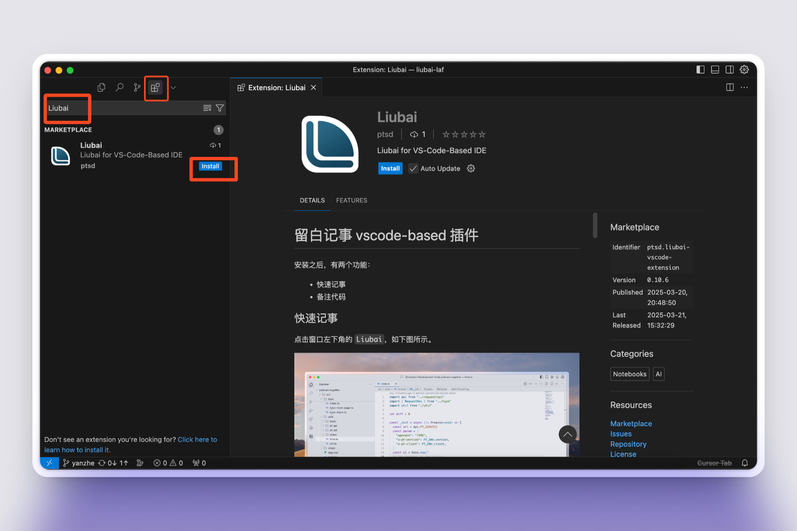
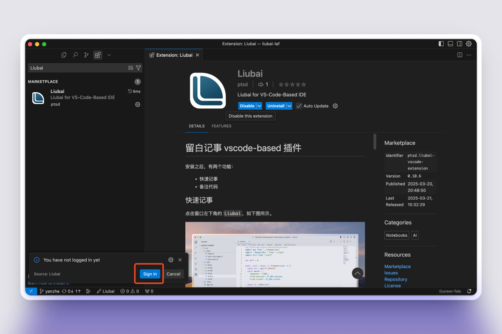
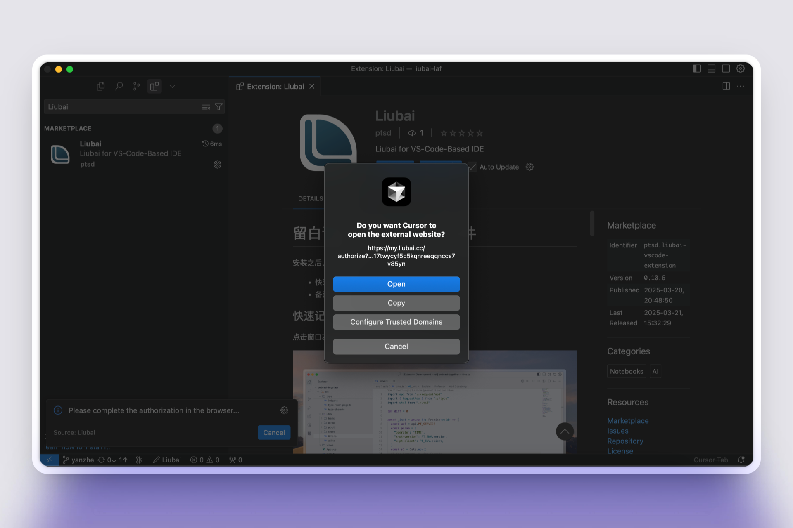
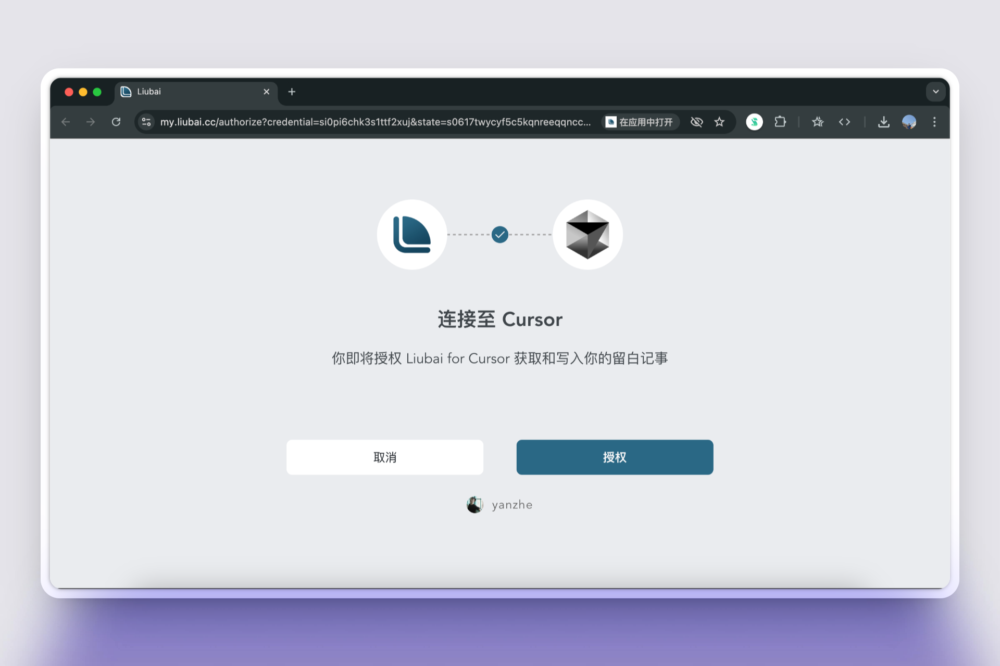
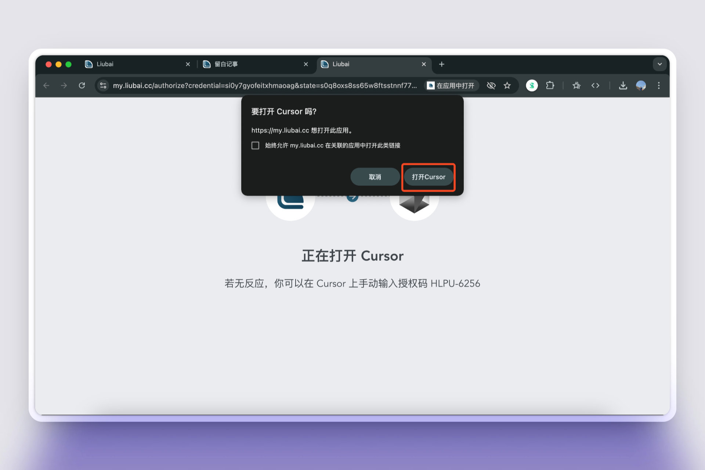
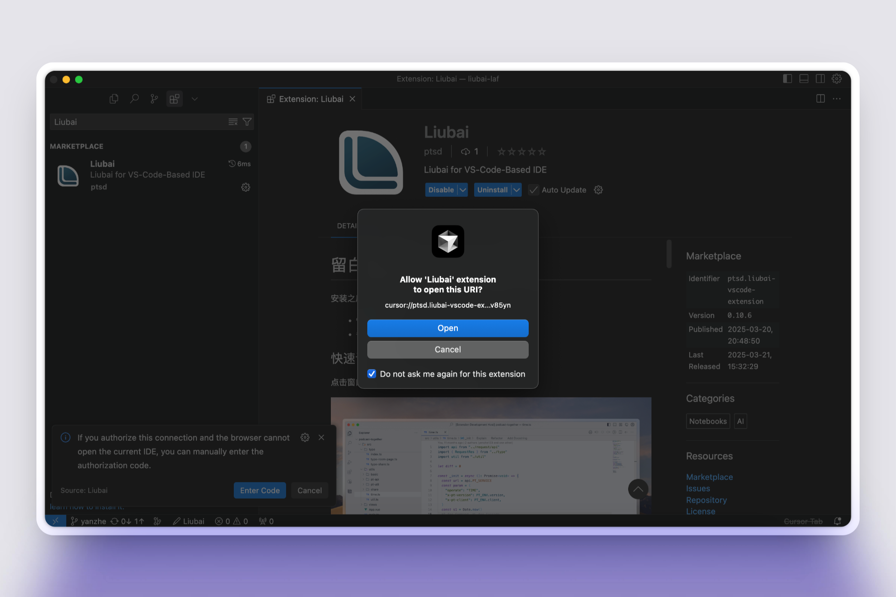
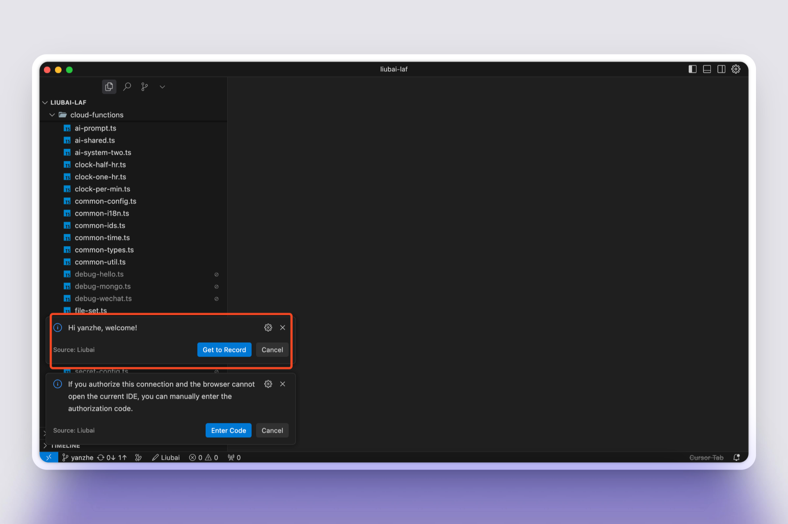

# 在 Cursor 上安装

[Cursor](https://www.xiaohongshu.com/explore/66c81649000000001f01a063?xsec_token=ABbvD-wZFI5qyo3oQq80LrqKjf9344uBykMH_5JdefooE=) 是一款 AI 编辑器，兼容 VS Code 插件和配置，能让你在创作时（无论是编辑文本或写代码），使用侧边栏与 AI 交互，辅助你或自动帮你完成创作！

如是现已完成 Cursor 上的适配：

让你在工作时无需离开编辑器，轻松捕捉灵光乍现💡的每一份想法，或者快速新建待办或日程！

## 安装 {#install}

打开 Cursor，搜索 `Thus`，并点击 `Install` 进行安装：

## 登录 {#login}

### 1. 开始登录

安装完毕后，插件会弹通知提示你登录。

若通知未弹出，可以点击状态栏左下角的 `如是` 字样（在底部状态栏上），然后再点击 `Sign in`。

### 2. 打开浏览器

点击 `Open` 以打开如是进行授权。

### 3. 授权

这是如是官方维护的插件，你可以放心点击 `授权`。

### 4. 跳转回 Cursor

授权完毕后，点击 `打开Cursor` 以返回。

### 5. 允许 Liubai 插件接收登录信息

在这一步，点击 `Open`。

### 6. 完成

稍等片刻，让插件去运行登录逻辑。

最后，看到如下图所示的欢迎通知，就代表已完成登录。

## 使用 {#use}

具体使用方式，请参见[如何使用插件](./how-to-use-vscode-ext)。

