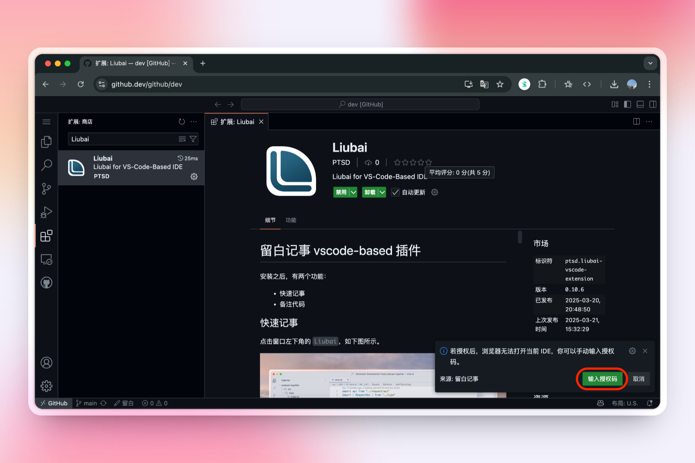

# 在 github.dev 上安装

在你已登录 GitHub 的前提下，当你在浏览任意仓库时，点击键盘 ⌨️ 上的英文字符 `.`，GitHub 会为你准备好云开发环境，你即可在它所提供的 VS Code for the Web 中进行开发。

::: info
若你点击 `.` 没有生效，请试着将输入法切换至英语模式。
:::

留白记事 vscode 插件支持在浏览器环境中运行，下面为你介绍如何在 [github.dev](https://github.dev/) 上进行安装和登录。

## 安装 {#install}

### 1. 搜索

将选项卡切换至 `扩展: 商店`，搜索 `Liubai`，并点击 `安装`。

### 2. 信任

点击 `信任发布者和安装`

::: tip
留白记事是完全开源的，本插件的源代码位于 [liubai-vscode-extension](https://github.com/yenche123/liubai/tree/cool/liubai-frontends/liubai-vscode-extension) 目录下，欢迎你审计。
:::

## 登录 {#login}

### 1. 点击登录

安装完毕，插件会弹通知请求你登录；若没有出现通知，点击窗口左下角的 `留白` 按钮，也可以登录。如上图所示。

### 2. 跳转到留白

点击 `打开`。

### 3. 授权

该插件是留白记事官方维护的，你可以放心授权。

### 4. 返回 github.dev

接着，浏览器会尝试跳转回 github.dev，但如果

- 跳转失败
- 跳转后没有显示正在 `登录中...`

那么请尝试手动复制授权码，如下二图所示：

手动切换浏览器分页，返回原来的 github.dev 上，点击通知上的 `输入授权码`：

将授权码粘贴上去，并敲击回车：

### 5. 完成

最后，如果出现欢迎通知，就代表已成功登录。

## 使用 {#use}

具体使用方式，请参见[如何使用插件](./how-to-use-vscode-ext)。
