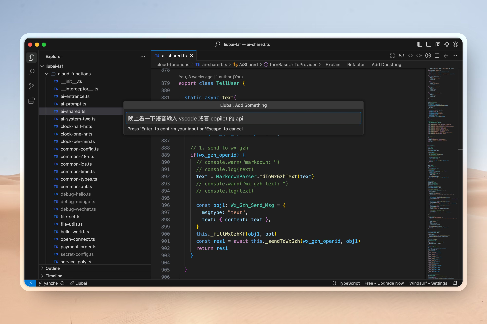
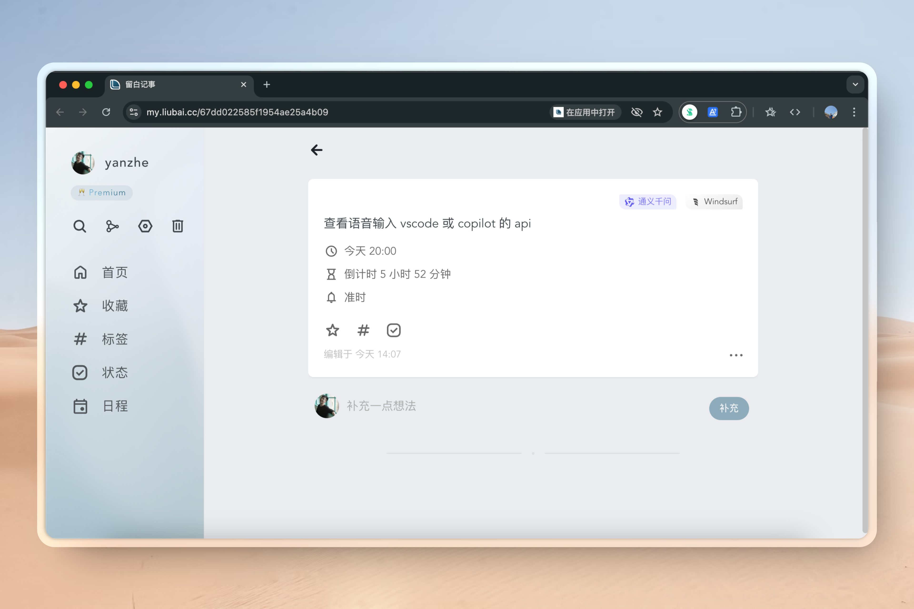
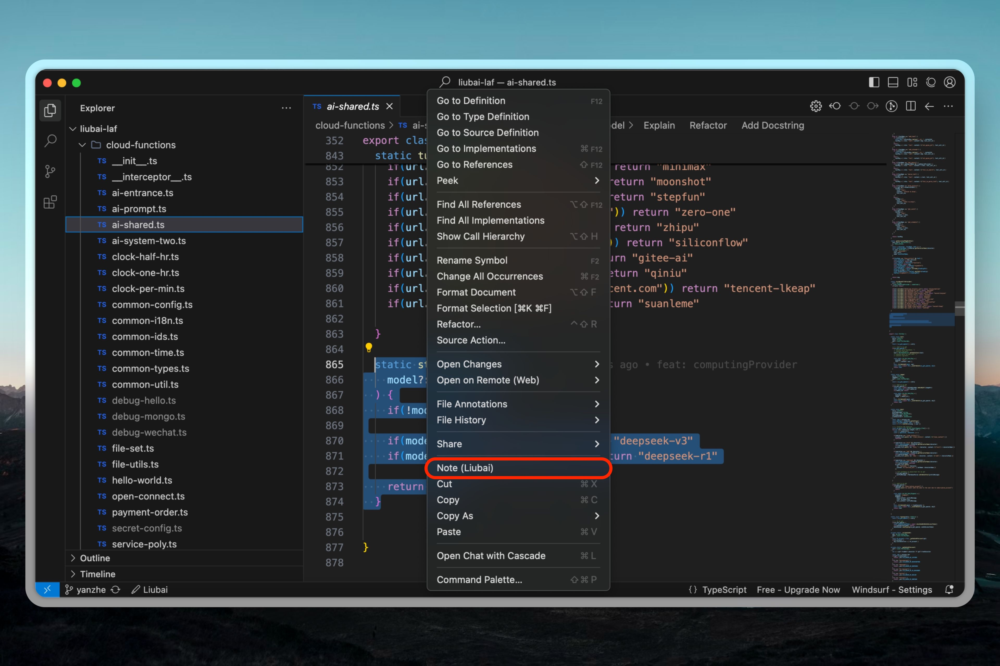
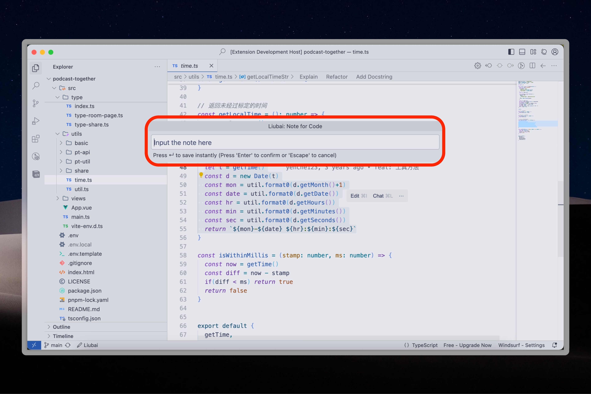
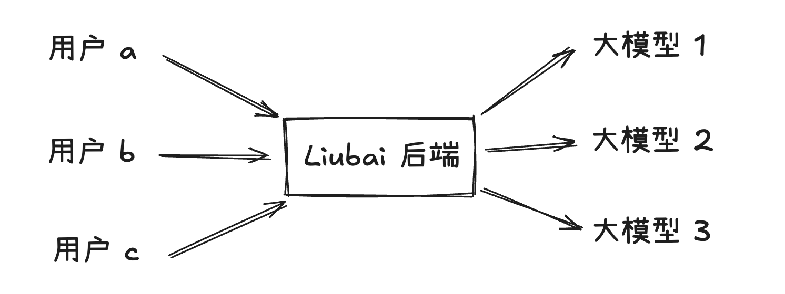

# 如何使用留白记事 IDE 插件

::: info 前情提要
我们假设你已完成 [安装和登录](./index)。
:::

目前插件有两个功能: 

- 快速记事
- 备注代码（或者说“备存代码”）

## 快速记事 {#quick-note}

点击窗口左下角的 `Liubai`，窗口中间会弹出一个输入框，你可以在这里记录任何事。

输入完毕，敲击回车 `Enter` 即完成记录。

::: tip 小诀窍
如果你输入的内容含有时间信息，可能触发 AI 自动分类。

比如上一张截图中，我们输入“晚上看一下语音输入 vscode 或者 copilot 的 api”，就有可能被 AI 自动整理成：

> *查看语音输入 vscode 或 copilot api*
> 
> 时间: *今天 20:00*
> 
> 倒计时: *5 小时 52 分*
> 
> 提醒: *准时*

整个过程 AI 在背景无缝运行。
:::

## 备注代码 {#code-note}

在编辑区域，选中代码（文字），右键唤起菜单栏，点击 `Note (Liubai)`。

弹出输入框后，你可以选择不备注、直接回车，快速备存代码片段。

## 额度 {#quota}

本插件是免费使用的。

只有当你使用 `快速记事` 并且被 AI **成功**自动分类时，才会消耗一次 AI 自动分类的额度。

免费版共有 10 次免费额度，[Premium 会员](https://my.liubai.cc/subscription)则享有每月 200 次额度。

关注 `留白记事` 微信服务号，回复 `AI` 或者 `额度`，即可获取当前已使用额度。

值得一提的是，即使免费额度使用完毕，你**依然可以**使用 `快速记事`，只是系统不会继续往下运行 `自动分类` 的逻辑。

为结果付费，我们率先尝试！

## 隐私 {#privacy}

在 `快速记事` 时，你的一句话消息会被传至大模型供应商，以实现 `自动整理`（或者叫 `自动分类`）。

请放心，任一供应商都无法得知你的确切个人信息（比如能定位身份的手机号、邮箱或 userId 等），他们仅能得知你在插件输入框中输入的那一句话。

由于我们会随机调用在[列表](https://github.com/yenche123/liubai/blob/cool/liubai-backends/liubai-laf/cloud-functions/sync-after.ts#L35)中的一个或多个供应商，所以任一供应商获得的信息都是不全面的。

另外，你的信息都是从我们的后端中发出，也就是从单一（或少量）端点的 IP 向大模型供应商发起请求。你和其他用户的共用一个端点，大模型供应商更加无法推测“你是谁了”，如下图所示。

留白记事是开源的，你可以在 [sync-after.ts](https://github.com/yenche123/liubai/blob/cool/liubai-backends/liubai-laf/cloud-functions/sync-after.ts) 文件中，查看具体运作方式。