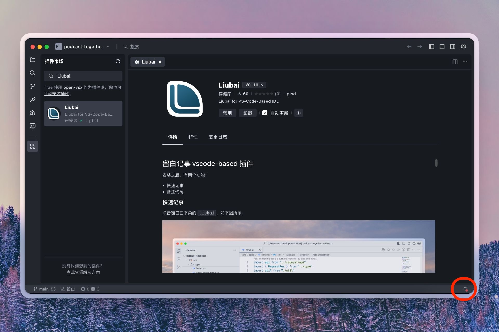
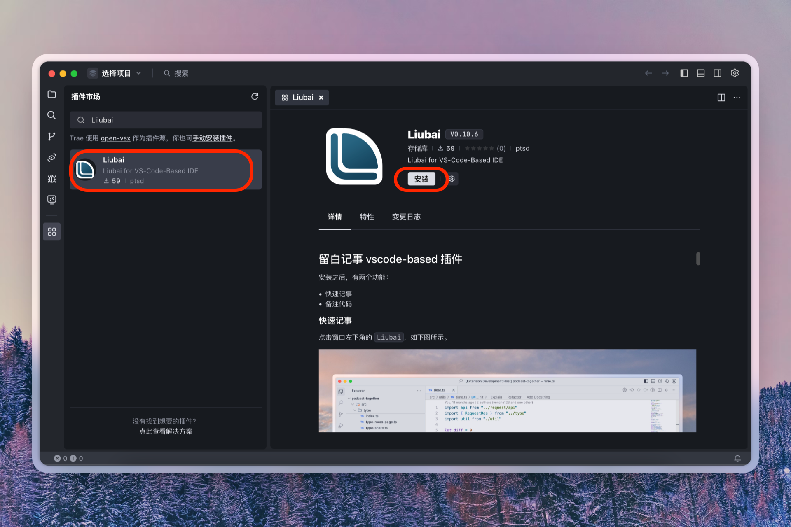
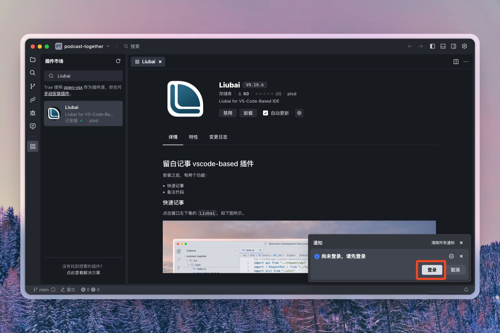
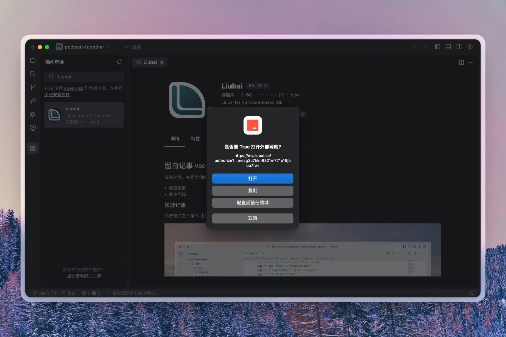
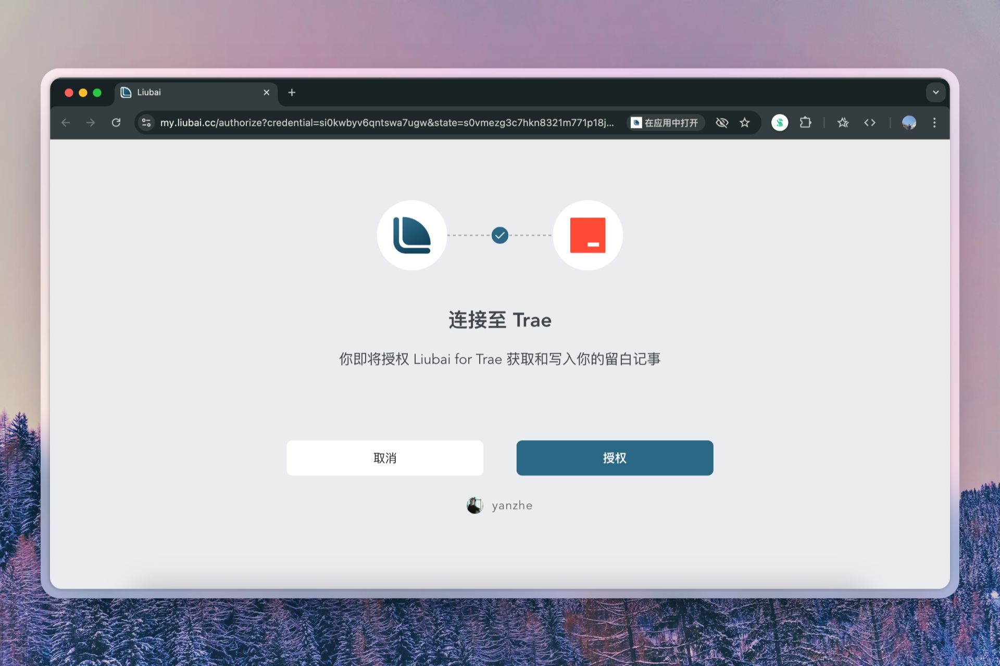
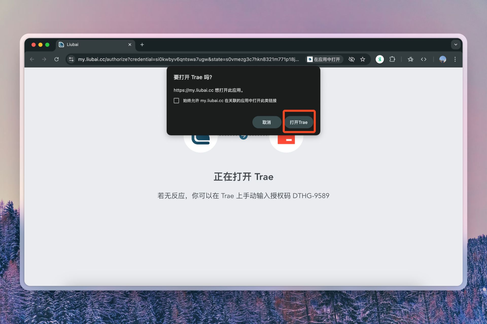
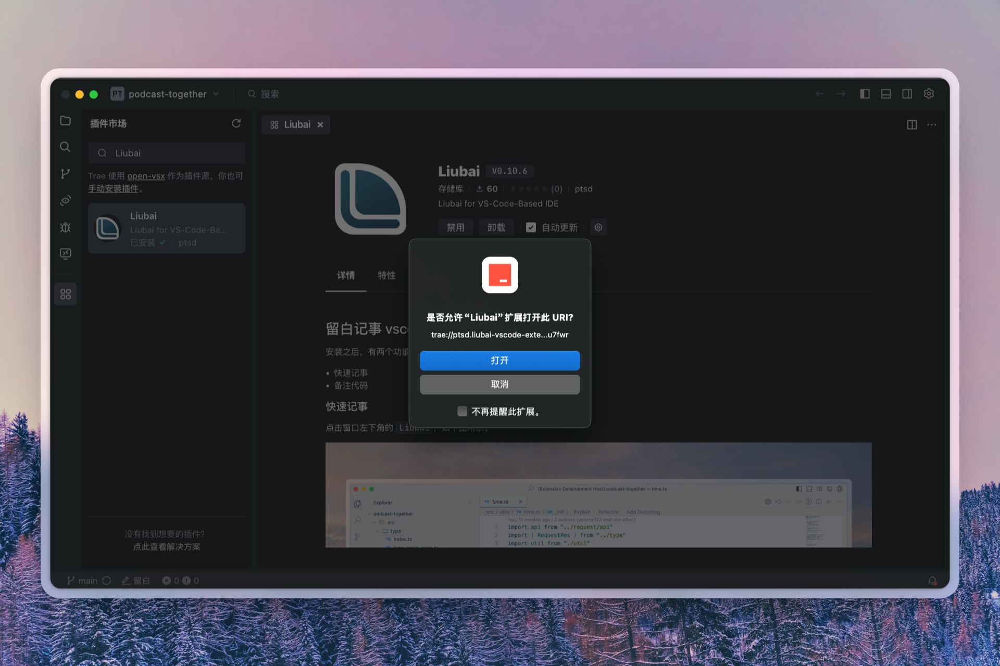
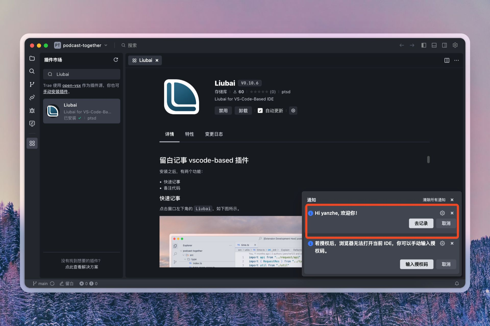

# 在 Trae 上安装

## 写在最前面

Trae 的通知会被隐藏在右下角，时常需要你手动点开才能看到。

## 安装 {#install}

打开 Trae 之后，在**插件市场**中搜索 `Thus`，并进行 `安装`。

## 登录 {#login}

### 1. 点开通知

安装完毕，点开通知。

### 2. 登录

点击 `登录`。

### 3. 打开浏览器

点击 `打开` 以跳转到留白进行授权：

### 4. 授权

这是如是官方维护的插件，你可以放心点击 `授权`。

### 5. 返回 Trae

点击 `打开Trae` 以返回：

### 6. 允许 Thus 插件接收登录信息

点击 `打开`。

### 7. 完成

稍等片刻，让插件去运行登录逻辑。

如果通知中心里有欢迎通知（如上图所示），那么就代表你已成功登录。

## 使用 {#use}

具体使用方式，请参见[如何使用插件](./how-to-use-vscode-ext)。