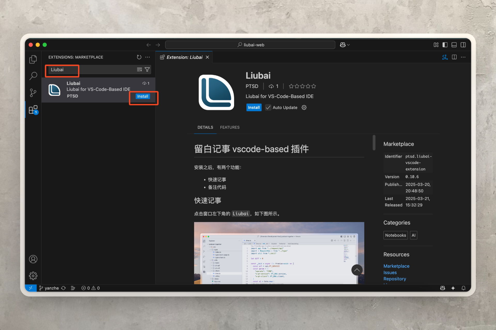
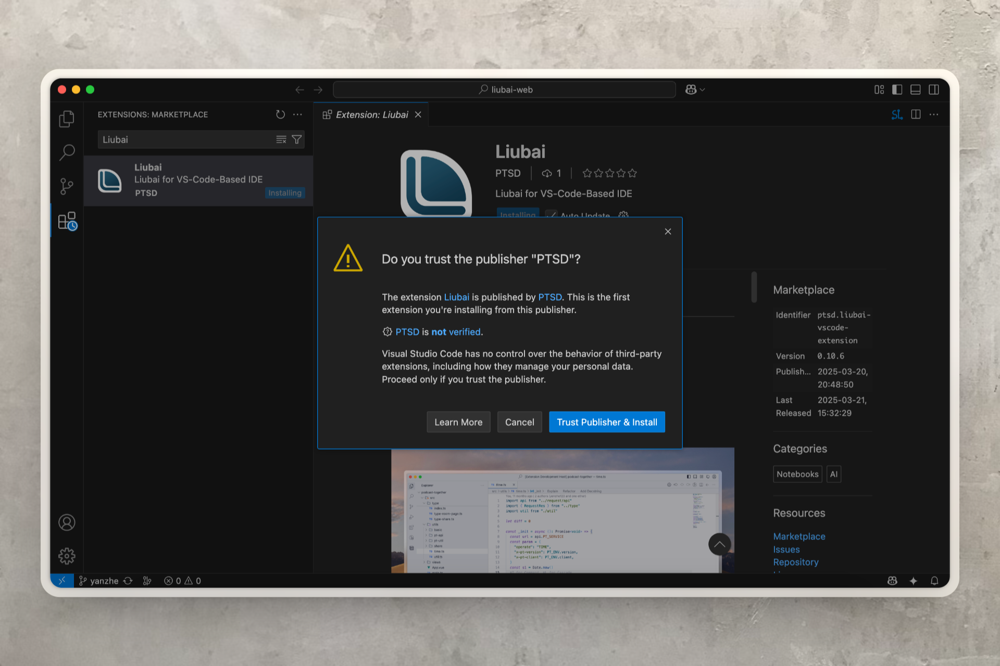
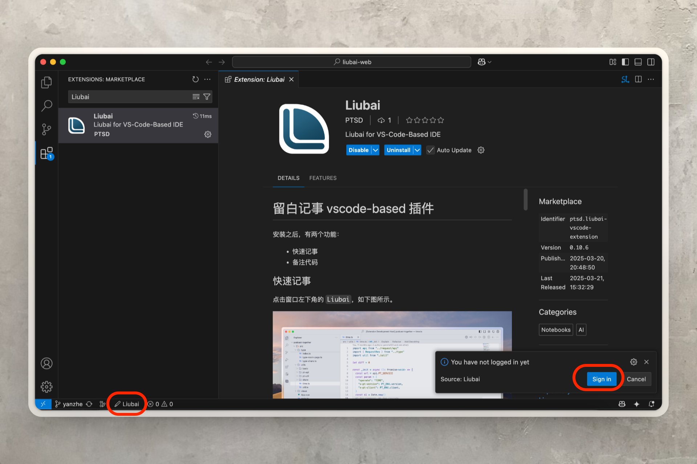
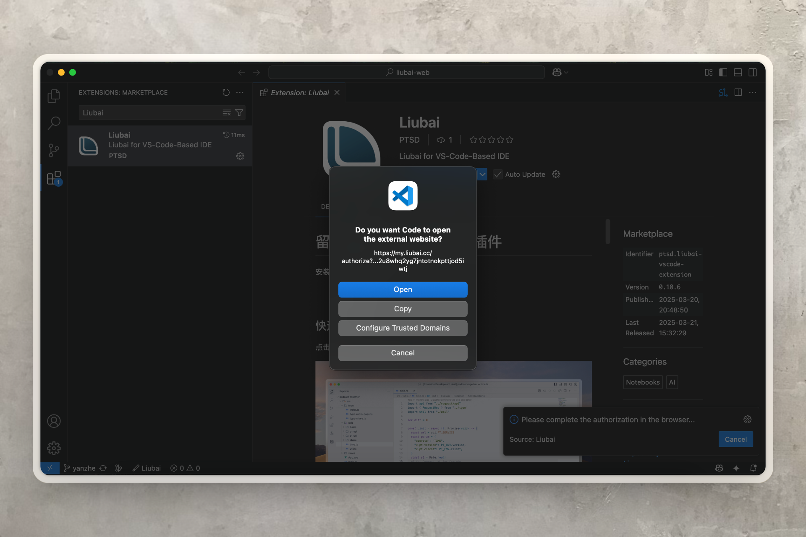
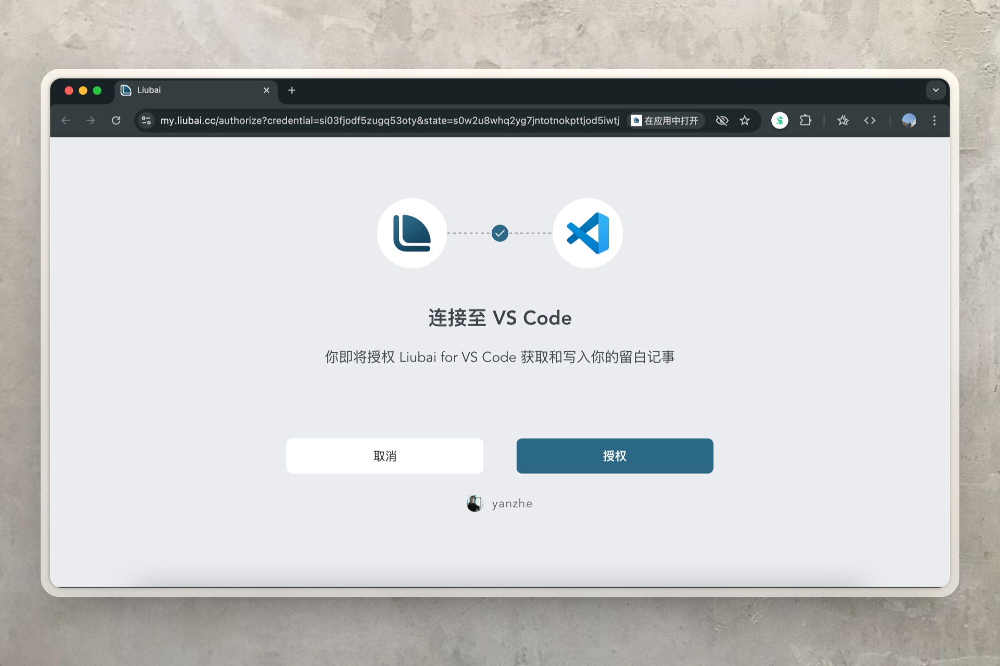
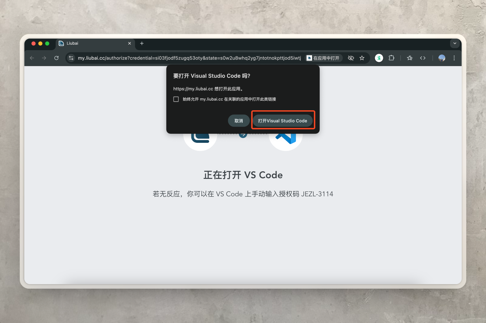
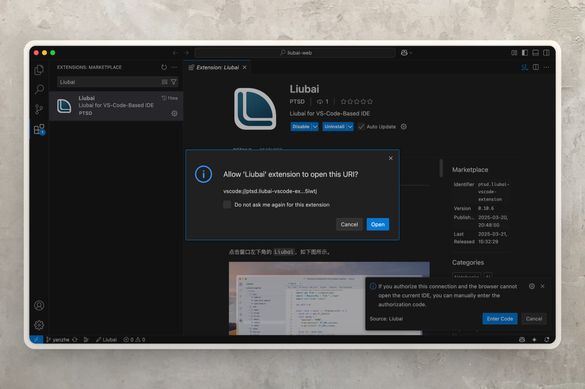
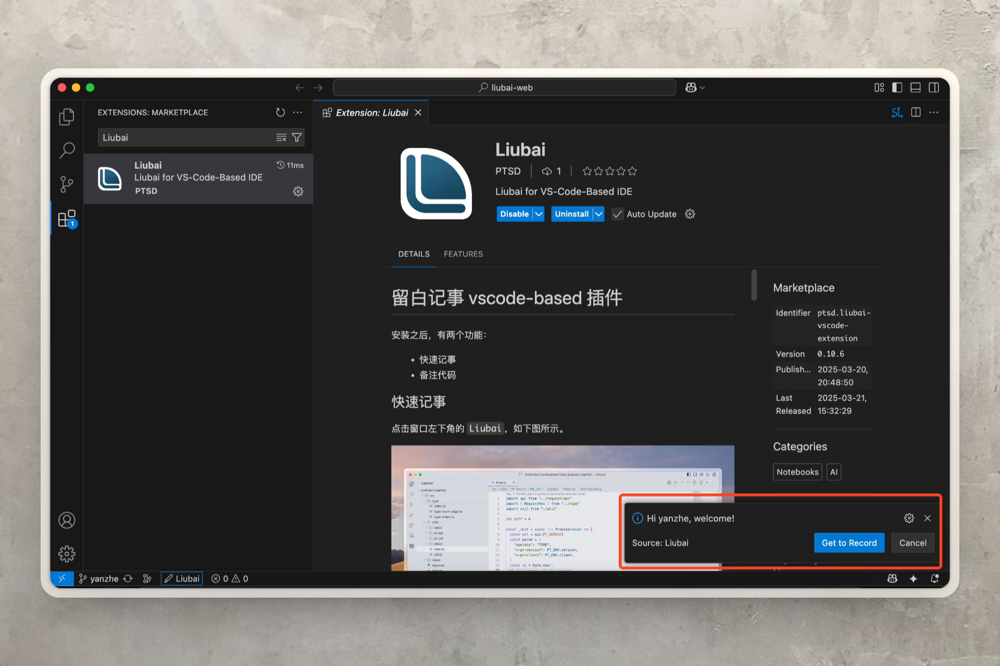

# 在 Visual Studio Code 上安装

## 安装 {#install}

### 1. 搜索

你可以尝试 [点击这个链接](vscode:extension/ptsd.liubai-vscode-extension)，直接在 VS Code 中安装。

如果上述链接无法打开，你可以手动切换至 VS Code 中的 `Extensions: Marketplace`：

搜索 `Liubai` 再点击 `Install`。

### 2. 信任

点击 `Trust Publisher and Install`。

::: tip
留白记事是完全开源的，本插件的源代码位于 [liubai-vscode-extension](https://github.com/yenche123/liubai/tree/cool/liubai-frontends/liubai-vscode-extension) 目录下，欢迎你审计。
:::

## 登录 {#login}

### 1. 点击登录

安装完毕，插件会弹通知请求你登录；若没有出现通知，点击窗口左下角的 `Liubai` 按钮，也可以登录。如上图所示。

### 2. 跳转到留白

点击 `Open`。

### 3. 授权

该插件是留白记事官方维护的，你可以放心授权。

### 4. 返回 VS Code

点击 `打开Visual Studio Code`。

### 5. 允许 Liubai 插件接收登录信息

在这一步，点击 `Open`。

### 6. 完成

稍等片刻，让插件去运行登录逻辑。

最后，看到如下图所示的通知，就代表已完成登录。

## 使用 {#use}

具体使用方式，请参见[如何使用插件](./how-to-use-vscode-ext)。
