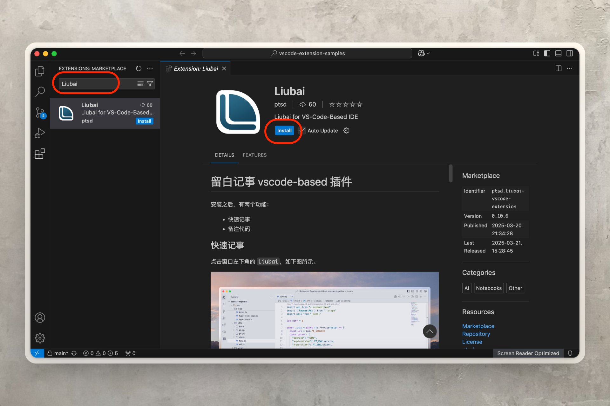
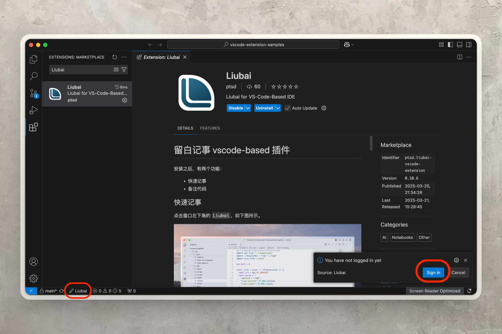
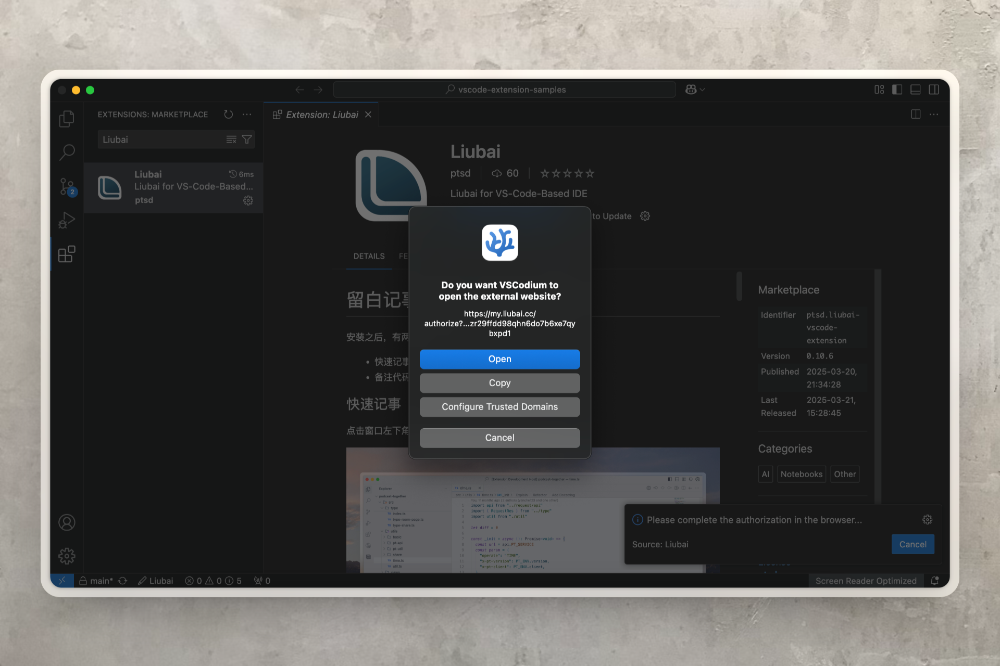
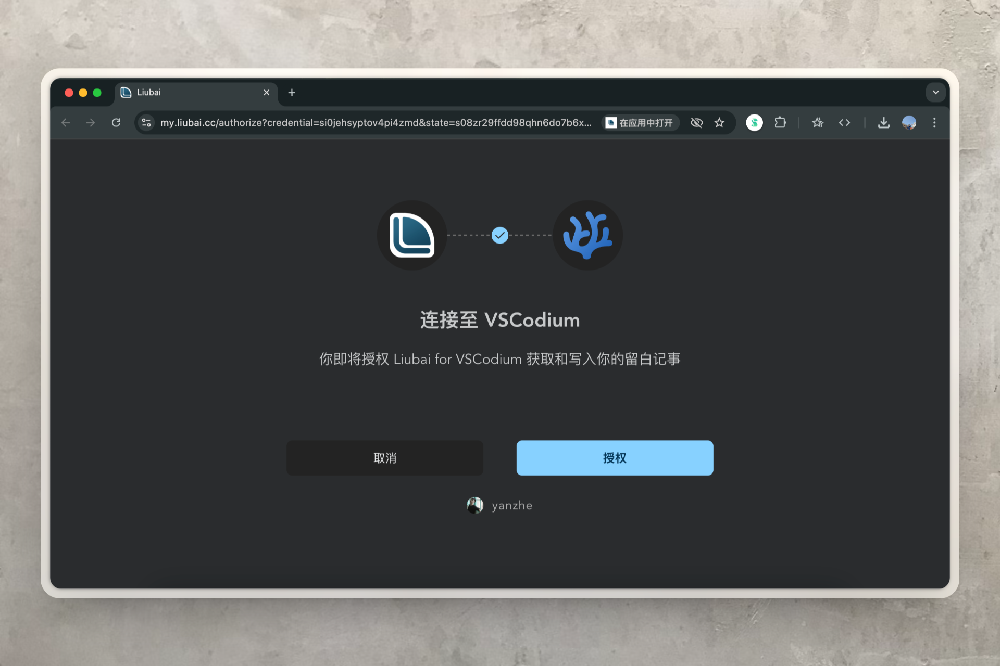
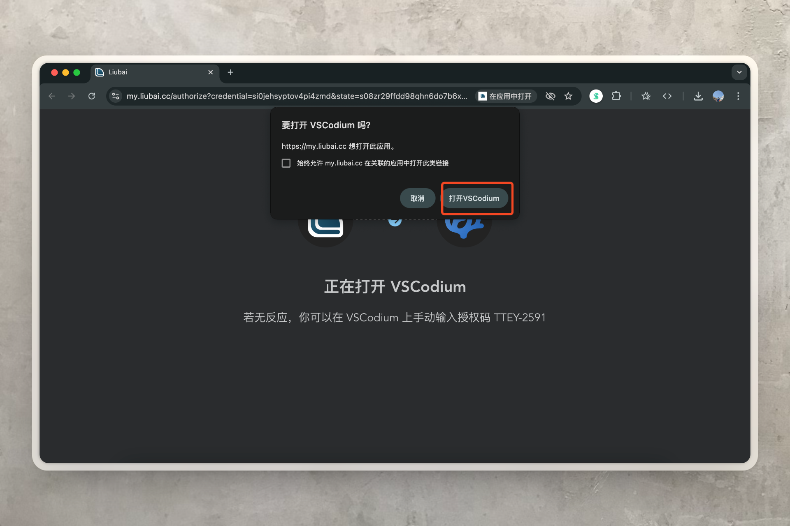
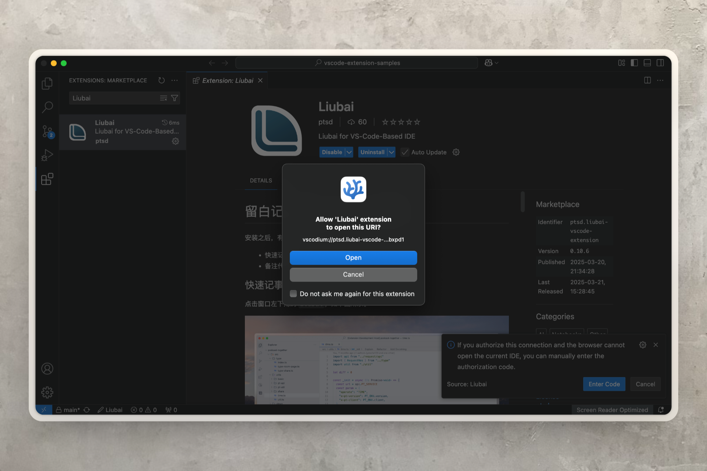
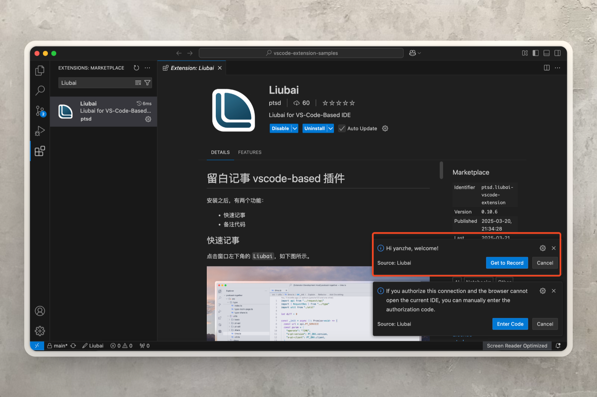

# 在 VSCodium 上安装

[VSCodium](https://vscodium.com/) 是由社区驱动的 VS Code 发行版，它移除了微软遥测、品牌标识和专有功能（比如 GitHub Copilot）。

如是 vscode 插件支持在 VSCodium 上运行。

## 安装 {#install}

打开 VSCodium 之后，点开插件市场，搜索 `Liubai`，点击 `Install`。

## 登录 {#login}

### 1. 点击登录

安装完毕，插件会弹通知请求你登录；若没有出现通知，点击窗口左下角的 `Liubai` 按钮，也可以登录。如上图所示。

### 2. 跳转到如是

点击 `Open`。

### 3. 授权

该插件是如是官方维护的，你可以放心授权。

### 4. 返回 VS Code

点击 `打开VSCodium`。

### 5. 允许 Liubai 插件接收登录信息

在这一步，点击 `Open`。

### 6. 完成

稍等片刻，让插件去运行登录逻辑。

最后，看到如下图所示的通知，就代表已完成登录。

## 使用 {#use}

具体使用方式，请参见[如何使用插件](./how-to-use-vscode-ext)。

