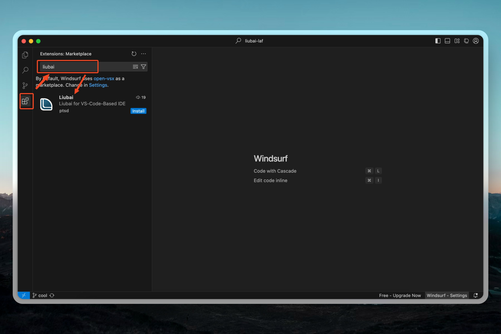
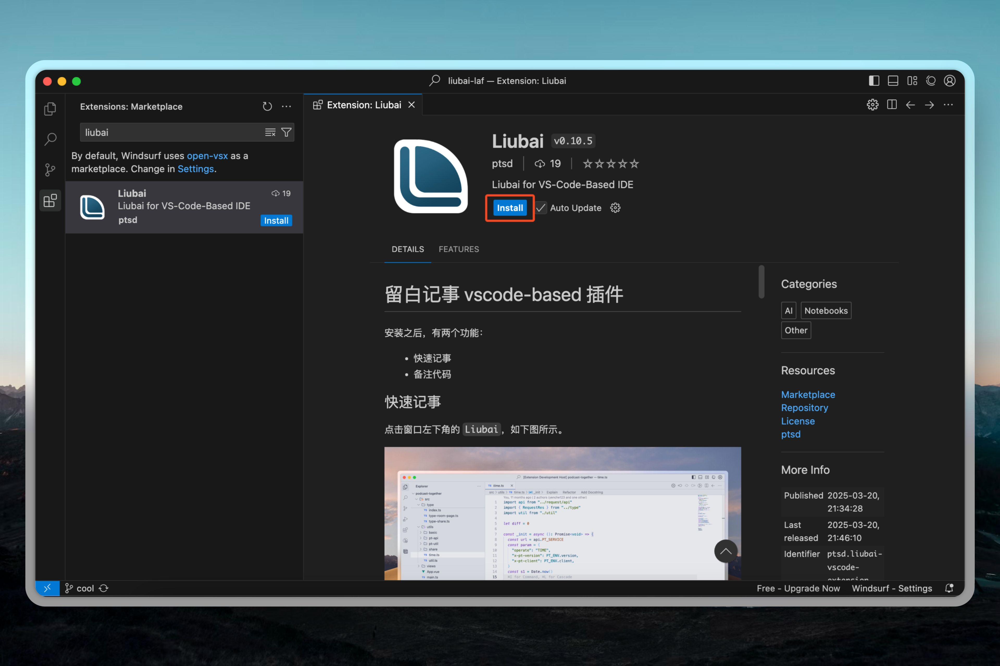
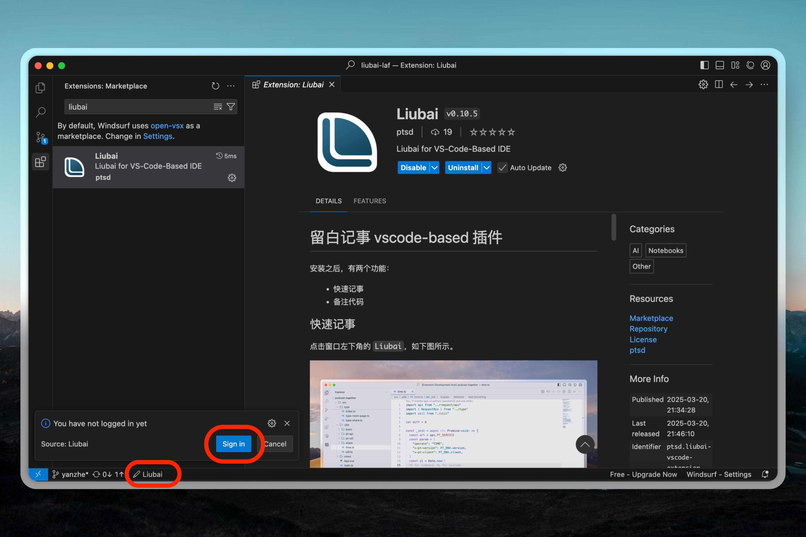
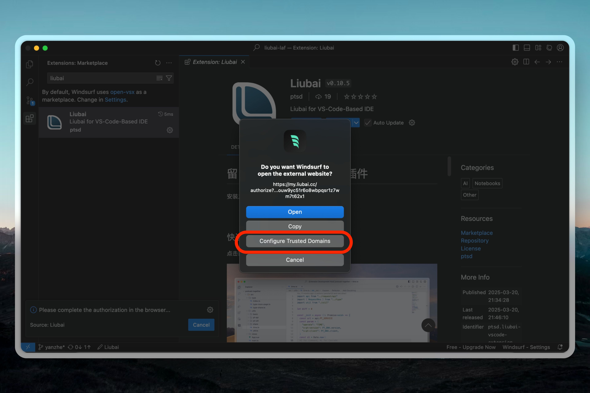
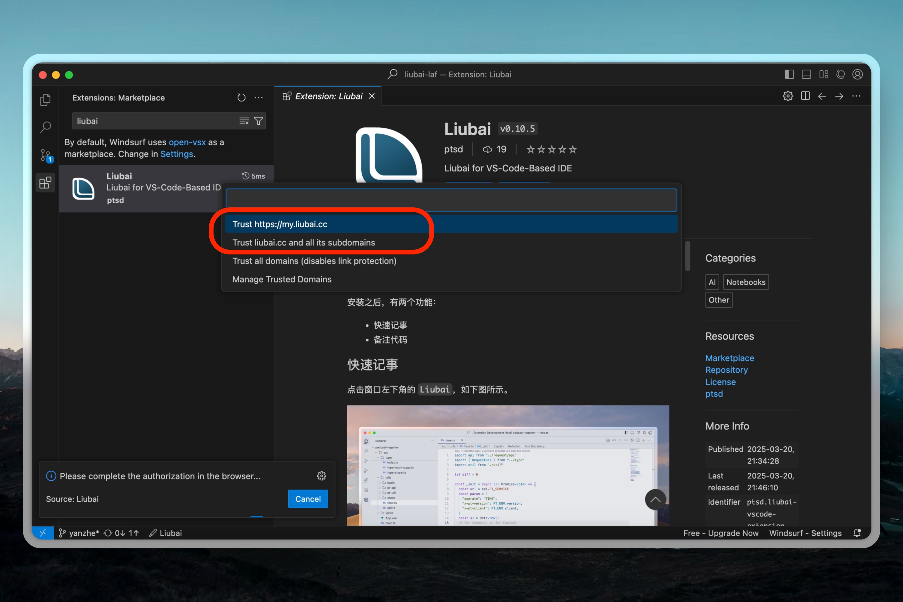
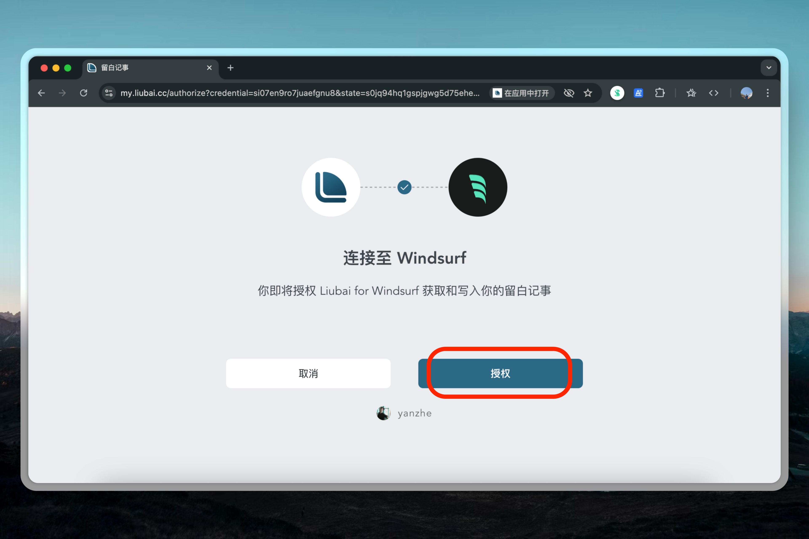
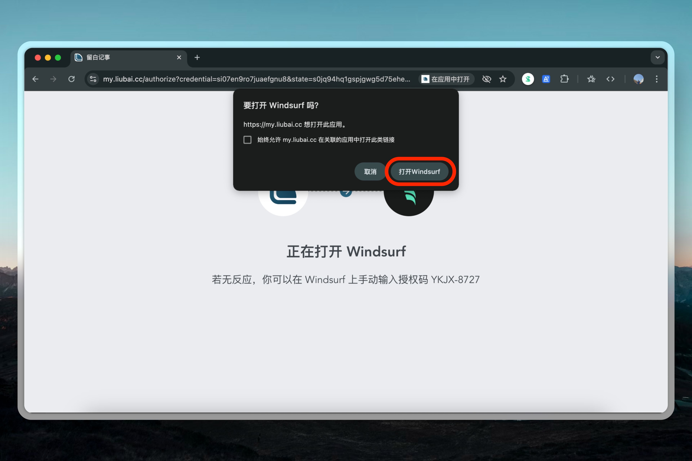
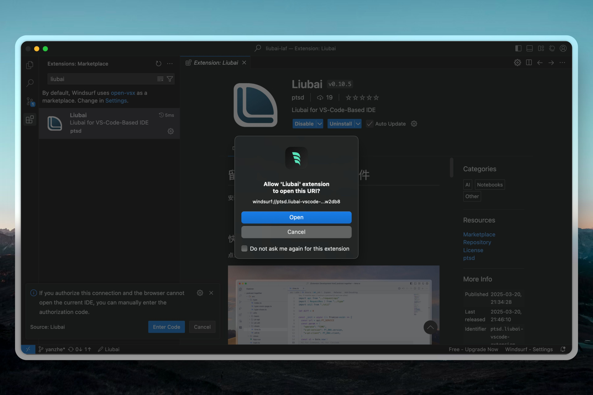
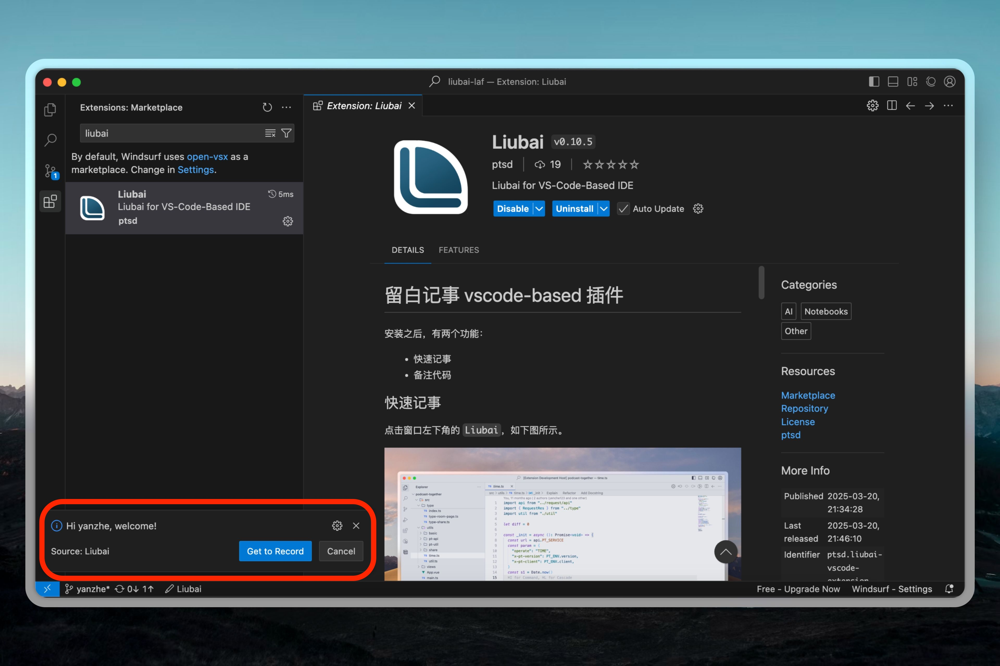

# 在 Windsurf 上安装

[Windsurf](https://www.xiaohongshu.com/explore/67384b60000000003c01c6d2?xsec_token=ABPBJ1IiiOXbcipHtKX6j6NFfXNFGKL1ukBYpZjY6XTbg=) 是一款由 Codeium 公司推出的 AI 编辑器，它让你在电脑面前创作时（无论是编辑文本或写代码），使用侧边栏与 AI 交互，辅助你或自动帮你完成创作！

如是现已完成 Windsurf 上的适配：

让你在工作时无需离开编辑器，轻松捕捉灵光乍现💡的每一份想法，或者快速新建待办或日程！

## 安装 {#install}

### 1. 搜索 Thus

在侧边栏中点击 `Extensions`，搜索 `Thus`。

### 2. 一键安装

## 登录 {#login}

### 1. 请求登录

安装完毕后，通常情况下，插件会弹通知提示你登录。

若通知未弹出，可以点击状态栏左下角的 `Thus` 图标，然后再点击 `Sign in`。

### 2. 打开登录页面

这时，Windsurf 会询问你是否打开浏览器进行登录。

你可以直接点击 `Open`，或者点击 `Configure Trusted Domains` 配置信任的域名。

配置时回车 `Trust https://my.thus-note.com` 即可，如上图所示。

### 3. 授权

这是如是官方维护的插件，你可以放心点击 `授权`。

### 4. 跳转回 Windsurf

授权完毕后，点击 `打开Windsurf` 以返回。

### 5. 允许 Thus 插件接收登录信息

在这一步，点击 `Open`。

### 6. 完成

稍等片刻，让插件去运行登录逻辑。

最后，看到如下图所示的通知，就代表已完成登录。

## 使用 {#use}

具体使用方式，请参见[如何使用插件](./how-to-use-vscode-ext)。

