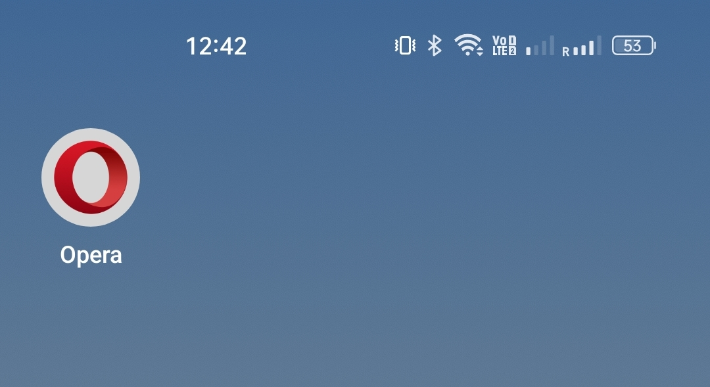
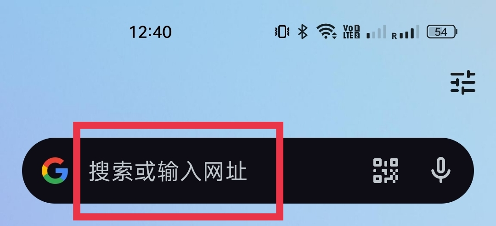
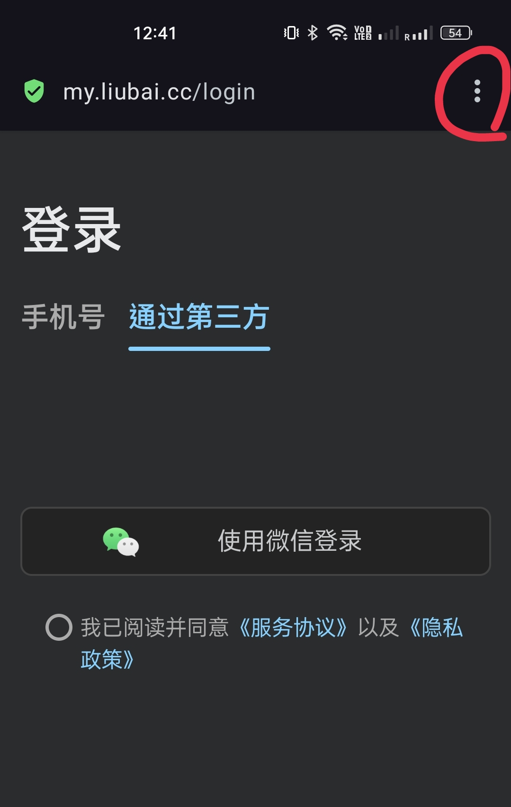
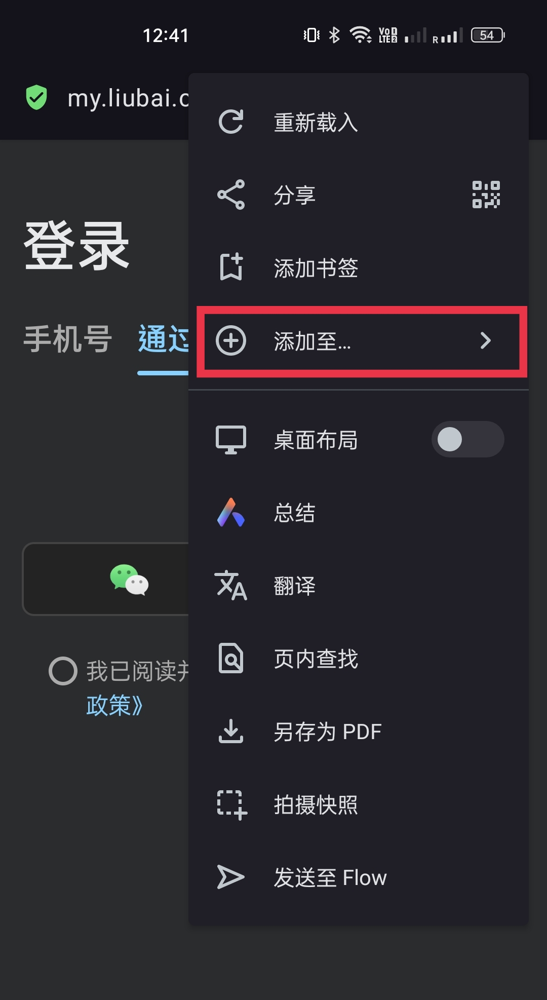
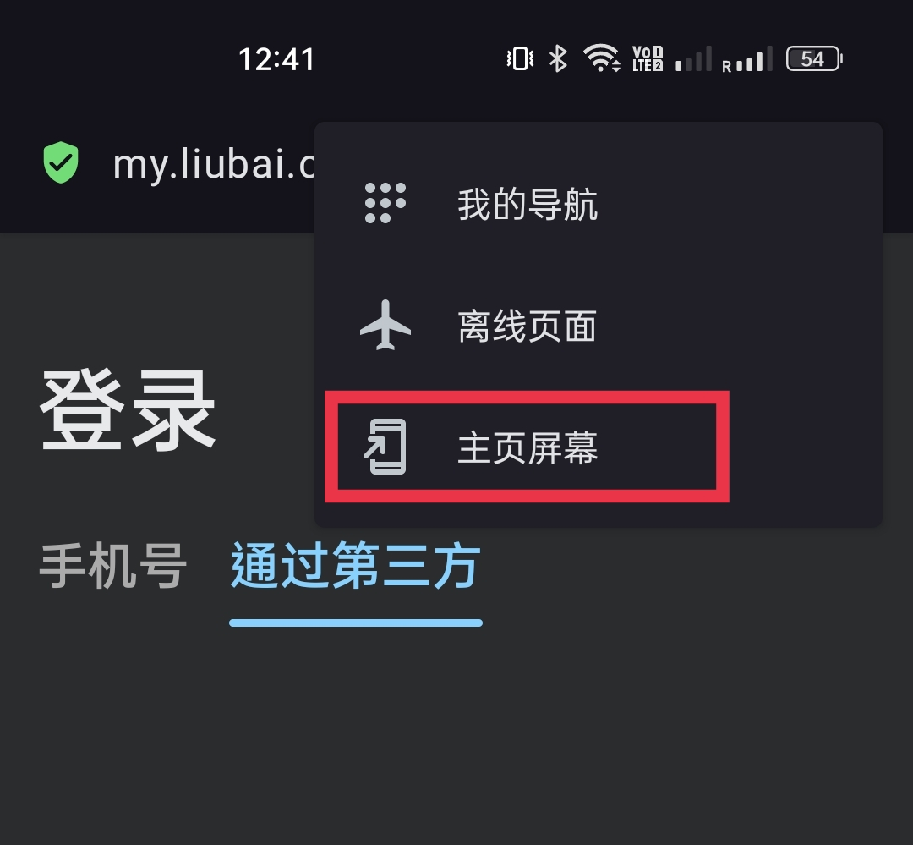
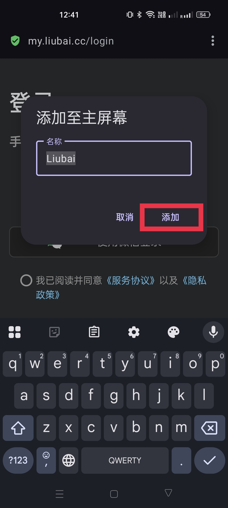
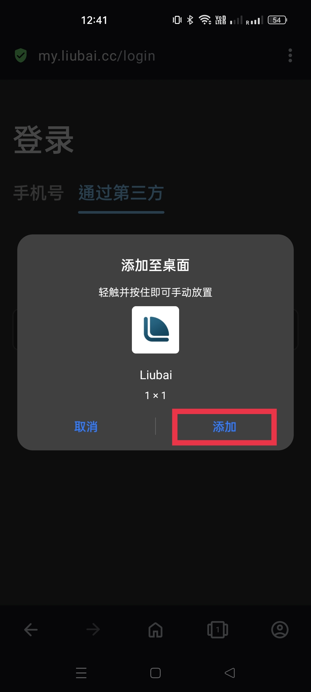
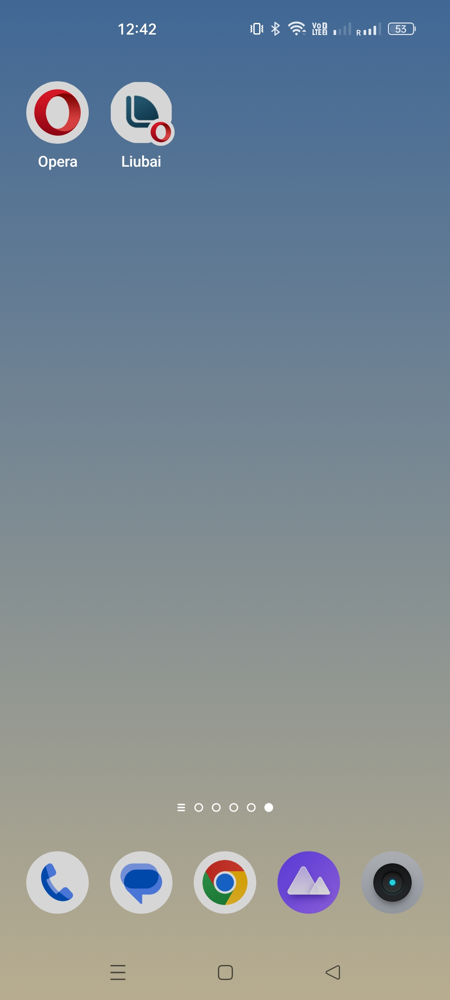

# 在 vivo 上安装

## 1. 复制链接

`https://my.thus-note.com`

<CopyButton />

## 2. 打开 Opera 浏览器

若你还没有 Opera 浏览器，可以[点击这里下载](https://musetransfer.com/s/alppnpqsj)。

 

## 3. 黏贴链接

在地址栏上，黏贴链接。 

## 4. 准备安装

点击右上方工具栏上的更多“...”按钮，弹出菜单；在菜单上选择 `添加至...`。

## 5. 开始安装

接着点击 `主页屏幕`。

依序点击 `添加`。

## 6. 安装完成

回到桌面上，留白应该已经在那等你了！

