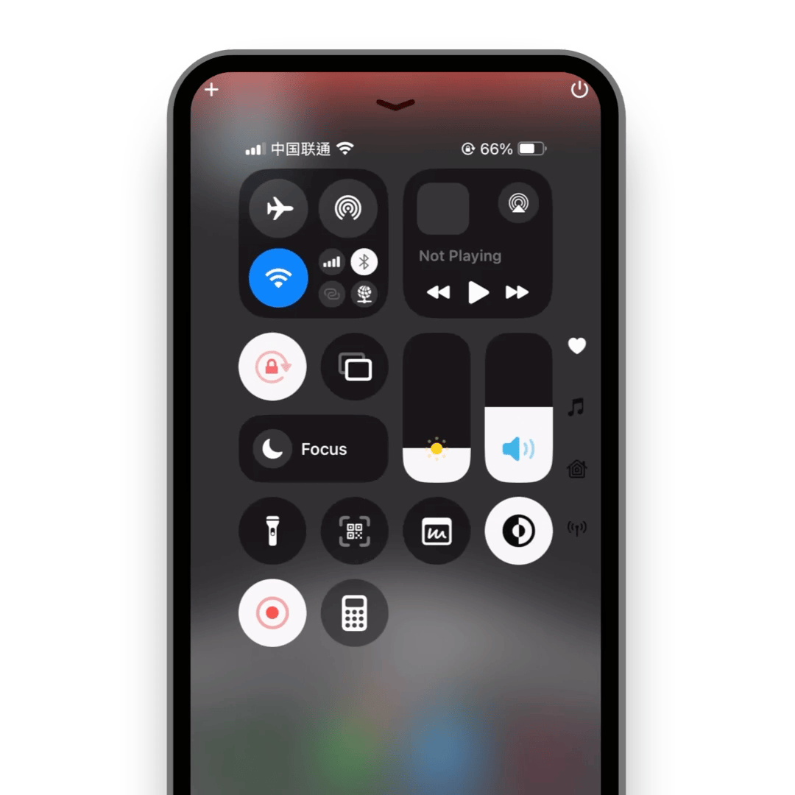

# 离线可用

> [!IMPORTANT]
> 离线可用的前提是你已 [安装](./install/index) 如是。
> 
> 值得注意的是，我们的 IDE 插件是不支持离线使用的，因为它背后配置了 [AI 结构化处理](./ide/how-to-use-vscode-ext#quick-note)，使用场景不同。

如是是本地优先的，你可以在断网的环境下使用如是。

 

在飞机或火车上，人处于另一个维度中。前者离开地球表面，后者则伴随着快速变换的风景。

在这种无网或弱网环境下，人的灵感非常容易迸发。若此刻不能轻松无压力地记录灵感，那将会非常非常难受。

> 我们不放弃任何你的灵感，因为那相当于破坏人类文明本身。

