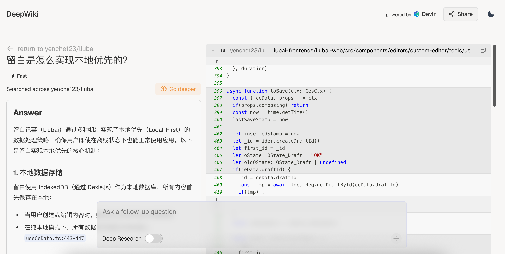

# 隐私

如是使用行业标准端到端加密 🔐：

```
1. 在登录前，客户端向远端获取 RSA 公钥
2. 客户端生成随机 AES 密钥
3. 客户端使用 RSA 公钥加密 AES 密钥（非对称加密）
4. 登录时，把加密后的 AES 密钥发送给远端
5. 远端使用 RSA 私钥解密出 AES 密钥
```

登录完成后，后续的敏感数据传输都会使用 AES 密钥进行加密。

## 仅存于本地 {#local-only}

如果你还是担心数据安全，可以在编辑器上关闭“同步至云端”：


我们支持单条卡片的关闭，而非全局关闭。因为我们想让你自由选择！

如果你只是不想让卡片被 [外部的 AI 访问](../article/2024/how-to-use-multi-ai-on-wechat)，那么这个时候你只需要关闭 `AI可读` 即可。


## 完全开源 {#open-source}

另外，如是是完全开源的，你可以在我们的 [GitHub 仓库](https://github.com/yenche123/thus-note) 上随意审计源代码。

看不懂的地方就问 AI，**代码去黑盒化**已不是口号。

> [!TIP]
> Devin 团队提供了 [DeepWiki](https://deepwiki.com/yenche123/thus-note)，协助你理解项目源码。亲测可用中文直接提问。
>
> 