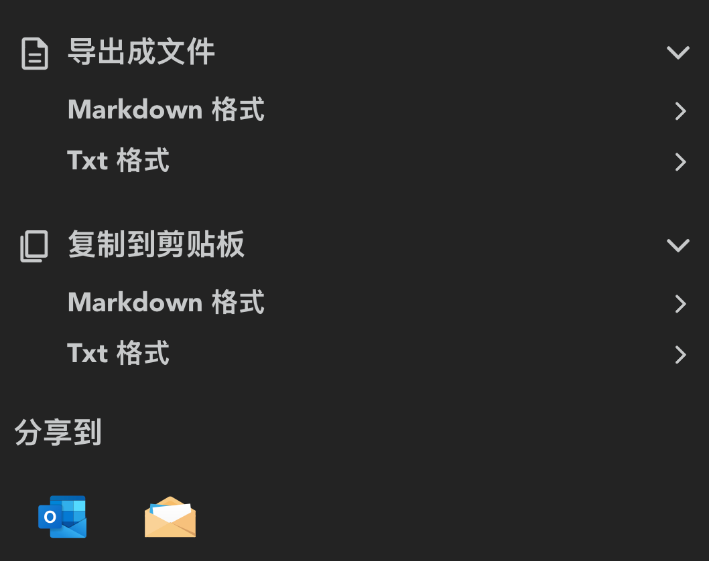
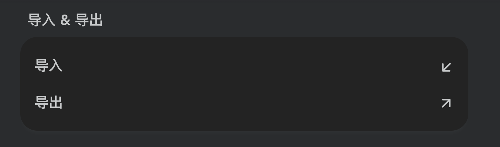

# 同步和备份

## 多端同步

如是自带多端同步，让你无需任何配置就能在各设备间流转数据。

::: info 🤩 救命
终于不用再配置 Git, iCloud, or 其他 xxx sync 了！
:::

## 本地备份

在卡片上点击箭头向右的图标，即可对单则卡片进行备份和导出。

另外，你还可以在 [设置](https://my.liubai.cc/settings/more) 中，批量导出和导入你的记事：

## 备份到外部

备份到本地还不够？数据流转起来才是重点。

我们还支持 [实时备份](./connect/index) 到 WPS / 钉钉 / 维格表，在他们的多维表格上查看你的记事，给你一种批奏折的即视感。

我们真的要让你的数据，由你掌握！

