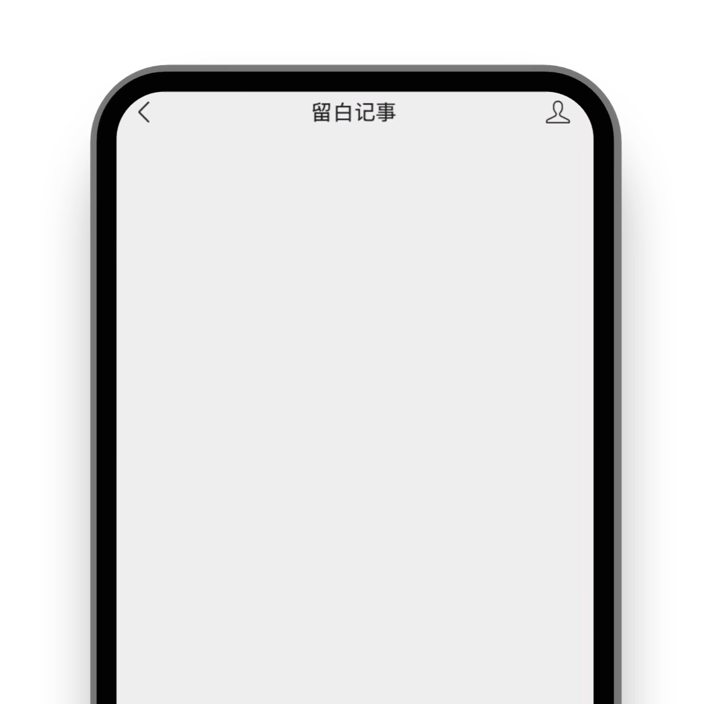

# AI 使用说明书

如是当前的 AI 功能叫作"三个助手"，它让你直接在微信上和多个大模型互动，最多同时与 3 名 AI 聊天！

## 使用方法 {#how-to-use}

在微信上搜索"如是"（或者扫描下方二维码），关注"如是"服务号。

关注后，根据引导完成登录，再点击对话框左下角 `⌨️` 图标（如上图第 3 步骤），即可开始聊天！

## 用说的比较快 {#just-talk}

除了打字，你还可以用说的！就跟你在微信上与好友发语音一样！

目前，部分 AI 也会说话啦！它们分别为 `通义千问`, `跃问` 和 `海螺`。

## 支持哪些 AI {#supported-ai}

目前支持的 AI 有:

- 百小应（来自[百川智能](https://www.baichuan-ai.com/home)）
- DeepSeek ([V3](https://api-docs.deepseek.com/zh-cn/news/news1226) 和 [R1](https://api-docs.deepseek.com/zh-cn/news/news250120))
- 海螺 (来自 [MiniMax](https://minimaxi.com/))，已支持语音回复你。
- 混元 (来自[腾讯](https://hunyuan.tencent.com/))
- Kimi（来自[月之暗面](https://www.moonshot.cn/)）
- 通义千问（来自[阿里巴巴](https://tongyi.aliyun.com/welcome)），已支持语音回复你。
- 万知（来自[零一万物](https://www.01.ai/cn)）
- 跃问（来自[阶跃星辰](https://www.stepfun.com/)），已支持语音回复你。
- 智谱（来自[智谱华章](https://bigmodel.cn/)）

DeepSeek 因其官方资源紧张 + 开源的原因，我们使用到了来自腾讯云、七牛云、硅基流动、Gitee AI 等第三方云厂商的服务。

其它 AI 的输出，则皆来自对应大模型厂商的官方开放平台。

我们让你无需切换 APP，直接在微信里一次性体验世界顶尖大模型！

## 玩法 {#how-to-play}

### 召唤... {#call}

你可以在对话框中回复

`召唤百小应`: 使用来自百川智能的 AI 大模型。

`召唤ds` / `召唤deepseek`: 使用 DeepSeek V3。

`召唤r1`: 使用 DeepSeek R1，支持在消息末尾展开思考过程。

`召唤海螺`: 使用来自 MiniMax 的 AI 大模型。

`召唤混元`: 使用来自腾讯的 AI 大模型。

`召唤kimi`: 使用来自月之暗面的 AI 大模型。

`召唤通义千问`: 使用来自阿里巴巴的 AI 大模型。此指令等效于 `召唤通义` / `召唤TY` / `召唤千问` / `召唤Qwen`。

`召唤万知`: 使用来自零一万物的 AI 大模型。

`召唤跃问`: 使用来自阶跃星辰的 AI 大模型。

`召唤智谱`: 使用来自智谱华章的 AI 大模型。

### 踢掉... {#kick}

在服务号内，你最多能同时跟 3 名 AI 聊天。当你想召唤其他 AI 但服务号内已有 3 名助手时，你可以回复

`踢掉xx`: 其中 `xx` 替换成对应的 AI 名称，即可踢掉你不想再使用的 AI。

### 一些操作和设置 {#ai-settings}

`控制台`: 打开 AI 控制台，去设置 AI 回复你时的声音，目前有“男声”和“女声”可以选择。

`群聊状态` 或 `额度`: 查看当前服务号内已有的 AI 以及使用额度。

`清空上文`: 清空之前的会话，从头跟 AI 开始聊。

::: info 💡 小提示
`清空上文` 指令可以有效避免 AI 参考到之前已经过时的对话，并且能加快它的回复速度。
:::

## 置顶 {#pin}

许多朋友询问如何快速找到如是，这里教大家一个实用的小技巧：置顶如是。

如上图所示，在关注如是的页面，点击右上角 `...` 按钮，再点击 `置顶服务号` 即可在微信消息列表里找到如是。

另外，如果你想**避免漏接日程提醒**，你还可以“[关闭消息免打扰](https://mp.weixin.qq.com/s/3g1vn8wnps7nKntUKXIJuw)”。

## 幻觉 {#hallucination}

现在的 AI 依然会有胡言乱语的情况。当你请 AI 管理你的日程或待办时，可能会遇到以下情况:

上图中，只有头像为如是 Logo 的消息（表示系统消息）是真实有效的✅，其他都在胡说八道🤬。你可以凭此区分谁在为你工作，谁又在胡言乱语。

随着 AI 技术的快速发展，这类被称为幻觉的现象将逐步降低。你可以关注如是，第一时间感受它所带来的变化。

## 微信的 Bug {#bugs-from-weixin}

在微信电脑版上使用“三个助手”，你可能会遇到:

1. 助手们的头像都展示为如是 Logo

2. 在操作栏上点击快捷按钮失效

系微信的问题，与如是无关。

我们也因此推荐大家在手机微信上使用“三个助手”，让它成为你的智能口袋；毕竟在电脑 PC 上，你其实有更多选择。

## 更多详情

更多使用方法，欢迎参阅 [在微信中使用多个 AI](../article/2024/how-to-use-multi-ai-on-wechat.md)。

关于计费方式，请参阅 [提问箱](./faq/index)。

想购买会员支持我们，请查看 [会员中心](https://my.thus-note.com/subscription)。